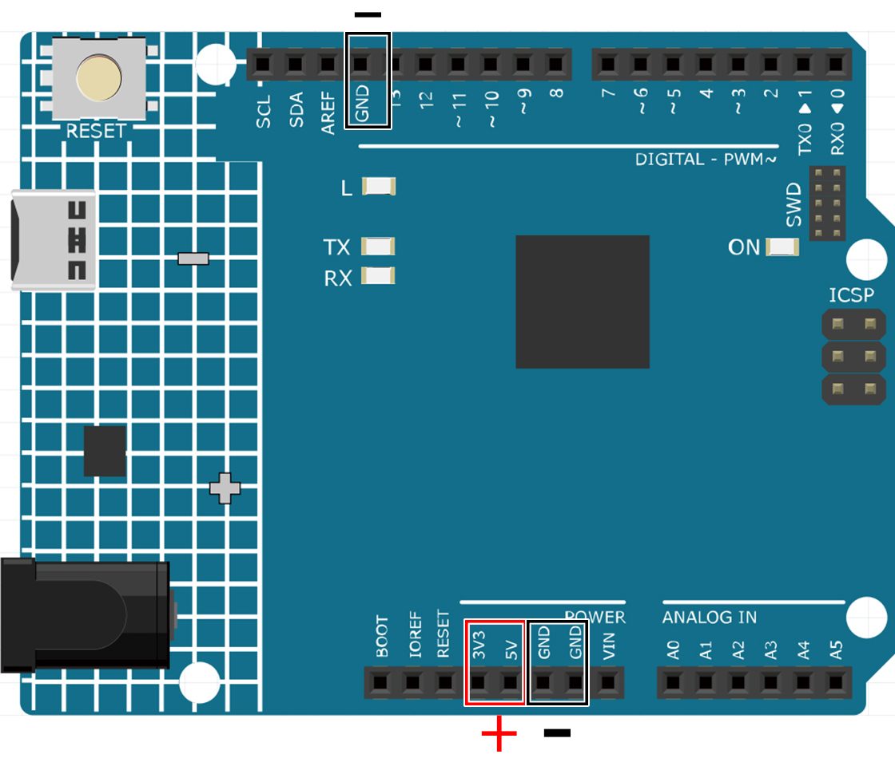
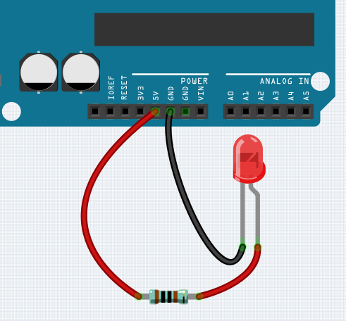
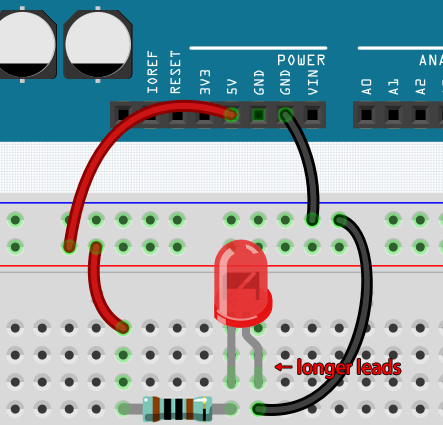
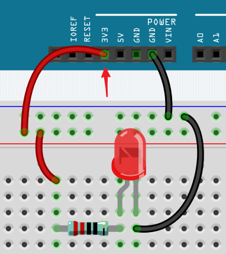

Wie man den Stromkreis aufbaut
=================================

Viele der Dinge, die Sie täglich verwenden, werden mit Strom betrieben, wie die Lichter in Ihrem Haus oder der Computer, auf dem Sie gerade lesen.

Um Strom zu nutzen, müssen Sie einen elektrischen Stromkreis aufbauen. Grundsätzlich ist ein Stromkreis ein Pfad, durch den Strom fließt, oder ein elektronischer Stromkreis, und besteht aus elektrischen Geräten und Bauteilen, die auf eine bestimmte Weise miteinander verbunden sind, wie Widerstände, Kondensatoren, Stromquellen und Schalter.

.. image:: img/circuit.png

Ein Stromkreis ist ein geschlossener Pfad, in dem Elektronen sich bewegen, um einen elektrischen Strom zu erzeugen. Damit der Strom fließt, muss ein leitender Pfad zwischen dem positiven Anschluss der Stromquelle und dem negativen Anschluss bestehen. Dies wird als geschlossener Stromkreis bezeichnet (wenn er unterbrochen ist, spricht man von einem offenen Stromkreis).

Das Arduino Board verfügt über einige Stromausgangspins (positiv) und einige Erdungspins (negativ).
Diese Pins können als positive und negative Seite der Stromversorgung verwendet werden, indem Sie die Stromquelle in das Board stecken.

Mit Strom können Sie Werke mit Licht, Ton und Bewegung erschaffen.
Sie können eine LED zum Leuchten bringen, indem Sie den langen Pin an den positiven Anschluss und den kurzen Pin an den negativen Anschluss anschließen.
Die LED wird sehr schnell kaputtgehen, wenn Sie dies tun, also müssen Sie einen 220* Widerstand in den Stromkreis einfügen, um ihn zu schützen.

Der von ihnen gebildete Stromkreis ist unten dargestellt.

Vielleicht fragen Sie sich jetzt: Wie baue ich diesen Stromkreis auf? Halte ich die Drähte mit der Hand, oder klebe ich die Pins und Drähte fest?

In dieser Situation werden Lötfreie Steckplatinen Ihre besten Verbündeten sein.

.. _bc_bb:

Hallo, Steckplatine!
-----------------------

Eine Steckplatine ist eine rechteckige Kunststoffplatte mit vielen kleinen Löchern.
Diese Löcher ermöglichen es uns, elektronische Bauteile einfach einzufügen und elektronische Schaltkreise aufzubauen.
Steckplatinen fixieren elektronische Bauteile nicht dauerhaft, so dass wir einen Schaltkreis bei Fehlern einfach reparieren und von vorne beginnen können.

.. note::
    Für die Verwendung von Steckplatinen sind keine speziellen Werkzeuge erforderlich. Viele elektronische Bauteile sind jedoch sehr klein, und eine Pinzette kann uns helfen, kleinere Teile besser aufzunehmen.

Im Internet finden wir viele Informationen über Steckplatinen.

* `Wie man eine Steckplatine verwendet - Science Buddies <https://www.sciencebuddies.org/science-fair-projects/references/how-to-use-a-breadboard#pth-smd>`_

* `Was ist eine STECKPLATINE? - Makezine <https://cdn.makezine.com/uploads/2012/10/breadboardworkshop.pdf>`_

Hier sind einige Dinge, die Sie über Steckplatinen wissen sollten.

#. Jede halbe Reihengruppe (wie Spalte A-E in Reihe 1 oder Spalte F-J in Reihe 3) ist verbunden. Wenn also ein elektrisches Signal von A1 einfließt, kann es von B1, C1, D1, E1, aber nicht von F1 oder A2 herausfließen.

#. In den meisten Fällen werden beide Seiten der Steckplatine als Stromschienen verwendet, und die Löcher in jeder Spalte (etwa 50 Löcher) sind miteinander verbunden. Als Faustregel werden positive Stromquellen an die Löcher in der Nähe des roten Drahts angeschlossen, und negative Stromquellen an die Löcher in der Nähe des blauen Drahts.

#. In einem Schaltkreis fließt der Strom von der positiven zur negativen Polklemme, nachdem er durch die Last geflossen ist. In diesem Fall kann ein Kurzschluss auftreten.

**Lassen Sie uns die Richtung des Stroms verfolgen, um den Schaltkreis aufzubauen!**

1. In diesem Schaltkreis verwenden wir den 5V-Pin des Boards, um die LED mit Strom zu versorgen. Verwenden Sie ein männlich-zu-männlich (M2M) Verbindungskabel, um es mit der roten Stromschiene zu verbinden.
#. Um die LED zu schützen, muss der Strom durch einen 220-Ohm-Widerstand fließen. Verbinden Sie ein Ende (beliebiges Ende) des Widerstands mit der roten Stromschiene und das andere Ende mit der freien Reihe der Steckplatine.

    .. note::
        Der Farbring des 220-Ohm-Widerstands ist rot, rot, schwarz, schwarz und braun.

#. Wenn Sie die LED aufheben, werden Sie sehen, dass einer ihrer Anschlüsse länger ist als der andere. Verbinden Sie den längeren Anschluss mit derselben Reihe wie der Widerstand und den kürzeren Anschluss mit der anderen Reihe.

    .. note::
        Der längere Anschluss ist die Anode, die die positive Seite des Stromkreises repräsentiert; der kürzere Anschluss ist die Kathode, die die negative Seite darstellt.

        Die Anode muss über einen Widerstand mit dem GPIO-Pin verbunden werden; die Kathode muss mit dem GND-Pin verbunden werden.

#. Verwenden Sie ein männlich-zu-männlich (M2M) Verbindungskabel, um den kurzen LED-Pin mit der negativen Stromschiene der Steckplatine zu verbinden.
#. Verbinden Sie den GND-Pin des Boards mit der negativen Stromschiene mithilfe eines Jumpers.

Vorsicht vor Kurzschlüssen
-------------------------------

Kurzschlüsse können auftreten, wenn zwei Komponenten, die nicht verbunden sein sollten, "versehentlich" verbunden werden.
Dieses Kit enthält Widerstände, Transistoren, Kondensatoren, LEDs usw., die lange Metallpins haben, die aneinander stoßen und einen Kurzschluss verursachen können. Einige Schaltungen funktionieren einfach nicht richtig, wenn ein Kurzschluss auftritt. Gelegentlich kann ein Kurzschluss Bauteile dauerhaft beschädigen, insbesondere zwischen der Stromquelle und der Erdungsschiene, wodurch der Schaltkreis sehr heiß wird, das Plastik auf der Steckplatine schmilzt und sogar die Bauteile verbrennt!

Stellen Sie daher immer sicher, dass die Pins aller Elektronikbauteile auf der Steckplatine sich nicht berühren.

Richtung des Schaltkreises
-------------------------------
Schaltkreise haben eine Orientierung und diese spielt bei bestimmten elektronischen Komponenten eine bedeutende Rolle. Es gibt Bauteile mit Polarität, was bedeutet, dass sie basierend auf ihren positiven und negativen Polen korrekt verbunden werden müssen. Schaltkreise mit falscher Orientierung funktionieren nicht ordnungsgemäß.

Wenn Sie die LED in diesem einfachen Schaltkreis, den wir zuvor gebaut haben, umkehren, werden Sie feststellen, dass sie nicht mehr funktioniert.

Im Gegensatz dazu haben manche Bauteile keine Richtung, wie zum Beispiel die Widerstände in diesem Schaltkreis. Daher können Sie diese umkehren, ohne die normale Funktion der LEDs zu beeinflussen.

Die meisten Komponenten und Module mit Bezeichnungen wie "+", "-", "GND", "VCC" oder mit Pins unterschiedlicher Länge müssen auf eine bestimmte Weise im Schaltkreis verbunden werden.

Schutz des Schaltkreises
-------------------------------------

Strom ist die Geschwindigkeit, mit der Elektronen an einem Punkt in einem geschlossenen elektrischen Schaltkreis vorbeifließen. Im Grundlegendsten ist Strom = Fluss. Ein Ampere (kurz: Amp) ist die internationale Einheit zur Messung von Strom. Es drückt die Menge an Elektronen (manchmal als "elektrische Ladung" bezeichnet) aus, die über einen Zeitraum an einem Punkt im Schaltkreis vorbeifließen.

Die treibende Kraft (Spannung) hinter dem Stromfluss wird als Spannung bezeichnet und in Volt (V) gemessen.

Widerstand (R) ist die Eigenschaft des Materials, die den Stromfluss einschränkt und wird in Ohm (Ω) gemessen.

Laut Ohmschem Gesetz (solange die Temperatur konstant bleibt), sind Strom, Spannung und Widerstand proportional.
Der Strom eines Schaltkreises ist proportional zu seiner Spannung und umgekehrt proportional zu seinem Widerstand.

Daher ist Strom (I) = Spannung (V) / Widerstand (R).

* `Ohmsches Gesetz - Wikipedia <https://en.wikipedia.org/wiki/Ohm%27s_law>`_

Zum Ohmschen Gesetz können wir ein einfaches Experiment durchführen.

Wenn Sie das Kabel, das 5V mit 3,3V verbindet, wechseln, wird die LED dunkler. Wenn Sie den Widerstand von 220 Ohm auf 1000 Ohm ändern (Farbring: braun, schwarz, schwarz, braun und braun), werden Sie feststellen, dass die LED dunkler als zuvor wird. Je größer der Widerstand, desto dunkler die LED.

.. note::
    Für eine Einführung in Widerstände und wie man Widerstandswerte berechnet, siehe :ref:`cpn_resistor`.

Die meisten verpackten Module benötigen nur Zugang zur richtigen Spannung (normalerweise 3,3V oder 5V), wie zum Beispiel das Ultraschallmodul.

In Ihren selbstgebauten Schaltkreisen müssen Sie jedoch auf die Versorgungsspannung und den Widerstandseinsatz für elektrische Geräte achten.

Als Beispiel: LEDs verbrauchen normalerweise 20mA Strom und ihr Spannungsabfall beträgt etwa 1,8V. Laut Ohmschem Gesetz benötigen wir bei einer 5V-Stromversorgung einen Widerstand von mindestens 160 Ohm ((5-1,8)/20mA), um die LED nicht zu zerstören.

Schaltkreissteuerung mit Arduino
------------------------------------

Jetzt, da wir ein grundlegendes Verständnis für Arduino-Programmierung und elektronische Schaltkreise haben, ist es Zeit für die wichtigste Frage: Wie steuert man Schaltkreise mit Arduino?

Einfach ausgedrückt, steuert Arduino einen Schaltkreis, indem es den Pegel der Pins auf dem Board ändert. Zum Beispiel steuert es eine an Bord befindliche LED, indem es ein hohes oder niedriges Signal an Pin 13 sendet.

Jetzt versuchen wir, das Arduino-Board zu programmieren, um die blinkende LED auf dem Steckbrett zu steuern. Bauen Sie den Schaltkreis so, dass die LED an Pin 9 angeschlossen ist.

.. image:: img/wiring_led.png
    :width: 400
    :align: center

Laden Sie anschließend diesen Sketch auf das Arduino-Entwicklungsboard hoch.

.. code-block:: C

    int ledPin = 9;
    int delayTime = 500;

    void setup() {
        pinMode(ledPin,OUTPUT); 
    }

    void loop() {
        digitalWrite(ledPin,HIGH); 
        delay(delayTime); 
        digitalWrite(ledPin,LOW); 
        delay(delayTime);
    }

Dieser Sketch ähnelt sehr dem, den wir verwendet haben, um das Blinken der an Bord befindlichen LED zu steuern. Der Unterschied ist, dass der Wert von ``ledPin`` dieses Mal auf 9 geändert wurde.

Jetzt können Sie sehen, wie die LED auf dem Steckbrett blinkt.

