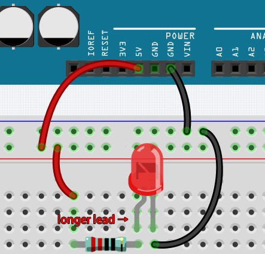
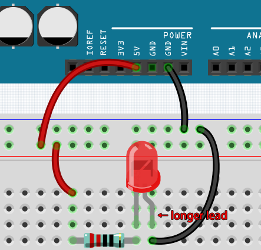

.. note::

    Bonjour, bienvenue dans la communauté SunFounder Raspberry Pi & Arduino & ESP32 Enthusiasts sur Facebook ! Plongez dans l'univers de Raspberry Pi, Arduino et ESP32 avec d'autres passionnés.

    **Pourquoi nous rejoindre ?**

    - **Assistance experte** : Résolvez les problèmes après-vente et relevez des défis techniques grâce à l'aide de notre communauté et de notre équipe.
    - **Apprenez et partagez** : Échangez des conseils et des tutoriels pour améliorer vos compétences.
    - **Aperçus exclusifs** : Accédez en avant-première aux annonces de nouveaux produits.
    - **Réductions spéciales** : Profitez de réductions exclusives sur nos derniers produits.
    - **Promotions et concours festifs** : Participez à des concours et des offres spéciales.

    👉 Prêt à explorer et à créer avec nous ? Cliquez sur [|link_sf_facebook|] et rejoignez-nous dès aujourd'hui !

Construire le Circuit
========================

Beaucoup de choses que vous utilisez au quotidien sont alimentées par l'électricité, comme les lumières dans votre maison et l'ordinateur que vous lisez actuellement.

Pour utiliser l'électricité, il faut construire un circuit électrique. Essentiellement, un circuit est un chemin par lequel l'électricité circule, composé de dispositifs et composants électroniques (appareils) connectés d'une certaine manière, comme des résistances, des condensateurs, des sources d'alimentation et des interrupteurs.

.. image:: img/circuit.png

Un circuit est un chemin fermé dans lequel les électrons se déplacent pour créer un courant électrique. Pour qu'un courant circule, il doit y avoir un chemin conducteur entre la borne positive et la borne négative de l'alimentation, appelé circuit fermé (s'il est interrompu, on parle de circuit ouvert).

La carte Arduino dispose de broches de sortie d'alimentation (positives) et de broches de masse (négatives).
Vous pouvez utiliser ces broches comme côtés positifs et négatifs de l'alimentation en connectant la source d'alimentation à la carte.

.. image:: img/arduinoPN.jpg

Avec l'électricité, vous pouvez créer des œuvres avec lumière, son et mouvement.
Vous pouvez allumer une LED en connectant la patte longue à la borne positive et la patte courte à la borne négative.
La LED se détériorera rapidement si vous faites cela directement. Vous devez donc ajouter une résistance de 1 kΩ dans le circuit pour la protéger.

Le circuit ainsi formé est illustré ci-dessous.

.. image:: img/sp221014_181625.png

Vous pourriez vous demander : comment construire ce circuit ? Tenir les fils à la main ou utiliser du ruban adhésif pour fixer les broches ?

Dans ce cas, les plaques de montage sans soudure (breadboards) seront vos alliées les plus précieuses.

.. _bc_bb:

Bonjour, Breadboard !
-------------------------

Une breadboard est une plaque rectangulaire en plastique avec une multitude de 
petits trous. Ces trous permettent d'insérer facilement des composants électroniques 
et de construire des circuits électroniques. Les breadboards ne fixent pas les composants 
de manière permanente, ce qui facilite la réparation ou la reconstruction d'un circuit en cas de problème.

.. note::
    Pas besoin d'outils spéciaux pour utiliser une breadboard. Cependant, de nombreux composants électroniques sont très petits, et une pince à épiler peut vous aider à manipuler ces pièces plus facilement.

Sur Internet, vous trouverez de nombreuses ressources sur les breadboards :

* `How to Use a Breadboard - Science Buddies <https://www.sciencebuddies.org/science-fair-projects/references/how-to-use-a-breadboard#pth-smd>`_
* `What is a BREADBOARD? - Makezine <https://cdn.makezine.com/uploads/2012/10/breadboardworkshop.pdf>`_

Voici quelques points essentiels à connaître :

#. Chaque groupe de rangées (par exemple, colonne A-E de la rangée 1 ou colonne F-J de la rangée 3) est connecté. Ainsi, si un signal électrique entre par A1, il peut sortir par B1, C1, D1, E1, mais pas par F1 ou A2.

#. En général, les deux côtés de la breadboard servent de bus d'alimentation. Les trous de chaque colonne (environ 50 trous) sont connectés ensemble. La règle générale est de connecter l'alimentation positive près du fil rouge et l'alimentation négative près du fil bleu.

#. Dans un circuit, le courant circule du pôle positif au pôle négatif après avoir traversé la charge. Cela peut provoquer un court-circuit si mal connecté.

**Construisons le circuit en suivant le sens du courant !**

1. Dans ce circuit, nous utilisons la broche 5V de la carte pour alimenter la LED. Utilisez un câble mâle-mâle (M2M) pour le connecter au bus d'alimentation rouge.
#. Pour protéger la LED, le courant doit passer par une résistance de 1 kΩ. Connectez une extrémité de la résistance au bus d'alimentation rouge, et l'autre extrémité à une rangée libre de la breadboard.

    .. note::
        La bague colorée de la résistance de 1 kΩ est marron, noir, noir, marron et marron.

#. Prenez la LED et connectez sa patte longue à la même rangée que la résistance, et sa patte courte à une autre rangée.

    .. note::
        La patte longue est l'anode (positive) et la patte courte est la cathode (négative). 
        
        L'anode doit être connectée à la broche GPIO via une résistance ; la cathode à la broche GND.

#. Utilisez un câble M2M pour connecter la patte courte de la LED au bus d'alimentation négatif de la breadboard.
#. Connectez la broche GND de la carte au bus d'alimentation négatif à l'aide d'un câble.

Attention aux courts-circuits
------------------------------

Les courts-circuits peuvent survenir lorsque deux composants qui ne devraient pas être connectés le sont "par accident". 
Ce kit comprend des résistances, transistors, condensateurs, LEDs, etc., qui ont de longues pattes métalliques susceptibles de se toucher et de provoquer un court-circuit. Certains courts-circuits empêchent simplement le bon fonctionnement du circuit, mais parfois, ils peuvent endommager définitivement les composants, notamment entre l'alimentation et le bus de masse, provoquant une surchauffe, la fonte du plastique de la breadboard, voire la combustion des composants !

Ainsi, vérifiez toujours que les pattes de tous les composants électroniques sur la breadboard ne se touchent pas.

Orientation du circuit
--------------------------

Les circuits électroniques ont une orientation, et celle-ci joue un rôle crucial pour certains composants. Certains dispositifs ont une polarité, ce qui signifie qu'ils doivent être connectés correctement en fonction de leurs pôles positifs et négatifs. Un circuit monté avec une orientation incorrecte ne fonctionnera pas correctement.

Si vous inversez la LED dans ce circuit simple que nous avons construit plus tôt, vous constaterez qu'elle ne fonctionne plus.

En revanche, certains composants, comme les résistances dans ce circuit, n'ont pas de direction. Vous pouvez les inverser sans affecter le fonctionnement normal de la LED.

La plupart des composants et modules portant des indications comme "+", "-", "GND", "VCC", ou ayant des pattes de différentes longueurs, doivent être connectés au circuit dans une direction spécifique.

Protection du circuit
--------------------------

Le courant est le débit d'électrons passant par un point dans un circuit électrique fermé. À son niveau le plus basique, courant = flux. Un ampère (AMP) est l'unité internationale utilisée pour mesurer le courant. Il exprime la quantité d'électrons (parfois appelée "charge électrique") circulant dans un circuit en un temps donné.

La tension, force motrice derrière le flux de courant, est mesurée en volts (V).

La résistance (R), propriété du matériau qui limite le flux de courant, est mesurée en ohms (Ω).

Selon la loi d'Ohm (tant que la température reste constante), courant, tension et résistance sont proportionnels.
Le courant dans un circuit est proportionnel à la tension et inversement proportionnel à la résistance. 

Ainsi, courant (I) = tension (V) / résistance (R).

* `Loi d'Ohm - Wikipedia <https://en.wikipedia.org/wiki/Ohm%27s_law>`_

Nous pouvons illustrer la loi d'Ohm par une expérience simple.

.. image:: img/sp221014_183107.png

En remplaçant le fil reliant 5V par 3,3V, la LED devient plus faible.
Si vous changez la résistance de 1 kΩ à 2 kΩ, vous remarquerez que la LED devient encore plus faible. Plus la résistance est grande, plus la LED est faible.

.. note::
    Pour une introduction aux résistances et au calcul des valeurs, voir :ref:`cpn_resistor`.

La plupart des modules préassemblés nécessitent uniquement une alimentation adéquate (généralement 3,3V ou 5V), comme le module à ultrasons.

Cependant, pour vos circuits construits manuellement, vous devez tenir compte de la tension d'alimentation et des résistances nécessaires pour les composants électriques.

À titre d'exemple, les LEDs consomment généralement 20mA de courant et leur chute de tension est d'environ 1,8V. Selon la loi d'Ohm, si nous utilisons une alimentation de 5V, nous devons connecter une résistance minimale de 160Ω ((5-1,8)/20mA) pour éviter de griller la LED.

Contrôle du circuit avec Arduino
------------------------------------

Maintenant que nous comprenons les bases de la programmation Arduino et des circuits électroniques, abordons la question essentielle : comment contrôler les circuits avec Arduino.

En résumé, Arduino contrôle un circuit en modifiant le niveau des broches de la carte. Par exemple, pour contrôler une LED embarquée, Arduino envoie un signal haut ou bas à la broche 13.

Essayons maintenant de coder la carte Arduino pour contrôler le clignotement d'une LED sur une breadboard. Construisez le circuit pour connecter la LED à la broche 9.

.. image:: img/wiring_led.png
    :width: 400
    :align: center

Ensuite, téléversez ce programme sur la carte Arduino.

.. code-block:: C

    int ledPin = 9;
    int delayTime = 500;

    void setup() {
        pinMode(ledPin,OUTPUT); 
    }

    void loop() {
        digitalWrite(ledPin,HIGH); 
        delay(delayTime); 
        digitalWrite(ledPin,LOW); 
        delay(delayTime);
    }

Ce programme est très similaire à celui utilisé pour contrôler le clignotement de la LED embarquée, sauf que la valeur de ``ledPin`` a été changée pour 9.
C'est parce que nous essayons cette fois de contrôler le niveau de la broche 9.

Vous pouvez maintenant voir la LED sur la breadboard clignoter.
