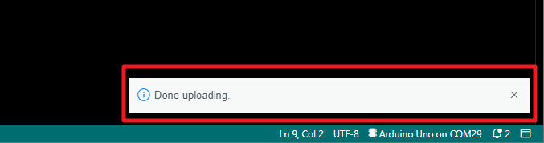
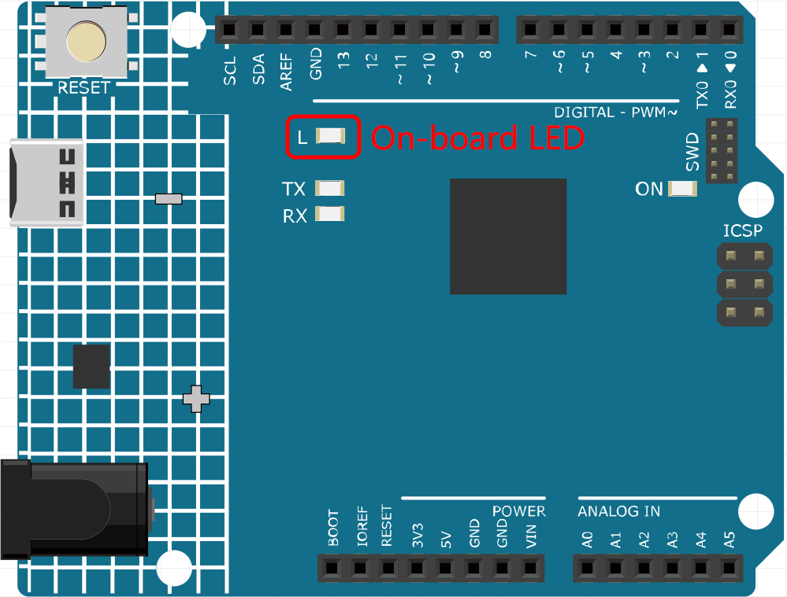

ボードにスケッチをアップロードする方法は？
=============================================

このセクションでは、先ほど作成したスケッチをArduinoボードにアップロードする方法、および考慮すべき点について学びます。

**1. ボードとポートを選択**

Arduinoの開発ボードには通常、USBケーブルが付属しています。これを使用してボードをコンピュータに接続します。

Arduino IDEで正しい **ボード（Board）** と **ポート（Port）** を選択します。通常、Arduinoボードはコンピュータに自動的に認識され、ポートが割り当てられるので、ここで選択できます。

    .. image:: img/board_port.png

もし、ボードが接続されているのに認識されない場合は、 **Boards Manager** の **Arduino AVR Boards** セクションに **INSTALLED** のロゴが表示されているか確認してください。表示されていない場合、少し下にスクロールして **INSTALL** をクリックしてください。

    .. image:: img/upload1.png

Arduino IDEを再度開いたり、Arduinoボードを再度接続すると、ほとんどの問題が解消されます。また、 **ツール（Tools）** -> **ボード（Board）** や **ポート（Port）** をクリックして選択することもできます。

**2. スケッチを検証**

検証ボタンをクリックすると、スケッチがエラーがないかどうかコンパイルされます。

    .. image:: img/sp221014_174532.png

何らかの文字を削除したり、間違って数文字入力した場合など、ミスを見つけるのに役立ちます。メッセージバーから、どこでどのようなタイプのエラーが発生したかを確認できます。

    .. image:: img/sp221014_175307.png

エラーがない場合、以下のようなメッセージが表示されます。

    .. image:: img/sp221014_175512.png

**3. スケッチをアップロード**

上記の手順を完了した後、 **アップロード（Upload）** ボタンをクリックして、このスケッチをボードにアップロードします。

    .. image:: img/sp221014_175614.png

成功すると、以下のプロンプトが表示されます。

同時に、ボード上のLEDが点滅します。

スケッチがアップロードされた後、電源が適用されるとArduinoボードは自動的にスケッチを実行します。新しいスケッチをアップロードすることで、実行中のプログラムを上書きすることができます。