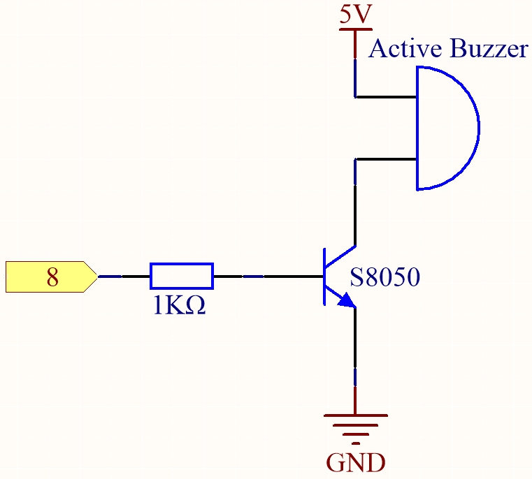
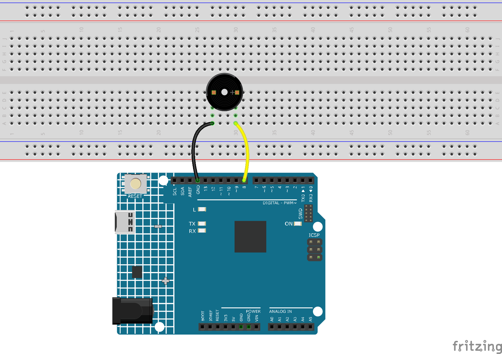

.. _ar_beep:

1.2 ビープ音
==================
アクティブブザーは、LEDを点灯させるのと同じくらい使いやすい典型的なデジタル出力デバイスです！

キットには2種類のブザーが含まれています。
アクティブブザーを使用する必要があります。裏返してみると、封印された背面（露出したPCBでない方）が私たちの求めているものです。

.. image:: img/buzzer.png

**必要な部品**

このプロジェクトでは、以下のコンポーネントが必要です。

一式を購入するのが便利です、リンクはこちら： 

.. list-table::
    :widths: 20 20 20
    :header-rows: 1

    *   - 名前
        - このキットのアイテム
        - リンク
    *   - 3 in 1 Starter Kit
        - 380+
        - |link_3IN1_kit|

以下のリンクから個別に購入することもできます。

.. list-table::
    :widths: 30 20
    :header-rows: 1

    *   - コンポーネントの紹介
        - 購入リンク

    *   - :ref:`cpn_uno`
        - \-
    *   - :ref:`cpn_breadboard`
        - |link_breadboard_buy|
    *   - :ref:`cpn_wires`
        - |link_wires_buy|
    *   - :ref:`cpn_buzzer`
        - \-

**回路図**

**配線図**

**コード**

.. note::

   * ファイル ``1.2.beep.ino`` をパス ``3in1-kit\learning_project\1.2.beep`` で開くことができます。 
   * または、このコードを **Arduino IDE** にコピーしてください。
   

.. raw:: html

    <iframe src=https://create.arduino.cc/editor/sunfounder01/95570ca2-11c6-404c-a23f-bf03094d8085/preview?embed style="height:510px;width:100%;margin:10px 0" frameborder=0></iframe>

コードが正常にアップロードされた後、1秒ごとにビープ音が聞こえるでしょう。
