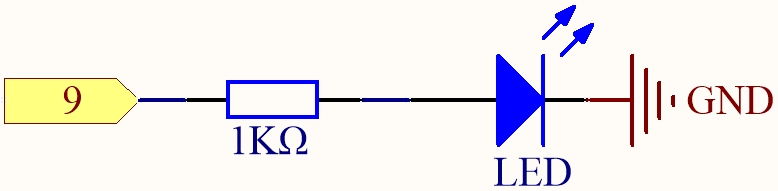

.. _ar_blink:

1.1 ハロー、LED！
=======================================

「Hello, world!」を表示することは、プログラミングを学ぶ最初のステップであるように、LEDを駆動するプログラムを使用することは、物理的なプログラミングを学ぶ伝統的な導入です。

**必要な部品**

このプロジェクトでは、以下の部品が必要です。

すべてのキットを購入するのは確かに便利です。リンクはこちら：

.. list-table::
    :widths: 20 20 20
    :header-rows: 1

    *   - 名前
        - このキットのアイテム
        - リンク
    *   - 3 in 1 Starter Kit
        - 380+
        - |link_3IN1_kit|

以下のリンクから個別に購入することもできます。

.. list-table::
    :widths: 30 20
    :header-rows: 1

    *   - コンポーネント紹介
        - 購入リンク

    *   - :ref:`cpn_uno`
        - |link_Uno_R3_buy|
    *   - :ref:`cpn_breadboard`
        - |link_breadboard_buy|
    *   - :ref:`cpn_wires`
        - |link_wires_buy|
    *   - :ref:`cpn_resistor`
        - |link_resistor_buy|
    *   - :ref:`cpn_led`
        - |link_led_buy|

**回路図**

この回路の原理は単純で、図には電流の方向が示されています。ピン9が高レベル（5V）を出力すると、220ohmの電流制限抵抗を通過した後、LEDが点灯します。ピン9が低レベル（0V）を出力すると、LEDは消灯します。

**配線図**

.. image:: img/wiring_led.png
    :width: 400
    :align: center

**コード**

.. note::

   * ``3in1-kit\basic_project\1.1.hello_led`` のパスの下にある ``1.1.hello_led.ino`` ファイルを開くことができます。
   * または、このコードを **Arduino IDE** にコピーします。
   * または、 `Arduino Web Editor <https://docs.arduino.cc/cloud/web-editor/tutorials/getting-started/getting-started-web-editor>`_ を通じてコードをアップロードします。

.. raw:: html

    <iframe src=https://create.arduino.cc/editor/sunfounder01/0497f915-5bf8-41a2-8e0f-b013130a57f5/preview?embed style="height:510px;width:100%;margin:10px 0" frameborder=0></iframe>

コードのアップロードが成功すると、LEDが点滅するのが見えるでしょう。

**どのように動作するのか？**

ここでは、LEDをデジタルピン9に接続しているため、プログラムの最初にledpinという名前のint変数を宣言し、9という値を割り当てる必要があります。

.. code-block:: arduino

    const int ledPin = 9;

次に、 ``setup()`` 関数内でピンを初期化し、ピンを ``OUTPUT`` モードに設定する必要があります。

.. code-block:: arduino

    void setup() {
        pinMode(ledPin, OUTPUT);
    }

``loop()`` 内で、 ``digitalWrite()`` を使用してledpinに5Vの高レベル信号を提供することで、LEDのピン間に電圧差が生じ、LEDが点灯します。

.. code-block:: arduino

    digitalWrite(ledPin, HIGH);

レベル信号がLOWに変わると、ledPinの信号が0 Vに戻ってLEDが消灯します。

.. code-block:: arduino

    digitalWrite(ledPin, LOW);

オンとオフの間にインターバルが必要であり、変化を人々が見ることができるようにするため、 ``delay(1000)`` コードを使用してコントローラが1000 ms何もしないようにします。

.. code-block:: arduino

    delay(1000);
