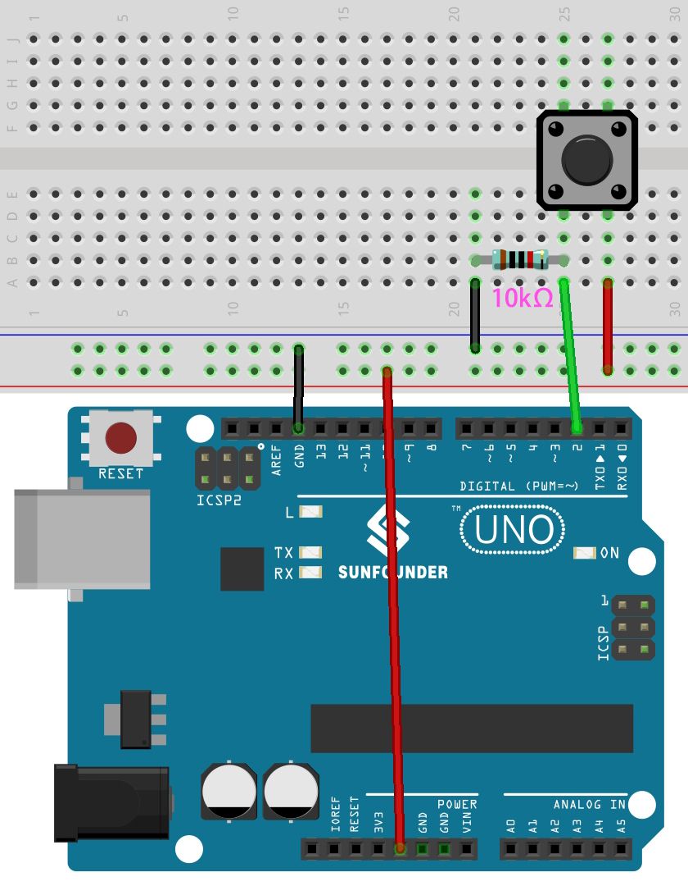

.. _ar_button:

3.1 ボタンの値を読む
==============================================

前のプロジェクトでは出力機能を使用しましたが、この章では入力機能を使用してボタンの値を読み取ります。

**必要な部品**

このプロジェクトには、以下の部品が必要です。

全体のキットを購入すると非常に便利です。こちらがリンクです：

.. list-table::
    :widths: 20 20 20
    :header-rows: 1

    *   - 名前	
        - このキットのアイテム
        - リンク
    *   - 3 in 1 Starter Kit
        - 380+
        - |link_3IN1_kit|

以下のリンクから個別に購入することもできます。

.. list-table::
    :widths: 30 20
    :header-rows: 1

    *   - コンポーネント紹介
        - 購入リンク

    *   - :ref:`cpn_uno`
        - |link_Uno_R3_buy|
    *   - :ref:`cpn_breadboard`
        - |link_breadboard_buy|
    *   - :ref:`cpn_wires`
        - |link_wires_buy|
    *   - :ref:`cpn_resistor`
        - |link_resistor_buy|
    *   - :ref:`cpn_button`
        - |link_button_buy|

**回路図**

.. image:: img/circuit_3.1_button.png

ボタンのピンの一方は5Vに接続され、
もう一方のピンはピン2に接続されているので、
ボタンを押すと、
ピン2はハイ状態になります。しかし、
ボタンを押していないと、
ピン2は未接続状態になり、ハイまたはローのどちらかになります。
ボタンを押していないときに安定したローレベルを得るために、
ピン2を10Kのプルダウン抵抗を介してGNDに再接続する必要があります。

**配線図**

**コード**

.. note::

   * ``3in1-kit\basic_project\3.1.read_button_value`` のパスの下で ``3.1.read_button_value.ino`` ファイルを開くことができます。
   * または、このコードを **Arduino IDE** にコピーします。
   
   * または、 `Arduino Web Editor <https://docs.arduino.cc/cloud/web-editor/tutorials/getting-started/getting-started-web-editor>`_ を通じてコードをアップロードします。

.. raw:: html
    
    <iframe src=https://create.arduino.cc/editor/sunfounder01/b456ff57-4dfb-4231-9d91-f1e9a5777de2/preview?embed style="height:510px;width:100%;margin:10px 0" frameborder=0></iframe>

コードが正常にアップロードされた後、Arduino IDEの右上隅にある虫眼鏡アイコン（シリアルモニタ）をクリックします。

.. image:: img/sp220614_152922.png

ボタンを押すと、シリアルモニタに"1"と表示されます。

