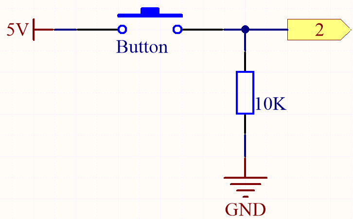
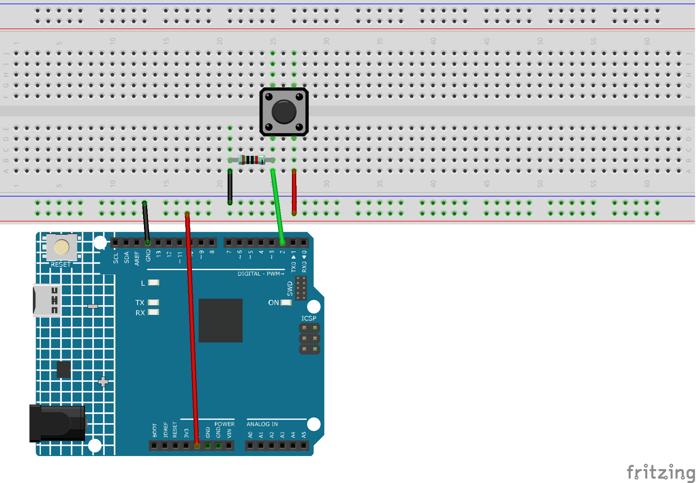
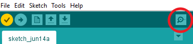

.. note:: 

    Bonjour, bienvenue dans la communauté SunFounder Raspberry Pi & Arduino & ESP32 Enthusiasts sur Facebook ! Plongez plus profondément dans Raspberry Pi, Arduino et ESP32 avec d'autres passionnés.

    **Pourquoi nous rejoindre ?**

    - **Support d'experts** : Résolvez les problèmes après-vente et les défis techniques avec l'aide de notre communauté et de notre équipe.
    - **Apprenez et partagez** : Échangez des astuces et des tutoriels pour améliorer vos compétences.
    - **Aperçus exclusifs** : Accédez en avant-première aux annonces de nouveaux produits et aperçus exclusifs.
    - **Réductions spéciales** : Profitez de réductions exclusives sur nos derniers produits.
    - **Promotions festives et cadeaux** : Participez à des concours et promotions de vacances.

    👉 Prêt à explorer et créer avec nous ? Cliquez sur [|link_sf_facebook|] et rejoignez-nous dès aujourd'hui !

.. _ar_button:

3.1 Lecture de la valeur du bouton
==============================================

Dans les projets précédents, nous avons utilisé la fonction de sortie. Dans ce chapitre, nous allons utiliser la fonction d'entrée pour lire la valeur d'un bouton.

**Composants nécessaires**

Dans ce projet, nous aurons besoin des composants suivants. 

Il est très pratique d'acheter un kit complet, voici le lien : 

.. list-table::
    :widths: 20 20 20
    :header-rows: 1

    *   - Nom
        - ARTICLES DANS CE KIT
        - LIEN
    *   - 3 in 1 Starter Kit
        - 380+
        - |link_3IN1_kit|

Vous pouvez également les acheter séparément via les liens ci-dessous.

.. list-table::
    :widths: 30 20
    :header-rows: 1

    *   - INTRODUCTION DES COMPOSANTS
        - LIEN D'ACHAT

    *   - :ref:`cpn_uno`
        - \-
    *   - :ref:`cpn_breadboard`
        - |link_breadboard_buy|
    *   - :ref:`cpn_wires`
        - |link_wires_buy|
    *   - :ref:`cpn_resistor`
        - |link_resistor_buy|
    *   - :ref:`cpn_button`
        - |link_button_buy|

**Schéma**

Un côté de la broche du bouton est connecté à 5V, 
et l'autre côté est connecté à la broche 2. 
Ainsi, lorsque le bouton est pressé, 
la broche 2 sera à un niveau haut. Cependant, 
lorsque le bouton n'est pas pressé, 
la broche 2 est dans un état flottant et peut être à un niveau haut ou bas. 
Pour obtenir un niveau bas stable lorsque le bouton n'est pas pressé, 
la broche 2 doit être reliée à la masse (GND) via une résistance de tirage de 10K.

**Câblage**

**Code**

.. note::

   * Vous pouvez ouvrir le fichier ``3.1.read_button_value.ino`` sous le chemin ``3in1-kit\learning_project\3.1.read_button_value``.
   * Ou copiez ce code dans **Arduino IDE**.

.. raw:: html
    
    <iframe src=https://create.arduino.cc/editor/sunfounder01/b456ff57-4dfb-4231-9d91-f1e9a5777de2/preview?embed style="height:510px;width:100%;margin:10px 0" frameborder=0></iframe>

Après avoir téléchargé le code avec succès, cliquez sur l'icône en forme de loupe dans le coin supérieur droit de l'IDE Arduino (Moniteur Série).

Lorsque vous appuyez sur le bouton, le Moniteur Série affichera "1".
