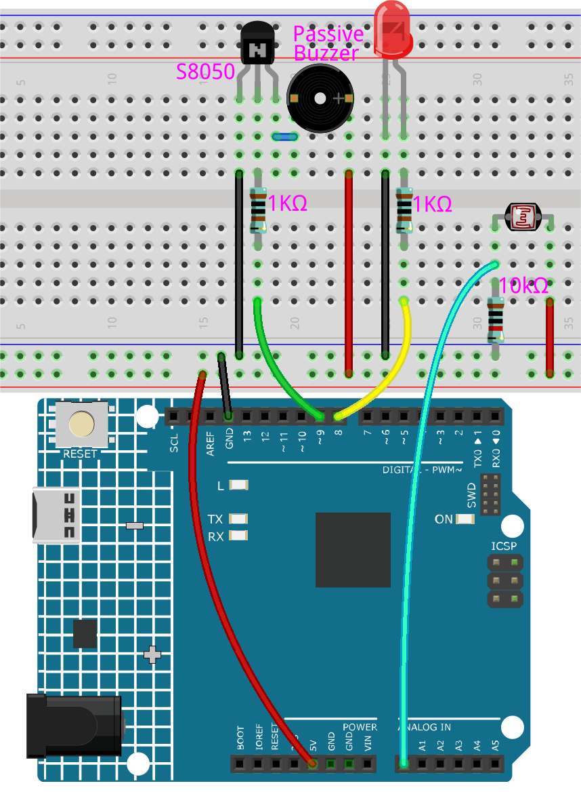

.. _ar_calibration:

5.14 キャリブレーション
==========================

アナログ入力コンポーネント（例：フォトレジスタ、土壌湿度センサなど）を使用する際、読み取り範囲が0から1023でなく、0から800や600から1000のような範囲になることがあります。これは、通常の使用ではこれらのデバイスの限界に達することができないためです。

このような場合、センサ入力をキャリブレーションする技術が役立ちます。起動時に、制御ボードがセンサの読み取りを5秒間行い、最高値と最低値を記録します。この5秒間の読み取りが、サイクル中の読み取りの最小値と最大値を定義します。

このプロジェクトでは、上記のキャリブレーション技術を使用して、フォトレジスタとパッシブブザーを使用し、 `テレミン <https://en.wikipedia.org/wiki/Theremin>`_ のようなゲームを実装します。

.. note::
    `テレミン <https://en.wikipedia.org/wiki/Theremin>`_ は、物理的な接触を必要としない電子楽器です。プレイヤーの手の位置を感知して、異なる音を生成します。

**必要な部品**

このプロジェクトには以下のコンポーネントが必要です。

一式のキットを購入すると非常に便利です。リンクはこちら：

.. list-table::
    :widths: 20 20 20
    :header-rows: 1

    *   - 名前	
        - このキットのアイテム
        - リンク
    *   - 3 in 1 Starter Kit
        - 380+
        - |link_3IN1_kit|

以下のリンクから、個別に購入することも可能です。

.. list-table::
    :widths: 30 20
    :header-rows: 1

    *   - コンポーネントの紹介
        - 購入リンク

    *   - :ref:`cpn_uno`
        - \-
    *   - :ref:`cpn_breadboard`
        - |link_breadboard_buy|
    *   - :ref:`cpn_wires`
        - |link_wires_buy|
    *   - :ref:`cpn_resistor`
        - |link_resistor_buy|
    *   - :ref:`cpn_buzzer`
        - |link_passive_buzzer_buy|
    *   - :ref:`cpn_led`
        - |link_led_buy|
    *   - :ref:`cpn_photoresistor`
        - |link_photoresistor_buy|

**回路図**

.. image:: img/circuit_8.8_calibration.png

**配線図**

**コード**

.. note::

    * ``3in1-kit\learning_project\5.14.calibration`` のパスの下の ``5.14.calibration.ino`` ファイルを開きます。
    * または、このコードを **Arduino IDE** にコピーします。

    
    

.. raw:: html
    
    <iframe src=https://create.arduino.cc/editor/sunfounder01/9cbcaae0-3c9d-4e33-9957-548f92a9aab7/preview?embed style="height:510px;width:100%;margin:10px 0" frameborder=0></iframe>

コードが正常にアップロードされると、LEDが点灯し、フォトレジスタの検出範囲をキャリブレーションするための5秒間が与えられます。これは、毎回使用する際に異なる光環境になる可能性があるためです（例：正午と夕方では光の強度が異なる）。

このとき、フォトレジスタの上で手を上下に振る必要があります。手の動きの範囲がこの楽器の演奏範囲にキャリブレーションされます。

5秒後、LEDが消灯し、フォトレジスタの上で手を振ることで演奏することができます。

**どのように動作するのか？**

#. すべてのコンポーネントの初期値とピンを設定する。

    .. code-block:: arduino

        const int buzzerPin = 9;
        const int ledPin = 8;
        const int photocellPin = A0;  //フォトレジスタはA2に接続
    
        int lightLow = 1023;
        int lightHigh = 0;
    
        int sensorValue = 0;        // センサからの読み取り値
        int pitch = 0;           // センサ値をLED 'bars'に変換
    
        unsigned long previousMillis = 0;
        const long interval = 5000;

#. ``setup()`` 内でキャリブレーションプロセスを設定する。

    .. code-block:: arduino

        void setup()
        {
            pinMode(buzzerPin, OUTPUT); // ブザーを出力として設定
            pinMode(ledPin, OUTPUT); // LEDピンを出力として設定

            /* フォトレジスタの最大値 & 最小値をキャリブレートする */
            previousMillis = millis();
            digitalWrite(ledPin, HIGH);
            while (millis() - previousMillis <= interval) {
                sensorValue = analogRead(photocellPin);
                if (sensorValue > lightHigh) {
                    lightHigh = sensorValue;
                }
                if (sensorValue < lightLow) {
                    lightLow = sensorValue;
                }
            }
            digitalWrite(ledPin, LOW);
        }

    ワークフローは以下の通りです。

    * 5000msの間隔で ``millis()`` を使ってタイミングを取る。

    .. code-block:: arduino

        previousMillis = millis();
        ...
        while (millis() - previousMillis <= interval) {
        ...
        }

    * この5秒間、フォトレジスタの周りで手を振ると、検出された光の最大値と最小値が記録され、それぞれ ``lightHigh`` と ``lightLow`` に割り当てられる。

    .. code-block:: arduino
        
        sensorValue = analogRead(photocellPin);
        if (sensorValue > lightHigh) {
            lightHigh = sensorValue;
        }
        if (sensorValue < lightLow) {
            lightLow = sensorValue;
        }

#. これで、このテルミンを演奏することができます。フォトレジスタの値を ``sensorValue`` に読み取り、それを小さい範囲から大きい範囲にマップして、ブザーの周波数として使用します。

    .. code-block:: arduino

        void loop()
        {
        /* 演奏 */
        sensorValue = analogRead(photocellPin); //A0の値を読み取る
        pitch = map(sensorValue, lightLow, lightHigh, 50, 6000);  // ブザーの周波数にマップする
        if (pitch > 50) {
            tone(buzzerPin, pitch, 20);
        }
        delay(10);
        }

