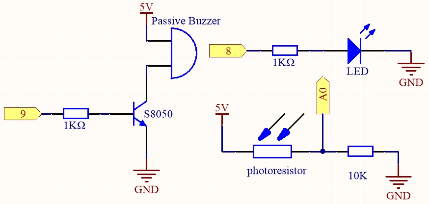
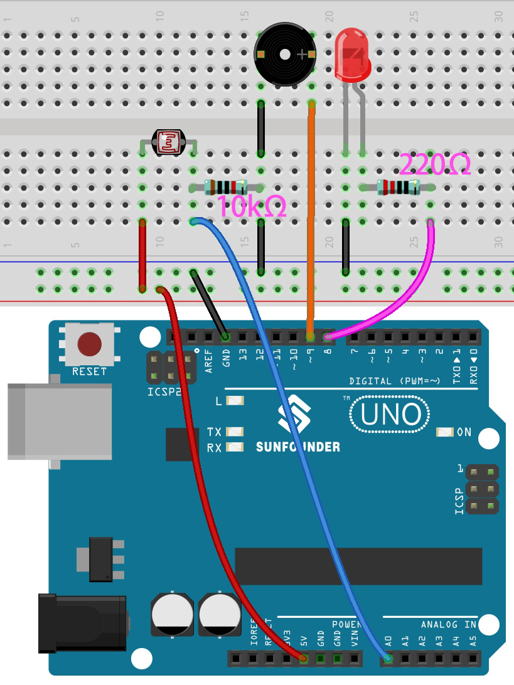

.. _ar_calibration:

5.14 キャリブレーション
==========================

アナログ入力コンポーネント、例えばフォトレジスタや土壌湿度センサなどを使用する際、その読み取り範囲が0から1023ではなく、例えば0から800や600から1000のような範囲であることがわかるかもしれません。これは、これらのデバイスの限界に通常の使用で到達することができないためです。

このような場合、センサーの入力をキャリブレーションする技術が利用できます。起動時に、制御ボードはセンサーの読み取りを5秒間行い、最も高いおよび最も低い読み取りを記録します。この5秒間の読み取りは、サイクル中に取得される読み取りの最小および最大の予想値を示します。

このプロジェクトでは、上記のキャリブレーション技法を用いて、フォトレジスタとパッシブブザーを利用し、 `テレミン <https://en.wikipedia.org/wiki/Theremin>`_ のようなゲームを実装します。

.. note::
    `テレミン <https://en.wikipedia.org/wiki/Theremin>`_ は物理的な接触を必要としない電子楽器で、プレイヤーの手の位置を感知して異なる音を生成します。

**必要な部品**

このプロジェクトに必要な部品は以下のとおりです。

一式を購入すると非常に便利です。こちらがリンクです：

.. list-table::
    :widths: 20 20 20
    :header-rows: 1

    *   - 名称	
        - このキットのアイテム
        - リンク
    *   - 3 in 1 Starter Kit
        - 380+
        - |link_3IN1_kit|

また、以下のリンクから各部品を個別に購入することもできます。

.. list-table::
    :widths: 30 20
    :header-rows: 1

    *   - コンポーネントの紹介
        - 購入リンク

    *   - :ref:`cpn_uno`
        - |link_Uno_R3_buy|
    *   - :ref:`cpn_breadboard`
        - |link_breadboard_buy|
    *   - :ref:`cpn_wires`
        - |link_wires_buy|
    *   - :ref:`cpn_resistor`
        - |link_resistor_buy|
    *   - :ref:`cpn_buzzer`
        - |link_passive_buzzer_buy|
    *   - :ref:`cpn_led`
        - |link_led_buy|
    *   - :ref:`cpn_photoresistor`
        - |link_photoresistor_buy|

**回路図**

**配線図**

**コード**

.. note::

    * ``5.14.calibration.ino`` ファイルを ``3in1-kit\basic_project\5.14.calibration`` のパスで開いてください。
    * または、このコードを **Arduino IDE** にコピーしてください。
    
    * あるいは、 `Arduino Web Editor <https://docs.arduino.cc/cloud/web-editor/tutorials/getting-started/getting-started-web-editor>`_ を利用してコードをアップロードしてください。

.. raw:: html
    
    <iframe src=https://create.arduino.cc/editor/sunfounder01/9cbcaae0-3c9d-4e33-9957-548f92a9aab7/preview?embed style="height:510px;width:100%;margin:10px 0" frameborder=0></iframe>

コードが正常にアップロードされた後、LEDが点灯し、フォトレジスタの検出範囲をキャリブレーションするための5秒間が与えられます。これは、使用するたびに異なる光の環境下にある可能性があるためです（例：正午と夕暮れ時の光の強度は異なる）。

この時点で、フォトレジスタの上で手を上下に振る必要があり、手の動きの範囲がこの楽器の演奏範囲にキャリブレーションされます。

5秒後、LEDが消灯し、フォトレジスタ上で手を振って演奏できます。

**それはどのように動作しますか？**

#. すべてのコンポーネントの初期値とピンを設定します。

    .. code-block:: arduino

        const int buzzerPin = 9;
        const int ledPin = 8;
        const int photocellPin = A0;  //フォトレジスタはA2に接続

        int lightLow = 1023;
        int lightHigh = 0;

        int sensorValue = 0;        // センサーから読み取った値
        int pitch = 0;           // センサーの値をLED 'バー'に変換

        unsigned long previousMillis = 0;
        const long interval = 5000;

#. ``setup()`` でのキャリブレーションプロセスを設定します。

    .. code-block:: arduino

        void setup()
        {
            pinMode(buzzerPin, OUTPUT);// すべてのLEDピンを出力に設定

            /* フォトレジスタの最大値 & 最小値のキャリブレーション */
            previousMillis = millis();
            digitalWrite(ledPin, HIGH);
            while (millis() - previousMillis <= interval) {
                sensorValue = analogRead(photocellPin);
                if (sensorValue > lightHigh) {
                    lightHigh = sensorValue;
                }
                if (sensorValue < lightLow) {
                    lightLow = sensorValue;
                }
            }
            digitalWrite(ledPin, LOW);
        }

    動作の流れは以下のとおりです。

    * 5000msの間隔で ``millis()`` を使用してタイミングを測定。

    .. code-block:: arduino

        previousMillis = millis();
        ...
        while (millis() - previousMillis <= interval) {
        ...
        }

    * この5秒間、フォトレジスタの周りで手を振ると、検出された光の最大値と最小値が記録され、それぞれ ``lightHigh`` と ``lightLow`` に割り当てられます。

    .. code-block:: arduino
        
        sensorValue = analogRead(photocellPin);
        if (sensorValue > lightHigh) {
            lightHigh = sensorValue;
        }
        if (sensorValue < lightLow) {
            lightLow = sensorValue;
        }

#. これでテレミンの演奏を開始することができます。フォトレジスタの値を ``sensorValue`` に読み込み、小さな範囲から大きな範囲にマッピングして、ブザーの周波数として使用します。

    .. code-block:: arduino

        void loop()
        {
        /* play*/
        sensorValue = analogRead(photocellPin); //A0の値を読み取る
        pitch = map(sensorValue, lightLow, lightHigh, 50, 6000);  // ブザーの周波数にマップする
        if (pitch > 50) {
            tone(buzzerPin, pitch, 20);
        }
        delay(10);
        }

