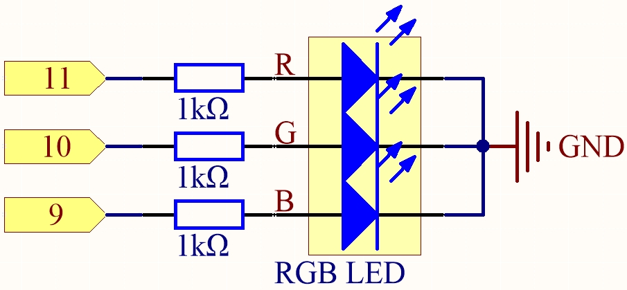
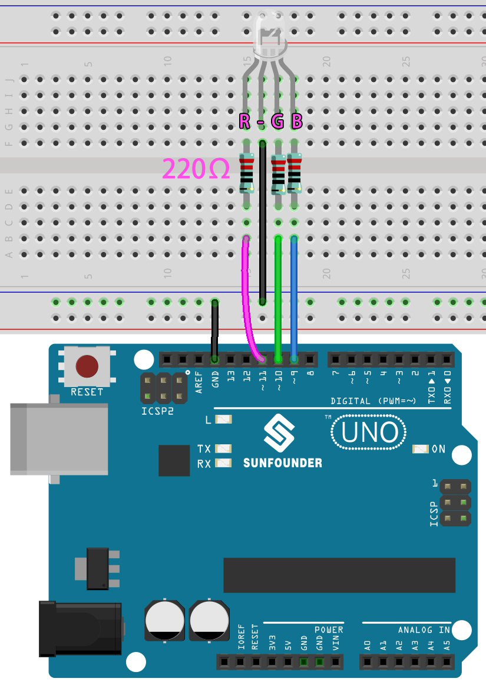

.. note::

    Ciao, benvenuto nella Community di SunFounder Raspberry Pi & Arduino & ESP32 su Facebook! Unisciti agli appassionati per approfondire Raspberry Pi, Arduino ed ESP32 insieme a noi.

    **Perché unirti?**

    - **Supporto esperto**: Risolvi problemi post-vendita e affronta sfide tecniche con l'aiuto della nostra community e del nostro team.
    - **Impara e condividi**: Scambia suggerimenti e tutorial per migliorare le tue competenze.
    - **Anteprime esclusive**: Ottieni accesso anticipato agli annunci di nuovi prodotti e anteprime esclusive.
    - **Sconti speciali**: Approfitta di sconti riservati sui nostri prodotti più recenti.
    - **Promozioni e omaggi festivi**: Partecipa a promozioni e omaggi durante le festività.

    👉 Pronto a esplorare e creare con noi? Clicca su [|link_sf_facebook|] e unisciti oggi stesso!

.. _ar_rgb:

2.2 Luce colorata
==============================================

Come sappiamo, la luce può essere sovrapposta. Ad esempio, mescolando la luce blu con la luce verde si ottiene la luce ciano, mentre mescolando la luce rossa con la luce verde si ottiene la luce gialla.
Questo è chiamato "metodo additivo della mescolanza dei colori".

* `Additive color - Wikipedia <https://en.wikipedia.org/wiki/Additive_color>`_

Basandoci su questo metodo, possiamo utilizzare i tre colori primari per mescolare la luce visibile di qualsiasi colore in base a diverse proporzioni. Ad esempio, l'arancione si può ottenere con più rosso e meno verde.

In questo capitolo, utilizzeremo un LED RGB per esplorare il mistero della mescolanza additiva dei colori!

Il LED RGB è l'equivalente di incapsulare un LED rosso, un LED verde e un LED blu sotto un'unica cupola, e i tre LED condividono un pin catodico comune.
Dato che il segnale elettrico è fornito per ciascun pin anodico, la luce del colore corrispondente può essere visualizzata. 
Variando l'intensità del segnale elettrico per ogni anodo, è possibile ottenere una vasta gamma di colori.

**Componenti necessari**

In questo progetto, abbiamo bisogno dei seguenti componenti.

È sicuramente comodo acquistare un intero kit, ecco il link:

.. list-table::
    :widths: 20 20 20
    :header-rows: 1

    *   - Nome	
        - OGGETTI IN QUESTO KIT
        - LINK
    *   - Kit Starter 3 in 1
        - 380+
        - |link_3IN1_kit|

Puoi anche acquistarli separatamente dai link qui sotto.

.. list-table::
    :widths: 30 20
    :header-rows: 1

    *   - INTRODUZIONE COMPONENTI
        - LINK DI ACQUISTO

    *   - :ref:`cpn_uno`
        - |link_Uno_R3_buy|
    *   - :ref:`cpn_breadboard`
        - |link_breadboard_buy|
    *   - :ref:`cpn_wires`
        - |link_wires_buy|
    *   - :ref:`cpn_resistor`
        - |link_resistor_buy|
    *   - :ref:`cpn_rgb`
        - |link_rgb_led_buy|

**Schema**

I pin PWM 11, 10 e 9 controllano rispettivamente i pin Rosso, Verde e Blu del LED RGB, mentre il pin catodico comune è collegato a GND. 
Questo consente al LED RGB di visualizzare un colore specifico sovrapponendo luce su questi pin con diversi valori PWM.

**Collegamenti**

.. image:: img/rgb_led_sch.png

Un LED RGB ha 4 pin: il pin più lungo è il catodo comune, che di solito viene collegato a GND. 
Il pin a sinistra del più lungo è il Rosso, mentre i 2 pin a destra sono Verde e Blu.

**Codice**

Qui possiamo scegliere il nostro colore preferito in un software di disegno (come Paint) e visualizzarlo con il LED RGB.

.. note::

   * Puoi aprire il file ``2.2.colorful_light.ino`` nel percorso ``3in1-kit\basic_project\2.analogWrite\2.2.colorful_light``. 
   * Oppure copia questo codice nell'**Arduino IDE**.
   
   * Oppure carica il codice tramite `Arduino Web Editor <https://docs.arduino.cc/cloud/web-editor/tutorials/getting-started/getting-started-web-editor>`_.

.. raw:: html
    
    <iframe src=https://create.arduino.cc/editor/sunfounder01/5d70e864-4f34-4090-b65d-904350091936/preview?embed style="height:510px;width:100%;margin:10px 0" frameborder=0></iframe>

.. image:: img/edit_colors.png

Scrivi i valori RGB in ``color_set()``, e sarai in grado di vedere il LED RGB illuminarsi nei colori desiderati.

**Come funziona?**

In questo esempio, la funzione utilizzata per assegnare i valori ai tre pin del LED RGB è incapsulata in una sottoprocedura indipendente ``color()``.

.. code-block:: arduino

    void color (unsigned char red, unsigned char green, unsigned char blue)
    {
        analogWrite(redPin, red);
        analogWrite(greenPin, green);
        analogWrite(bluePin, blue);
    }

Nel ``loop()``, i valori RGB funzionano come argomenti di input per chiamare la funzione ``color()`` e permettere al LED RGB di emettere diversi colori.

.. code-block:: arduino

    void loop() 
    {    
        color(255, 0, 0); //  red 
        delay(1000); 
        color(0,255, 0); //  green  
        delay(1000);  
        color(0, 0, 255); //  blue  
        delay(1000);
    }
