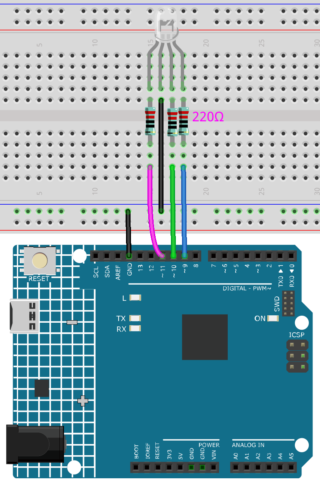

.. _ar_rgb:

2.2 カラフルな光
==============================================

私たちは知っているように、光は重ね合わせることができます。例えば、青色の光と緑色の光を混ぜるとシアン色の光になり、赤色の光と緑色の光を混ぜると黄色の光になります。
これを"色の加算混合法"と呼びます。

* `加算色 - ウィキペディア <https://en.wikipedia.org/wiki/Additive_color>`_

この方法を基に、三原色を使って、異なる比重に応じて任意の色の可視光を混合することができます。例えば、赤色を多く、緑色を少なくするとオレンジ色が生成されます。

この章では、RGB LEDを使用して、加算色混合の神秘を探求します！

RGB LEDは、赤、緑、青のLEDを1つのランプキャップの下に封入するものと同等であり、3つのLEDは共通のカソードピンを共有しています。
各アノードピンに電気信号が供給されると、対応する色の光が表示されます。 
各アノードの電気信号の強度を変えることで、さまざまな色を生み出すことができます。

**必要な部品**

このプロジェクトには、以下のコンポーネントが必要です。

一式を購入するのが便利です。こちらのリンクから購入できます：

.. list-table::
    :widths: 20 20 20
    :header-rows: 1

    *   - 名前	
        - このキットのアイテム
        - リンク
    *   - 3 in 1 Starter Kit
        - 380+
        - |link_3IN1_kit|

以下のリンクから、個別に購入することもできます。

.. list-table::
    :widths: 30 20
    :header-rows: 1

    *   - コンポーネントの紹介
        - 購入リンク

    *   - :ref:`cpn_uno`
        - \-
    *   - :ref:`cpn_breadboard`
        - |link_breadboard_buy|
    *   - :ref:`cpn_wires`
        - |link_wires_buy|
    *   - :ref:`cpn_resistor`
        - |link_resistor_buy|
    *   - :ref:`cpn_rgb`
        - |link_rgb_led_buy|

**回路図**

.. image:: img/circuit_2.2_rgb.png

PWMピンの11、10、9は、それぞれRGB LEDの赤、緑、青のピンを制御し、共通のカソードピンをGNDに接続します。 
これにより、RGB LEDは、これらのピンに異なるPWM値で光を重ね合わせることで、特定の色を表示することができます。

**配線図**

.. image:: img/rgb_led_sch.png

RGB LEDには4つのピンがあります：最も長いピンは共通のカソードピンで、通常GNDに接続され、
最も長いピンの隣の左のピンは赤色で、右側の2つのピンは緑色と青色です。

**コード**

ここで、お気に入りの色を描画ソフトウェア（ペイントなど）で選び、RGB LEDで表示することができます。

.. note::

   * ``3in1-kit\learning_project\2.analogWrite\2.2.colorful_light`` のパスの下で ``2.2.colorful_light.ino`` ファイルを開くことができます。
   * または、このコードを **Arduino IDE** にコピーしてください。

.. raw:: html
    
    <iframe src=https://create.arduino.cc/editor/sunfounder01/5d70e864-4f34-4090-b65d-904350091936/preview?embed style="height:510px;width:100%;margin:10px 0" frameborder=0></iframe>

.. image:: img/edit_colors.png

RGB値を ``color_set()`` に書き込むと、希望する色でRGBが点灯します。

**どのように動作するのか？**

この例では、RGBの3つのピンに値を割り当てるために使用される関数は、独立したサブ関数 ``color()`` にパッケージされています。

.. code-block:: arduino

    void color (unsigned char red, unsigned char green, unsigned char blue)
    {
        analogWrite(redPin, red);
        analogWrite(greenPin, green);
        analogWrite(bluePin, blue);
    }

``loop()`` 内では、RGB値は入力引数として機能し、関数 ``color()`` を呼び出してRGBが異なる色を放出することを実現しています。

.. code-block:: arduino

    void loop() 
    {    
        color(255, 0, 0); //  red 
        delay(1000); 
        color(0,255, 0); //  green  
        delay(1000);  
        color(0, 0, 255); //  blue  
        delay(1000);
    }
