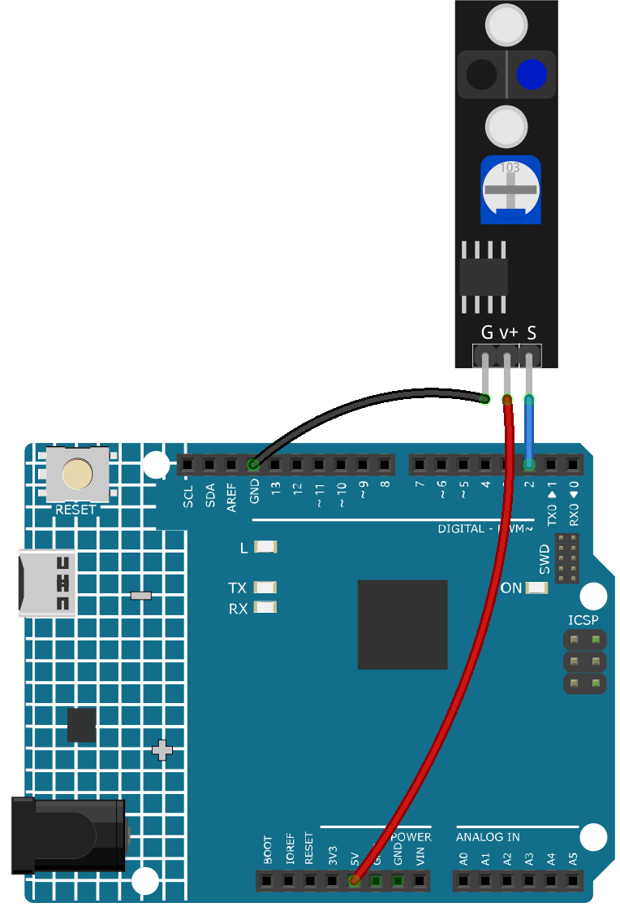

.. note::

    こんにちは、SunFounderのRaspberry Pi & Arduino & ESP32愛好家コミュニティへようこそ！Facebook上でRaspberry Pi、Arduino、ESP32についてもっと深く掘り下げ、他の愛好家と交流しましょう。

    **参加する理由は？**

    - **エキスパートサポート**：コミュニティやチームの助けを借りて、販売後の問題や技術的な課題を解決します。
    - **学び＆共有**：ヒントやチュートリアルを交換してスキルを向上させましょう。
    - **独占的なプレビュー**：新製品の発表や先行プレビューに早期アクセスしましょう。
    - **特別割引**：最新製品の独占割引をお楽しみください。
    - **祭りのプロモーションとギフト**：ギフトや祝日のプロモーションに参加しましょう。

    👉 私たちと一緒に探索し、創造する準備はできていますか？[|link_sf_facebook|]をクリックして今すぐ参加しましょう！

.. _ar_line_track:

3.4 ラインを検出する
===================================

ライン追跡モジュールは、電気テープで貼られた黒いラインなど、地面に黒いエリアがあるかどうかを検出するために使用されます。

モジュールのLEDの一つが地面に適切な赤外線光を放射し、黒い表面は光を吸収する能力が比較的強く、反射能力が弱いです。白い表面はその逆です。
反射光を検出した場合、現在の地面は白いことを意味します。検出されなかった場合、それは黒いことを意味します。

これが動作原理です。

**必要な部品**

このプロジェクトには、以下の部品が必要です。

キット全体を購入するのは非常に便利です。こちらがリンクです:

.. list-table::
    :widths: 20 20 20
    :header-rows: 1

    *   - 名前
        - このキットのアイテム
        - リンク
    *   - 3 in 1 Starter Kit
        - 380+
        - |link_3IN1_kit|

以下のリンクから個別に購入することもできます。

.. list-table::
    :widths: 30 20
    :header-rows: 1

    *   - コンポーネントの紹介
        - 購入リンク

    *   - :ref:`cpn_uno`
        - \-
    *   - :ref:`cpn_wires`
        - |link_wires_buy|
    *   - :ref:`cpn_track`
        - |link_track_buy|

**回路図**

.. image:: img/circuit_3.4_line.png

デジタルピン2はライン追跡モジュールの信号を読むために使用されます。モジュールのVCCを5Vに接続し、GNDをGNDに、OUTをデジタルピン2に接続します。

**配線図**

**コード**

.. note::

   * ``3in1-kit\learning_project\3.4.detect_the_line`` のパスの下にある ``3.4.detect_the_line.ino`` ファイルを開くことができます。
   * または、このコードを **Arduino IDE** にコピーしてください。

.. raw:: html

    <iframe src=https://create.arduino.cc/editor/sunfounder01/9795add6-c838-4a66-b484-0c39f252a7b4/preview?embed style="height:510px;width:100%;margin:10px 0" frameborder=0></iframe>

ライン追跡モジュールが黒いラインを検出すると、シリアルモニタに[1]が表示され、それ以外の場合は[0]が表示されます。
