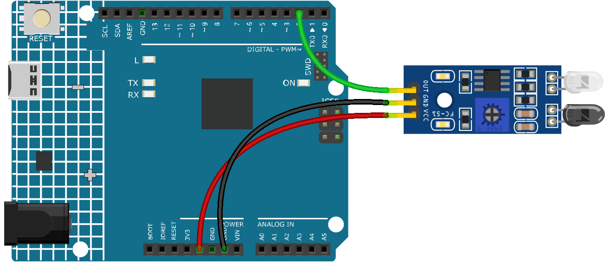

.. note:: 

    Bonjour, bienvenue dans la communauté SunFounder Raspberry Pi & Arduino & ESP32 Enthusiasts sur Facebook ! Plongez plus profondément dans Raspberry Pi, Arduino et ESP32 avec d'autres passionnés.

    **Pourquoi nous rejoindre ?**

    - **Support d'experts** : Résolvez les problèmes après-vente et les défis techniques avec l'aide de notre communauté et de notre équipe.
    - **Apprenez et partagez** : Échangez des astuces et des tutoriels pour améliorer vos compétences.
    - **Aperçus exclusifs** : Accédez en avant-première aux annonces de nouveaux produits et aperçus exclusifs.
    - **Réductions spéciales** : Profitez de réductions exclusives sur nos derniers produits.
    - **Promotions festives et cadeaux** : Participez à des concours et promotions de vacances.

    👉 Prêt à explorer et créer avec nous ? Cliquez sur [|link_sf_facebook|] et rejoignez-nous dès aujourd'hui !

.. _ar_ir_obstacle:

3.3 Détecter un obstacle
===================================

Ce module est couramment installé sur les voitures et les robots pour détecter la présence 
d'obstacles devant eux. Il est également largement utilisé dans les appareils portables, 
les robinets automatiques, et bien plus encore.

**Composants nécessaires**

Dans ce projet, nous aurons besoin des composants suivants. 

Il est très pratique d'acheter un kit complet, voici le lien : 

.. list-table::
    :widths: 20 20 20
    :header-rows: 1

    *   - Nom
        - ARTICLES DANS CE KIT
        - LIEN
    *   - 3 in 1 Starter Kit
        - 380+
        - |link_3IN1_kit|

Vous pouvez également les acheter séparément via les liens ci-dessous.

.. list-table::
    :widths: 30 20
    :header-rows: 1

    *   - INTRODUCTION DES COMPOSANTS
        - LIEN D'ACHAT

    *   - :ref:`cpn_uno`
        - \-
    *   - :ref:`cpn_wires`
        - |link_wires_buy|
    *   - :ref:`cpn_avoid`
        - |link_obstacle_avoidance_buy|

**Schéma**

.. image:: img/circuit_3.3_obstacle.png

La broche numérique 2 est utilisée pour lire le signal du module d'évitement 
d'obstacles IR. Nous connectons le VCC du module capteur IR au 5V, 
le GND au GND, et la broche OUT à la broche numérique 2.

**Câblage**

**Code**

.. note::

   * Vous pouvez ouvrir le fichier ``3.3.detect_the_obstacle.ino`` sous le chemin ``3in1-kit\learning_project\3.3.detect_the_obstacle``. 
   * Ou copiez ce code dans **Arduino IDE**.
   
.. raw:: html

    <iframe src=https://create.arduino.cc/editor/sunfounder01/535a0304-684e-481d-b85d-403911b3a4e2/preview?embed style="height:510px;width:100%;margin:10px 0" frameborder=0></iframe>

Lorsque le module d'évitement d'obstacles IR détecte quelque chose bloquant devant lui, un [0] apparaîtra sur le moniteur série ; sinon, un [1] sera affiché.
