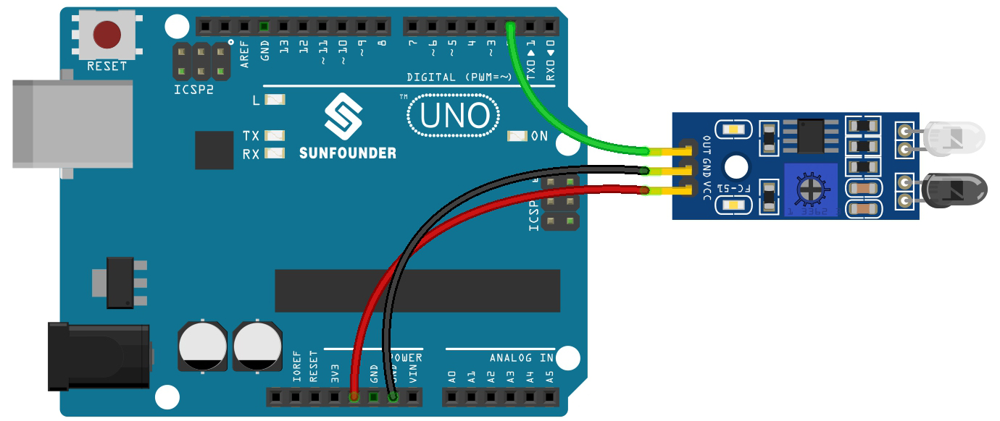

.. note::

    Ciao, benvenuto nella Community di SunFounder Raspberry Pi & Arduino & ESP32 su Facebook! Unisciti agli appassionati per approfondire Raspberry Pi, Arduino ed ESP32 insieme a noi.

    **Perché unirti?**

    - **Supporto esperto**: Risolvi problemi post-vendita e affronta sfide tecniche con l'aiuto della nostra community e del nostro team.
    - **Impara e condividi**: Scambia suggerimenti e tutorial per migliorare le tue competenze.
    - **Anteprime esclusive**: Ottieni accesso anticipato agli annunci di nuovi prodotti e anteprime esclusive.
    - **Sconti speciali**: Approfitta di sconti riservati sui nostri prodotti più recenti.
    - **Promozioni e omaggi festivi**: Partecipa a promozioni e omaggi durante le festività.

    👉 Pronto a esplorare e creare con noi? Clicca su [|link_sf_facebook|] e unisciti oggi stesso!

.. _ar_ir_obstacle:

3.3 Rileva l'Ostacolo
===================================

Questo modulo è comunemente installato su auto e robot per rilevare la
presenza di ostacoli davanti. È anche ampiamente utilizzato in dispositivi portatili,
rubinetti automatici e simili.

**Componenti necessari**

In questo progetto, abbiamo bisogno dei seguenti componenti.

È sicuramente comodo acquistare un intero kit, ecco il link:

.. list-table::
    :widths: 20 20 20
    :header-rows: 1

    *   - Nome	
        - OGGETTI IN QUESTO KIT
        - LINK
    *   - Kit Starter 3 in 1
        - 380+
        - |link_3IN1_kit|

Puoi anche acquistarli separatamente dai link qui sotto.

.. list-table::
    :widths: 30 20
    :header-rows: 1

    *   - INTRODUZIONE COMPONENTI
        - LINK DI ACQUISTO

    *   - :ref:`cpn_uno`
        - |link_Uno_R3_buy|
    *   - :ref:`cpn_wires`
        - |link_wires_buy|
    *   - :ref:`cpn_avoid`
        - |link_obstacle_avoidance_buy|

**Schema**

.. image:: img/circuit_3.3_obstacle.png

Il pin digitale 2 viene utilizzato per leggere il
segnale del Modulo di Evitamento Ostacoli IR. Colleghiamo il VCC del modulo IR
al 5V, GND al GND e OUT al pin digitale 2.

**Collegamenti**

**Codice**

.. note::

   * Puoi aprire il file ``3.3.detect_the_obstacle.ino`` nel percorso ``3in1-kit\basic_project\3.3.detect_the_obstacle``. 
   * Oppure copia questo codice nell'**Arduino IDE**.
   
   * Oppure carica il codice tramite `Arduino Web Editor <https://docs.arduino.cc/cloud/web-editor/tutorials/getting-started/getting-started-web-editor>`_.

.. raw:: html

    <iframe src=https://create.arduino.cc/editor/sunfounder01/535a0304-684e-481d-b85d-403911b3a4e2/preview?embed style="height:510px;width:100%;margin:10px 0" frameborder=0></iframe>

Quando il modulo di evitamento ostacoli IR rileva un oggetto che blocca davanti a sé, [0] apparirà sul monitor seriale, altrimenti verrà visualizzato [1].
