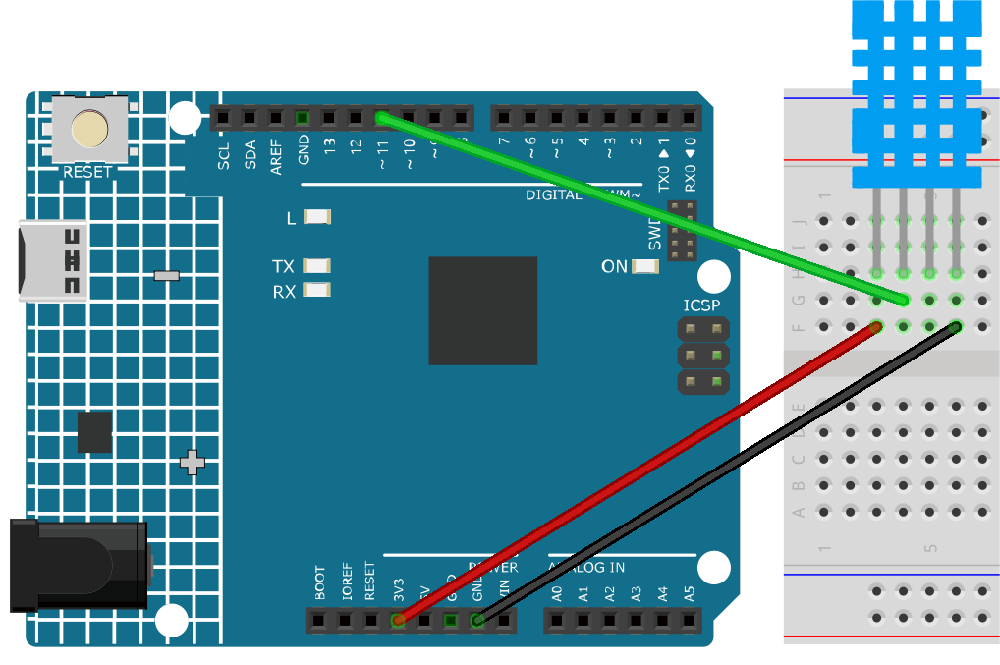

.. note::

    Hallo und willkommen in der SunFounder Raspberry Pi & Arduino & ESP32 Enthusiasten-Gemeinschaft auf Facebook! Tauchen Sie tiefer ein in die Welt von Raspberry Pi, Arduino und ESP32 mit anderen Enthusiasten.

    **Warum beitreten?**

    - **Expertenunterstützung**: Lösen Sie Nachverkaufsprobleme und technische Herausforderungen mit Hilfe unserer Gemeinschaft und unseres Teams.
    - **Lernen & Teilen**: Tauschen Sie Tipps und Anleitungen aus, um Ihre Fähigkeiten zu verbessern.
    - **Exklusive Vorschauen**: Erhalten Sie frühzeitigen Zugang zu neuen Produktankündigungen und exklusiven Einblicken.
    - **Spezialrabatte**: Genießen Sie exklusive Rabatte auf unsere neuesten Produkte.
    - **Festliche Aktionen und Gewinnspiele**: Nehmen Sie an Gewinnspielen und Feiertagsaktionen teil.

    👉 Sind Sie bereit, mit uns zu erkunden und zu erschaffen? Klicken Sie auf [|link_sf_facebook|] und treten Sie heute bei!

.. _ar_dht11:

5.11.3 Temperatur - Luftfeuchtigkeit
=======================================

Luftfeuchtigkeit und Temperatur sind sowohl in Bezug auf die physikalische Größe selbst als auch im tatsächlichen Leben der Menschen eng miteinander verbunden.
Die Temperatur und Luftfeuchtigkeit der menschlichen Umgebung beeinflussen direkt die thermoregulatorische Funktion und den Wärmeübertragungseffekt des menschlichen Körpers.
Dies hat wiederum Auswirkungen auf die Denkaktivität und den geistigen Zustand, wodurch die Effizienz unseres Lernens und Arbeitens beeinflusst wird.

Die Temperatur ist eine der sieben Grundgrößen im Internationalen Einheitensystem und dient zur Messung des Wärmezustands eines Objekts.
Celsius ist eine der weltweit am häufigsten verwendeten Temperaturskalen und wird durch das Symbol "℃" dargestellt.

Luftfeuchtigkeit bezeichnet die Konzentration von Wasserdampf in der Luft.
Die relative Luftfeuchtigkeit, die im täglichen Leben häufig verwendet wird, wird in %RH angegeben. Sie hängt eng mit der Temperatur zusammen.
Für ein bestimmtes Volumen abgeschlossenen Gases gilt: Je höher die Temperatur, desto niedriger die relative Luftfeuchtigkeit und umgekehrt.

.. image:: img/Dht11.png

Der dht11, ein digitaler Temperatur- und Luftfeuchtigkeitssensor, ist in diesem Kit enthalten. Er verwendet einen kapazitiven Luftfeuchtigkeitssensor und einen Thermistor, um die umgebende Luft zu messen und gibt ein digitales Signal am Datenpin aus.

**Benötigte Komponenten**

Für dieses Projekt benötigen wir folgende Komponenten. 

Es ist definitiv praktisch, ein komplettes Kit zu kaufen. Hier ist der Link:

.. list-table::
    :widths: 20 20 20
    :header-rows: 1

    *   - Name	
        - ARTIKEL IN DIESEM KIT
        - LINK
    *   - 3 in 1 Starter Kit
        - 380+
        - |link_3IN1_kit|

Sie können sie auch einzeln über die untenstehenden Links kaufen.

.. list-table::
    :widths: 30 20
    :header-rows: 1

    *   - KOMPONENTENBESCHREIBUNG
        - KAUF-LINK

    *   - :ref:`cpn_uno`
        - \-
    *   - :ref:`cpn_breadboard`
        - |link_breadboard_buy|
    *   - :ref:`cpn_wires`
        - |link_wires_buy|
    *   - :ref:`cpn_dht11`
        - \-

**Schaltplan**

.. image:: img/circuit_7.3_dht11.png

**Verdrahtung**

**Code**

.. note::

    * Öffnen Sie die Datei ``5.11.temperature_humidity.ino`` im Pfad ``3in1-kit\learning_project\5.11.temperature_humidity``.
    * Oder kopieren Sie diesen Code in die **Arduino IDE**.
    * Hier wird die ``DHT sensor library`` verwendet. Sie können sie aus dem **Library Manager** installieren.

        .. image:: ../img/lib_dht11.png

.. raw:: html
    
    <iframe src=https://create.arduino.cc/editor/sunfounder01/c5b4c902-f39d-45a6-9a17-1308056041a8/preview?embed style="height:510px;width:100%;margin:10px 0" frameborder=0></iframe>

Nach erfolgreichem Hochladen des Codes werden Sie sehen, dass der serielle Monitor kontinuierlich Temperatur und Luftfeuchtigkeit ausgibt. Mit der stabilen Ausführung des Programms werden diese beiden Werte immer genauer.

**Wie funktioniert das?**

#.  Bindet die Bibliothek ``DHT.h`` ein, die Funktionen zur Interaktion mit den DHT-Sensoren bereitstellt. Danach wird der Pin und der Typ für den DHT-Sensor festgelegt.

    .. code-block:: arduino

        #include "DHT.h"

        #define DHTPIN 11  // Set the pin connected to the DHT11 data pin
        #define DHTTYPE DHT11 // DHT 11 

        DHT dht(DHTPIN, DHTTYPE);

#. Initialisiert die serielle Kommunikation mit einer Baudrate von 115200 und startet den DHT-Sensor.

    .. code-block:: arduino

        void setup() {
            Serial.begin(115200);
            Serial.println("DHT11 test!");
            dht.begin();
        }

#. In der Funktion ``loop()`` werden Temperatur- und Luftfeuchtigkeitswerte vom DHT11-Sensor gelesen und im seriellen Monitor angezeigt.

    .. code-block:: arduino

        void loop() {
            // Wait a few seconds between measurements.
            delay(2000);

            // Reading temperature or humidity takes about 250 milliseconds!
            // Sensor readings may also be up to 2 seconds 'old' (it's a very slow sensor)
            float humidity = dht.readHumidity();
            // Read temperature as Celsius (the default)
            float temperture = dht.readTemperature();

            // Check if any reads failed and exit early (to try again).
            if (isnan(humidity) || isnan(temperture)) {
                Serial.println("Failed to read from DHT sensor!");
                return;
            }
            // Print the humidity and temperature
            Serial.print("Humidity: "); 
            Serial.print(humidity);
            Serial.print(" %\t");
            Serial.print("Temperature: "); 
            Serial.print(temperture);
            Serial.println(" *C");
        }

    * Mit der Funktion ``dht.readHumidity()`` wird der Luftfeuchtigkeitswert vom DHT-Sensor gelesen.
    * Mit der Funktion ``dht.readTemperature()`` wird der Temperaturwert vom DHT-Sensor gelesen.
    * Die Funktion ``isnan()`` wird verwendet, um zu überprüfen, ob die Messungen gültig sind. Wenn entweder der Luftfeuchtigkeits- oder der Temperaturwert NaN (keine Zahl) ist, zeigt dies ein fehlerhaftes Lesen vom Sensor an, und eine Fehlermeldung wird ausgegeben.

