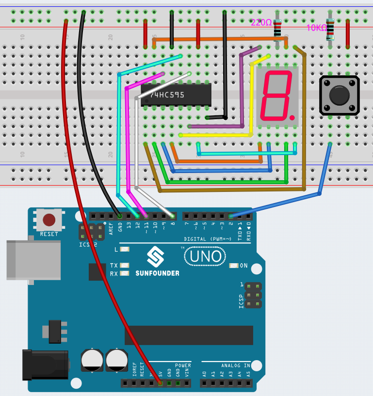

.. note::

    ¡Hola, bienvenido a la Comunidad de Aficionados a Raspberry Pi, Arduino y ESP32 de SunFounder en Facebook! Profundiza en Raspberry Pi, Arduino y ESP32 con otros entusiastas.

    **¿Por qué unirse?**

    - **Soporte de expertos**: Resuelve problemas posventa y desafíos técnicos con ayuda de nuestra comunidad y equipo.
    - **Aprender y compartir**: Intercambia consejos y tutoriales para mejorar tus habilidades.
    - **Vistas previas exclusivas**: Obtén acceso anticipado a anuncios de nuevos productos y avances.
    - **Descuentos especiales**: Disfruta de descuentos exclusivos en nuestros productos más nuevos.
    - **Promociones festivas y sorteos**: Participa en sorteos y promociones de fiestas.

    👉 ¿Listo para explorar y crear con nosotros? Haz clic en [|link_sf_facebook|] y únete hoy!

.. _ar_eeprom:

6.2 Dados Digitales
=============================

Aquí utilizamos un botón, un display de 7 segmentos y el 74hc595 para hacer un dado electrónico. 
Cada vez que se presiona el botón, se genera un número aleatorio del 1 al 6 y se muestra en el Display de 7 segmentos.

**Componentes Necesarios**

Para este proyecto, necesitamos los siguientes componentes.

Comprar un kit completo es definitivamente conveniente, aquí está el enlace:

.. list-table::
    :widths: 20 20 20
    :header-rows: 1

    *   - Nombre	
        - ELEMENTOS DE ESTE KIT
        - ENLACE
    *   - 3 in 1 Starter Kit
        - 380+
        - |link_3IN1_kit|

También puedes comprarlos por separado en los siguientes enlaces.

.. list-table::
    :widths: 30 20
    :header-rows: 1

    *   - INTRODUCCIÓN DEL COMPONENTE
        - ENLACE DE COMPRA

    *   - :ref:`cpn_uno`
        - |link_Uno_R3_buy|
    *   - :ref:`cpn_breadboard`
        - |link_breadboard_buy|
    *   - :ref:`cpn_wires`
        - |link_wires_buy|
    *   - :ref:`cpn_resistor`
        - |link_resistor_buy|
    *   - :ref:`cpn_button`
        - |link_button_buy|
    *   - :ref:`cpn_74hc595`
        - |link_74hc595_buy|
    *   - :ref:`cpn_7_segment`
        - |link_7segment_buy|

**Esquemático**

.. image:: img/circuit_8.9_eeprom.png

**Cableado**

**Código**

.. note::

    * Abre el archivo ``6.2.electronic_dice.ino`` en la ruta ``3in1-kit\basic_project\6.2.electronic_dice``.
    * O copia este código en **Arduino IDE**.
    
    * O sube el código a través del `Arduino Web Editor <https://docs.arduino.cc/cloud/web-editor/tutorials/getting-started/getting-started-web-editor>`_.

.. raw:: html
    
    <iframe src=https://create.arduino.cc/editor/sunfounder01/8d8ad340-b1de-4518-917b-caaf07e4baf4/preview?embed style="height:510px;width:100%;margin:10px 0" frameborder=0></iframe>

Cuando el código se haya cargado con éxito, el Display de 7 segmentos mostrará del 0-7 en un desplazamiento rápido, y cuando presiones el botón, mostrará un número aleatorio y dejará de desplazarse. El desplazamiento del display comienza nuevamente cuando presionas el botón otra vez.

**¿Cómo funciona?**

Este proyecto se basa en :ref:`ar_segment` con un botón para iniciar/pausar el desplazamiento en el Display de 7 segmentos.

#. Inicializa cada pin y lee el valor del botón.

    .. code-block:: arduino

        void setup ()
        {
            ...
            attachInterrupt(digitalPinToInterrupt(buttonPin), rollDice, FALLING);
        }

    * Aquí se utiliza la interrupción para leer el estado del botón. El valor predeterminado de ``buttonPin`` es bajo, que cambia de bajo a alto cuando se presiona el botón.
    * ``rollDice`` representa la función que se llamará cuando se active la interrupción, se utiliza para alternar el valor de la variable ``state``.
    * ``FALLING`` significa que la interrupción se activa cuando el ``buttonPin`` pasa de bajo a alto.

#. Cuando la variable ``state`` es 0, se llama a la función ``showNumber()`` para hacer que el Display de 7 segmentos muestre aleatoriamente un número entre 1 y 7.

    .. code-block:: arduino

        void loop()
        {
            if (state == 0) {
                showNumber((int)random(1, 7));
                delay(50);
            }
        }

#. Acerca de la función ``rollDice()``.

    .. code-block:: arduino

        void rollDice() {
            state = !state;
        }
    
    Cuando se llama a esta función, alterna el valor de state, como 1 la última vez y 0 esta vez.

#. Acerca de la función ``showNumber()``.

    .. code-block:: arduino

        void showNumber(int num) {
            digitalWrite(STcp, LOW); //ground ST_CP and hold low for as long as you are transmitting
            shiftOut(DS, SHcp, MSBFIRST, datArray[num]);
            //return the latch pin high to signal chip that it
            //no longer needs to listen for information
            digitalWrite(STcp, HIGH); //pull the ST_CPST_CP to save the data
        }
    
    Este es el código dentro de ``loop()`` en el proyecto :ref:`ar_segment` en la función ``showNumber()``.
