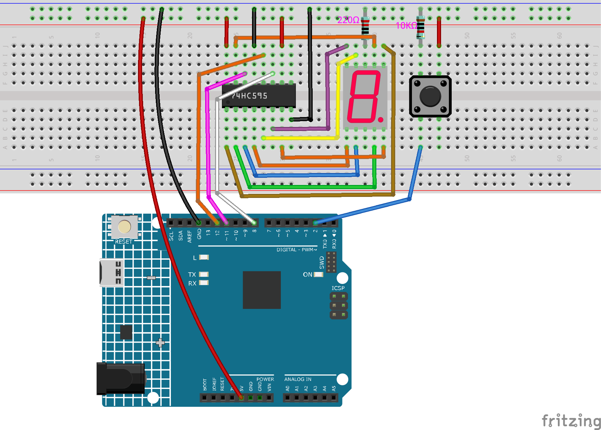

.. _ar_eeprom:

6.2 Digitaler Würfel
=============================

Hier verwenden wir einen Taster, ein 7-Segment-Display und den 74hc595, um einen elektronischen Würfel zu erstellen.
Jedes Mal, wenn der Taster gedrückt wird, wird eine zufällige Zahl zwischen 1 und 6 erzeugt und auf dem 7-Segment-Display angezeigt.

**Benötigte Komponenten**

Für dieses Projekt benötigen wir die folgenden Komponenten.

Es ist definitiv praktisch, ein komplettes Set zu kaufen, hier ist der Link:

.. list-table::
    :widths: 20 20 20
    :header-rows: 1

    *   - Name	
        - ARTIKEL IN DIESEM KIT
        - LINK
    *   - 3 in 1 Starter Kit
        - 380+
        - |link_3IN1_kit|

Sie können sie auch einzeln über die untenstehenden Links kaufen.

.. list-table::
    :widths: 30 20
    :header-rows: 1

    *   - KOMPONENTENBESCHREIBUNG
        - KAUF-LINK

    *   - :ref:`cpn_uno`
        - \-
    *   - :ref:`cpn_breadboard`
        - |link_breadboard_buy|
    *   - :ref:`cpn_wires`
        - |link_wires_buy|
    *   - :ref:`cpn_resistor`
        - |link_resistor_buy|
    *   - :ref:`cpn_button`
        - |link_button_buy|
    *   - :ref:`cpn_74hc595`
        - |link_74hc595_buy|
    *   - :ref:`cpn_7_segment`
        - |link_7segment_buy|

**Schaltplan**

.. image:: img/circuit_8.9_eeprom.png

**Verdrahtung**

**Code**

.. note::

    * Öffnen Sie die Datei ``6.2.electronic_dice.ino`` im Pfad ``3in1-kit\learning_project\6.2.electronic_dice``.
    * Oder kopieren Sie diesen Code in die **Arduino IDE**.
    

.. raw:: html
    
    <iframe src=https://create.arduino.cc/editor/sunfounder01/8d8ad340-b1de-4518-917b-caaf07e4baf4/preview?embed style="height:510px;width:100%;margin:10px 0" frameborder=0></iframe>

Nachdem der Code erfolgreich hochgeladen wurde, zeigt das 7-Segment-Display schnell die Zahlen 0-7 an. Wenn Sie den Taster drücken, wird eine zufällige Zahl angezeigt und das schnelle Scrollen stoppt. Das schnelle Scrollen startet wieder, wenn Sie den Taster erneut drücken.

**Wie funktioniert das?**

Dieses Projekt basiert auf :ref:`ar_segment` mit einem Taster, um das Scroll-Display auf dem 7-Segment-Display zu starten/pausieren.

1. Initialisieren Sie jeden Pin und lesen Sie den Wert des Tasters.

    .. code-block:: arduino

        void setup ()
        {
            ...
            attachInterrupt(digitalPinToInterrupt(buttonPin), rollDice, FALLING);
        }

    * Das Interrupt wird hier verwendet, um den Zustand des Tasters zu lesen. Der Standardwert von ``buttonPin`` ist niedrig, der sich ändert, wenn der Taster gedrückt wird.
    * ``rollDice`` stellt die Funktion dar, die aufgerufen wird, wenn das Interrupt ausgelöst wird. Sie dient dazu, den Wert der Variablen ``state`` umzuschalten.
    * ``FALLING`` bedeutet, dass das Interrupt ausgelöst wird, wenn der ``buttonPin`` von niedrig auf hoch wechselt.

2. Wenn die Variable ``state`` 0 ist, wird die Funktion ``showNumber()`` aufgerufen, um das 7-Segment-Display zufällig eine Zahl zwischen 1 und 7 anzeigen zu lassen.

    .. code-block:: arduino

        void loop()
        {
            if (state == 0) {
                showNumber((int)random(1, 7));
                delay(50);
            }
        }

3. Über die Funktion ``rollDice()``.

    .. code-block:: arduino

        void rollDice() {
            state = !state;
        }
    
    Wenn diese Funktion aufgerufen wird, wechselt sie den Wert von state, zum Beispiel 1 beim letzten Mal und 0 diesmal.

4. Über die Funktion ``showNumber()``.

    .. code-block:: arduino

        void showNumber(int num) {
            digitalWrite(STcp, LOW); //ground ST_CP and hold low for as long as you are transmitting
            shiftOut(DS, SHcp, MSBFIRST, datArray[num]);
            //return the latch pin high to signal chip that it
            //no longer needs to listen for information
            digitalWrite(STcp, HIGH); //pull the ST_CPST_CP to save the data
        }
    
    Dies ist der Code innerhalb der ``loop()`` im Projekt :ref:`ar_segment` in der Funktion ``showNumber()``.
