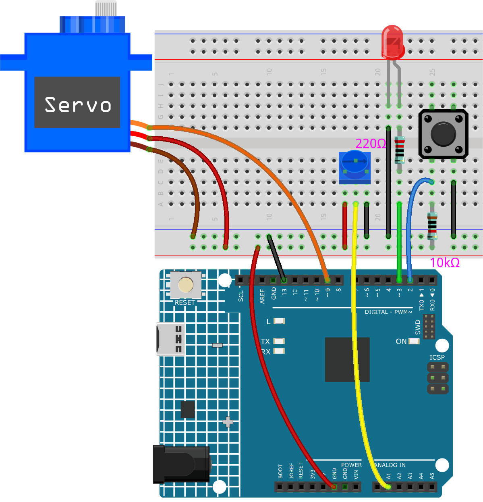

.. _ar_74hc_7seg:

5.15 EEPROM
==============

`EEPROM <https://docs.arduino.cc/learn/built-in-libraries/eeprom>`_ はメモリであり、メインコントロールボードをオフにしてもその中のデータは消去されません。これを使用して、いくつかのデータを記録し、次回電源を入れたときにそれを読み取ることができます。

例として、毎日のジャンプロープの回数を記録するスポーツカウンタを作成することができます。

また、1つのプログラムでデータを書き込み、別のプログラムでそれを読み取ることもできます。例えば、車のプロジェクトに取り組んでいるとき、2つのモータの速度が一致しない場合、モータ速度の補正値を記録するキャリブレーションプログラムを書くことができます。

**必要な部品**

このプロジェクトでは、以下のコンポーネントが必要です。

キット全体を購入するのは確かに便利です、リンクはこちら：

.. list-table::
    :widths: 20 20 20
    :header-rows: 1

    *   - 名前
        - このキットのアイテム
        - リンク
    *   - 3 in 1 Starter Kit
        - 380+
        - |link_3IN1_kit|

以下のリンクから個別に購入することもできます。

.. list-table::
    :widths: 30 20
    :header-rows: 1

    *   - コンポーネントの紹介
        - 購入リンク

    *   - :ref:`cpn_uno`
        - \-
    *   - :ref:`cpn_breadboard`
        - |link_breadboard_buy|
    *   - :ref:`cpn_wires`
        - |link_wires_buy|
    *   - :ref:`cpn_resistor`
        - |link_resistor_buy|
    *   - :ref:`cpn_led`
        - |link_led_buy|
    *   - :ref:`cpn_servo`
        - |link_servo_buy|
    *   - :ref:`cpn_button`
        - |link_button_buy|
    *   - :ref:`cpn_potentiometer`
        - |link_potentiometer_buy|

**回路図**

.. image:: img/circuit_515_eeprom.png

**配線図**

**コード**

.. note::

    * ``3in1-kit\learning_project\5.15.eeproom`` のパスの下にある ``5.15.eeproom.ino`` ファイルを開きます。
    * または、このコードを **Arduino IDE** にコピーします。

.. raw:: html

    <iframe src=https://create.arduino.cc/editor/sunfounder01/7378341f-9c1a-4171-814f-c76c109e1e67/preview?embed style="height:510px;width:100%;margin:10px 0" frameborder=0></iframe>

この回路を使用するには、ボタンを押して記録を開始し、ポテンショメータを通じて所望の情報を入力します。これで、ボードはあなたのアクションを無限に繰り返します（そして、それぞれの繰り返しでLEDが点滅します）新しいアクションを記録するために再びボタンを押すまで。resolutionとrecordTimeの値を変更することで、記録される時間の長さを変更することもできます。

**どのように動作するのか？**

#. ``EEPROM.h`` ライブラリをインポートし、EEPROMメモリを初期化します。

    .. code-block:: arduino

        ...
        #include <EEPROM.h>//記録された値を保存するために使用

        ...
        float resolution = 1000;//EEPROM.length() より小さくする必要があります
        float recordTime = 5; //遅延時間
        bool recording = false;
        ...
    
    ``/EEPROM.length() より小さくする必要があります`` の点に注意してください。 ``setup()`` でボードのEEPROMのメモリを印刷します。あなたのボードの場合は1024であるはずです。異なるボードを使用している場合、変数 ``resolution`` の値を変更できます。

#. あなたのボードのEEPROMメモリを印刷します。

    .. code-block:: arduino

        void setup() {
            ...
            Serial.begin(9600);
            //Serial.println(EEPROM.length());
        }

    ボードのEEPROMメモリのサイズを見つけるために、 ``Serial.println(EEPROM.read(i))`` の行のコメントを外します。これにより、シリアルモニタにEEPROMのサイズが印刷され、変数 ``resolution`` の値をそれに応じて変更できます。

#. ボタンの押下が検出されると、録音が開始され、必要な情報がポテンショメータを介して入力されます。ボタンを再度押すまで、ボードはあなたのアクションを無限に繰り返します（そして、LEDがそれぞれの繰り返しで点滅します）。

    .. code-block:: arduino

        void loop() {
            if (recording == true) {//record
                for (int i = 1; i <= resolution; i++) {
                    digitalWrite(ledPin, HIGH); //ライトステータスLED
                    int val = map(analogRead(A0), 0, 1023, 0, 180);
                    EEPROM.write(i, val);
                    //Serial.println(EEPROM.read(i));
                    myServo.write(val);
                    delay(recordTime);
                }
                digitalWrite(ledPin, LOW); // ステータス LED をオフにする
                delay(1000);//人のために時間を与える
                recording = false;
            }
            else {
                for (int i = 1; i <= resolution; i++) {//playback
                    if (digitalRead(buttonPin) == 0) {// 再生を停止し、新しい値を記録します
                        recording = true;
                        break;
                    }
                    int readval = EEPROM.read(i);
                    myServo.write(readval);
                    //Serial.println(readval);
                    delay(recordTime);
                }
                digitalWrite(ledPin, HIGH); // 新しいリピートを表示する
                delay(100);
                digitalWrite(ledPin, LOW);
            }
        }

    * ボタンが押されると、変数 ``recording`` をtrueにします。
    * 変数 ``recording`` がtrueの場合、メモリ範囲でのアクションの録音を開始します。
    * ポテンショメータの値を読み取り、それを0-180にマッピングしてEEPROMに保存し、サーボの回転を制御します。
    * 録音の開始時にLEDが点灯し、終了時に消灯します。
    * LEDの短い点滅で記録されたアクションを繰り返します。

#. ``EEPROM`` ライブラリについて。

    以下は、その機能の一部です。

    * ``write(address,value)``: EEPROMにバイトを書き込みます。

        * ``address``: 0から始まる書き込む場所（int）
        * ``value``: 0から255までの書き込む値（byte）
        * EEPROMの書き込みには3.3 msかかります。EEPROMメモリの指定された寿命は100,000回の書き込み/消去サイクルなので、頻繁に書き込む際は注意が必要です。

    * ``Read(address)``: EEPROMからバイトを読み取ります。書き込まれていない場所の値は255です。

    * ``update(address,value)``: EEPROMにバイトを書き込みます。書き込まれる値は、同じアドレスに既に保存されている値と異なる場合のみです。

        * EEPROMの書き込みには3.3 msかかります。データが頻繁に変更されない場合、この関数をwrite()の代わりに使用することで、サイクルを節約できます。

    * ``EEPROM.put(address, data)``: EEPROMに任意のデータ型やオブジェクトを書き込みます。

        * ``address``: 0から始まる読み取る場所（int）。
        * ``data``: 読み取るデータ、プリミティブ型（例: float）やカスタム構造体が可能。
        * この関数はEEPROM.update()を使用して書き込みを行うので、値が変わらない場合は書き込みを行いません。

    * ``EEPROM.get(address, data)``: EEPROMから任意のデータ型やオブジェクトを読み取ります。

        * ``address``: 0から始まる読み取る場所（int）。
        * ``data``: 読み取るデータ、プリミティブ型（例: float）やカスタム構造体が可能。

