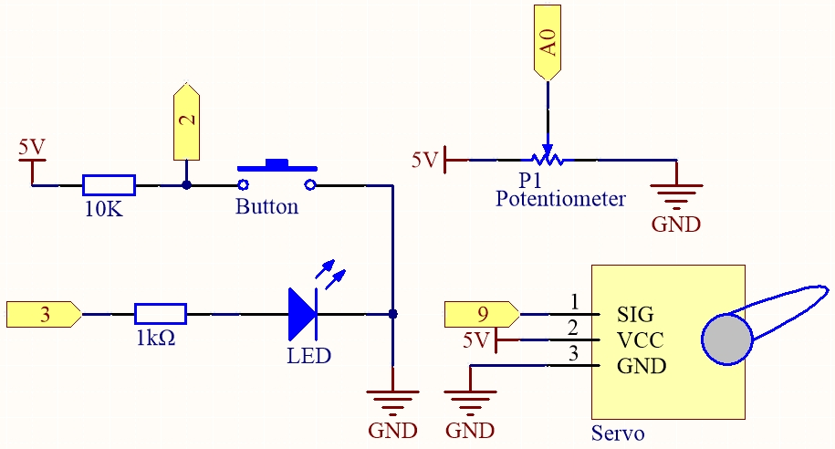

.. _ar_74hc_7seg:

5.15 EEPROM
===========

`EEPROM <https://docs.arduino.cc/learn/built-in-libraries/eeprom>`_ est une mémoire, donc les données qu'elle stocke ne seront pas effacées lorsque la carte de contrôle principale est éteinte. Vous pouvez l'utiliser pour enregistrer certaines données et les lire la prochaine fois que vous l'allumez.

Par exemple, vous pouvez créer un compteur de sport qui suit le nombre de sauts à la corde que vous faites chaque jour.

Vous pouvez également y écrire des données dans un programme et les lire dans un autre. Par exemple, lorsque vous travaillez sur un projet de voiture, les vitesses des deux moteurs sont incohérentes. Vous pouvez écrire un programme de calibration pour enregistrer la valeur de compensation de la vitesse du moteur.

**Composants requis**

Pour ce projet, nous aurons besoin des composants suivants.

Il est certainement pratique d'acheter un kit complet, voici le lien :

.. list-table::
    :widths: 20 20 20
    :header-rows: 1

    *   - Nom	
        - ÉLÉMENTS DE CE KIT
        - LIEN
    *   - 3 in 1 Starter Kit
        - 380+
        - |link_3IN1_kit|

Vous pouvez également les acheter séparément via les liens ci-dessous.

.. list-table::
    :widths: 30 20
    :header-rows: 1

    *   - INTRODUCTION DES COMPOSANTS
        - LIEN D'ACHAT

    *   - :ref:`cpn_uno`
        - |link_Uno_R3_buy|
    *   - :ref:`cpn_breadboard`
        - |link_breadboard_buy|
    *   - :ref:`cpn_wires`
        - |link_wires_buy|
    *   - :ref:`cpn_resistor`
        - |link_resistor_buy|
    *   - :ref:`cpn_led`
        - |link_led_buy|
    *   - :ref:`cpn_servo`
        - |link_servo_buy|
    *   - :ref:`cpn_button`
        - |link_button_buy|
    *   - :ref:`cpn_potentiometer`
        - |link_potentiometer_buy|

**Schéma**

**Câblage**

.. image:: img/eeprom_servo.png

**Code**

.. note::

    * Ouvrez le fichier ``5.15.eeproom.ino`` situé dans le dossier ``3in1-kit\basic_project\5.15.eeproom``.
    * Ou copiez ce code dans **Arduino IDE**.
    
    * Ou téléversez le code via l'`Éditeur Web Arduino <https://docs.arduino.cc/cloud/web-editor/tutorials/getting-started/getting-started-web-editor>`_.

.. raw:: html

    <iframe src=https://create.arduino.cc/editor/sunfounder01/7378341f-9c1a-4171-814f-c76c109e1e67/preview?embed style="height:510px;width:100%;margin:10px 0" frameborder=0></iframe>

Pour utiliser ce circuit, vous appuyez simplement sur le bouton pour commencer l'enregistrement et entrer les informations souhaitées via un potentiomètre. Désormais, la carte répétera vos actions indéfiniment (et fera clignoter une LED à chaque itération) jusqu'à ce que vous appuyiez à nouveau sur le bouton pour enregistrer de nouvelles actions. Vous pouvez également varier la durée de l'enregistrement en changeant les valeurs de résolution et de recordTime.

**Comment ça fonctionne ?**

#. Importez la bibliothèque ``EEPROM.h`` et initialisez la mémoire EEPROM.

    .. code-block:: arduino

        ...
        #include <EEPROM.h>//used to store recorded values

        ...
        float resolution = 1000;//MUST be less than EEPROM.length()
        float recordTime = 5; //delay time
        bool recording = false;
        ...
    
    Veuillez noter que ``/DOIT être inférieur à EEPROM.length()``, dans ``setup()`` il imprimera la mémoire de l'EEPROM de votre carte, qui devrait être 1024 pour la carte SunFounder R3. Si vous utilisez une autre carte, vous pouvez changer la valeur de la variable ``resolution``.

#. Imprimez la mémoire EEPROM de votre carte.

    .. code-block:: arduino

        void setup() {
            ...
            Serial.begin(9600);
            //Serial.println(EEPROM.length());
        }

    Pour trouver la taille de la mémoire EEPROM de votre carte, décommentez la ligne ``Serial.println(EEPROM.read(i))``. Cela imprimera la taille de l'EEPROM dans le moniteur série, et vous pourrez changer la valeur de la variable ``resolution`` en conséquence.

#. Dès qu'une pression sur un bouton est détectée, l'enregistrement commence et les informations requises sont entrées via un potentiomètre. Maintenant, la carte répète votre action indéfiniment (et fait clignoter une LED à chaque répétition) jusqu'à ce que vous appuyiez à nouveau sur le bouton, enregistrant une nouvelle action.

    .. code-block:: arduino

        void loop() {
            if (recording == true) {//record
                for (int i = 1; i <= resolution; i++) {
                    digitalWrite(ledPin, HIGH); //light status led
                    int val = map(analogRead(A0), 0, 1023, 0, 180);
                    EEPROM.write(i, val);
                    //Serial.println(EEPROM.read(i));
                    myServo.write(val);
                    delay(recordTime);
                }
                digitalWrite(ledPin, LOW); //turn off status led
                delay(1000);//give time for person
                recording = false;
            }
            else {
                for (int i = 1; i <= resolution; i++) {//playback
                    if (digitalRead(buttonPin) == 0) {//stop playback and record new values
                        recording = true;
                        break;
                    }
                    int readval = EEPROM.read(i);
                    myServo.write(readval);
                    //Serial.println(readval);
                    delay(recordTime);
                }
                digitalWrite(ledPin, HIGH); //show a new repeat
                delay(100);
                digitalWrite(ledPin, LOW);
            }
        }

    * Rendez la variable ``recording`` vraie lorsque le bouton est pressé.
    * Lorsque la variable ``recording`` est vraie, commencez à enregistrer l'action dans la plage de mémoire.
    * Lisez la valeur du potentiomètre et mappez-la de 0 à 180 pour la stocker dans l'EEPROM et contrôler la rotation du servo.
    * La LED s'allume au début de l'enregistrement et s'éteint à la fin.
    * Répétez l'action enregistrée avec un clignotement rapide de la LED pour vous rappeler une nouvelle répétition.

#. À propos de la bibliothèque ``EEPROM``.

    Voici certaines de ses fonctions.
        
    * ``write(address,value)`` : Écrivez un octet dans l'EEPROM.

        * ``address`` : l'emplacement où écrire, à partir de 0 (int)
        * ``value`` : la valeur à écrire, de 0 à 255 (byte)
        * Une écriture EEPROM prend 3.3 ms pour s'achever. La mémoire EEPROM a une durée de vie spécifiée de 100,000 cycles d'écriture/effacement, donc vous devrez peut-être faire attention à la fréquence à laquelle vous écrivez dedans.

    * ``Read(address)`` : Lit un octet de l'EEPROM. Les emplacements qui n'ont jamais été écrits ont une valeur de 255.

    * ``update(address,value)`` : Écrivez un octet dans l'EEPROM. La valeur est écrite seulement si elle diffère de celle déjà enregistrée à la même adresse.

        * Une écriture EEPROM prend 3.3 ms pour s'achever. La mémoire EEPROM a une durée de vie spécifiée de 100,000 cycles d'écriture/effacement, donc l'utilisation de cette fonction au lieu de write() peut économiser des cycles si les données écrites ne changent pas souvent.

    * ``EEPROM.put(address, data)`` : Écrivez n'importe quel type de données ou objet dans l'EEPROM.

        * ``address`` : l'emplacement à lire, à partir de 0 (int).
        * ``data`` : les données à lire, peuvent être un type primitif (par exemple, float) ou une structure personnalisée.
        * Cette fonction utilise EEPROM.update() pour effectuer l'écriture, donc elle ne réécrit pas la valeur si elle n'a pas changé.

    * ``EEPROM.get(address, data)`` : Lisez n'importe quel type de données ou objet de l'EEPROM.

        * ``address`` : l'emplacement à lire, à partir de 0 (int).
        * ``data`` : les données à lire, peuvent être un type primitif (par exemple, float) ou une structure personnalisée.

