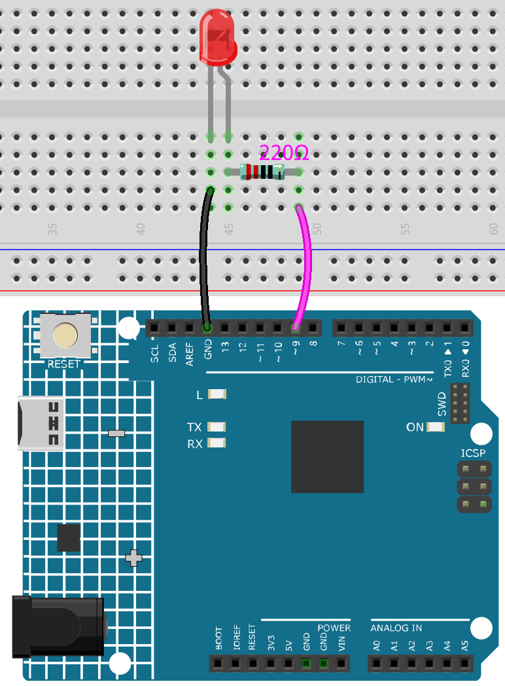

.. note:: 
 
    Bonjour, bienvenue dans la communauté SunFounder Raspberry Pi & Arduino & ESP32 Enthusiasts sur Facebook ! Plongez plus profondément dans Raspberry Pi, Arduino et ESP32 avec d'autres passionnés.

    **Pourquoi nous rejoindre ?**

    - **Assistance d'experts** : Résolvez les problèmes après-vente et les défis techniques avec l'aide de notre communauté et de notre équipe.
    - **Apprendre et partager** : Échangez des conseils et des tutoriels pour améliorer vos compétences.
    - **Aperçus exclusifs** : Accédez en avant-première aux annonces de nouveaux produits et aux aperçus.
    - **Réductions spéciales** : Profitez de réductions exclusives sur nos nouveaux produits.
    - **Promotions festives et cadeaux** : Participez à des cadeaux et à des promotions saisonnières.

    👉 Prêt à explorer et à créer avec nous ? Cliquez sur [|link_sf_facebook|] et rejoignez-nous dès aujourd'hui !

.. _ar_fading:

2.1 Atténuation
=================

Ce projet est similaire à :ref:`ar_blink`, à la différence près du type de signal.
Le premier permet d’allumer ou d’éteindre une LED en sortant un signal numérique (0&1), tandis que ce projet consiste à contrôler la luminosité de la LED en sortant un signal analogique.

**Composants nécessaires**

Dans ce projet, nous avons besoin des composants suivants. 

Il est très pratique d'acheter un kit complet, voici le lien : 

.. list-table::
    :widths: 20 20 20
    :header-rows: 1

    *   - Nom	
        - ÉLÉMENTS DANS CE KIT
        - LIEN
    *   - Kit de démarrage 3 en 1
        - 380+
        - |link_3IN1_kit|

Vous pouvez également les acheter séparément via les liens ci-dessous.

.. list-table::
    :widths: 30 20
    :header-rows: 1

    *   - INTRODUCTION DES COMPOSANTS
        - LIEN D'ACHAT

    *   - :ref:`cpn_uno`
        - \-
    *   - :ref:`cpn_breadboard`
        - |link_breadboard_buy|
    *   - :ref:`cpn_wires`
        - |link_wires_buy|
    *   - :ref:`cpn_resistor`
        - |link_resistor_buy|
    *   - :ref:`cpn_led`
        - |link_led_buy|

**Schéma**

.. image:: img/circuit_1.1_led.png

**Câblage**

**Code**

.. note::

   * Vous pouvez ouvrir le fichier ``2.1.fading.ino`` dans le répertoire ``3in1-kit\learning_project\2.analogWrite\2.1.fading``. 
   * Ou copiez ce code dans **Arduino IDE**.
   
   

.. raw:: html
    
    <iframe src=https://create.arduino.cc/editor/sunfounder01/8a7e52a4-fcb3-4c3b-98ff-f3f657822d72/preview?embed style="height:510px;width:100%;margin:10px 0" frameborder=0></iframe>
    
Après avoir téléchargé le code avec succès, vous pourrez observer la LED respirer.
