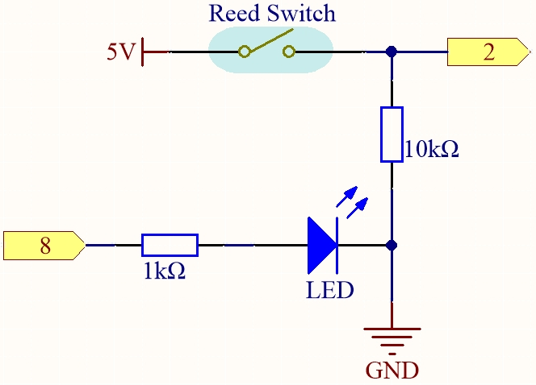
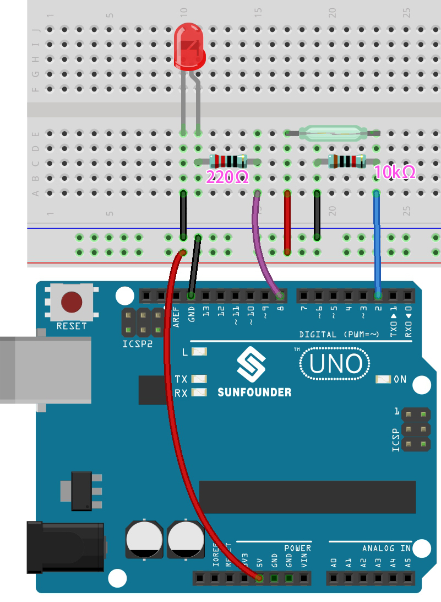

.. _ar_if_else:

5.1 If else
==============

Usually we use conditional judgment to complete the most basic reality interaction projects.
Here, we build a door detection system with reed switch and LED to show this logic.

Fix the magnet on one side of the door and the reed switch (with circuit) on the other side of the door.
When the door is closed, the magnet is close to the reed switch, which will turn it on.

**Schematic**

**Wiring**

* :ref:`cpn_uno`
* :ref:`cpn_breadboard`
* :ref:`cpn_wires`
* :ref:`cpn_resistor`
* :ref:`cpn_led`
* :ref:`cpn_reed`

**Code**

.. note::

    * Open the ``5.1.if_else.ino`` file under the path of ``3in1-kit\basic_project\5.1.if_else``.
    * Or copy this code into **Arduino IDE**.
    
    * Or upload the code through the `Arduino Web Editor <https://docs.arduino.cc/cloud/web-editor/tutorials/getting-started/getting-started-web-editor>`_.

.. raw:: html
    
    <iframe src=https://create.arduino.cc/editor/sunfounder01/c7bf6236-1276-45a0-8d34-008d2d838476/preview?embed style="height:510px;width:100%;margin:10px 0" frameborder=0></iframe>
    
After the code is uploaded successfully, if you do not close the door, the LED will light up, prompting you to close the door.

By the way, if we need the opposite effect (lighting up the LED when the door is closed), we just need to modify the condition in the ``if``.

* `if else <https://www.arduino.cc/reference/en/language/structure/control-structure/else/>`_

    The ``if else`` allows greater control over the flow of code than the basic if statement, by allowing multiple tests to be grouped.