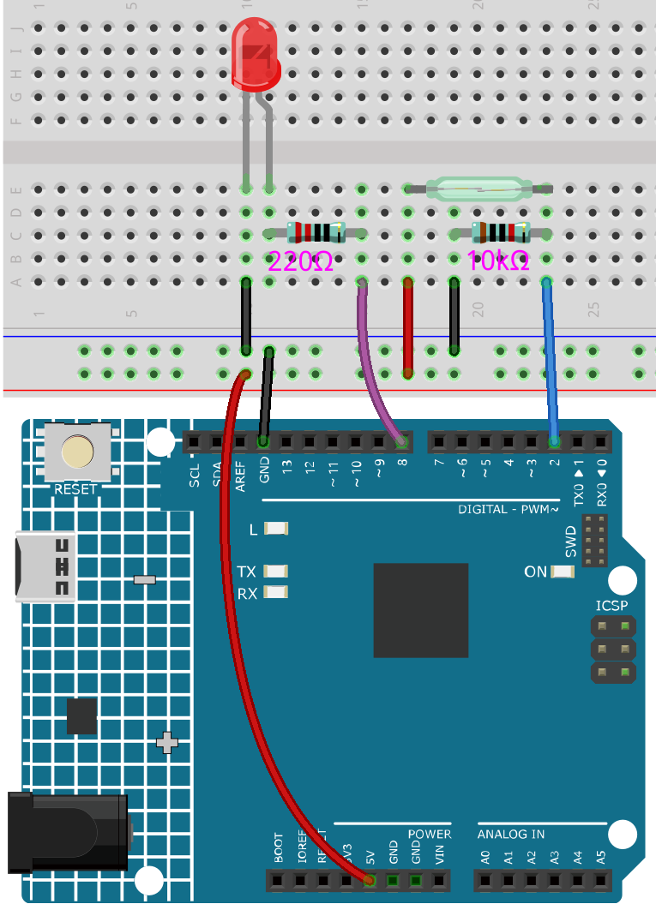

.. note::

    Hello, welcome to the SunFounder Raspberry Pi & Arduino & ESP32 Enthusiasts Community on Facebook! Dive deeper into Raspberry Pi, Arduino, and ESP32 with fellow enthusiasts.

    **Why Join?**

    - **Expert Support**: Solve post-sale issues and technical challenges with help from our community and team.
    - **Learn & Share**: Exchange tips and tutorials to enhance your skills.
    - **Exclusive Previews**: Get early access to new product announcements and sneak peeks.
    - **Special Discounts**: Enjoy exclusive discounts on our newest products.
    - **Festive Promotions and Giveaways**: Take part in giveaways and holiday promotions.

    👉 Ready to explore and create with us? Click [|link_sf_facebook|] and join today!

.. _ar_if_else:

5.1 If else
==============

Usually we use conditional judgment to complete the most basic reality interaction projects.
Here, we build a door detection system with reed switch and LED to show this logic.

Fix the magnet on one side of the door and the reed switch (with circuit) on the other side of the door.
When the door is closed, the magnet is close to the reed switch, which will turn it on.

**Required Components**

In this project, we need the following components. 

It's definitely convenient to buy a whole kit, here's the link: 

.. list-table::
    :widths: 20 20 20
    :header-rows: 1

    *   - Name	
        - ITEMS IN THIS KIT
        - LINK
    *   - 3 in 1 Starter Kit
        - 380+
        - |link_3IN1_kit|

You can also buy them separately from the links below.

.. list-table::
    :widths: 30 20
    :header-rows: 1

    *   - COMPONENT INTRODUCTION
        - PURCHASE LINK

    *   - :ref:`cpn_uno`
        - \-
    *   - :ref:`cpn_breadboard`
        - |link_breadboard_buy|
    *   - :ref:`cpn_wires`
        - |link_wires_buy|
    *   - :ref:`cpn_resistor`
        - |link_resistor_buy|
    *   - :ref:`cpn_led`
        - |link_led_buy|
    *   - :ref:`cpn_reed`
        - \-

**Schematic**

.. image:: img/circuit_8.1_ifelse.png

**Wiring**

**Code**

.. note::

    * Open the ``5.1.if_else.ino`` file under the path of ``3in1-kit\learning_project\5.1.if_else``.
    * Or copy this code into **Arduino IDE**.
    
    

.. raw:: html
    
    <iframe src=https://create.arduino.cc/editor/sunfounder01/c7bf6236-1276-45a0-8d34-008d2d838476/preview?embed style="height:510px;width:100%;margin:10px 0" frameborder=0></iframe>
    
After the code is uploaded successfully, if you do not close the door, the LED will light up, prompting you to close the door.

By the way, if we need the opposite effect (lighting up the LED when the door is closed), we just need to modify the condition in the ``if``.

* `if else <https://www.arduino.cc/reference/en/language/structure/control-structure/else/>`_

    The ``if else`` allows greater control over the flow of code than the basic if statement, by allowing multiple tests to be grouped.