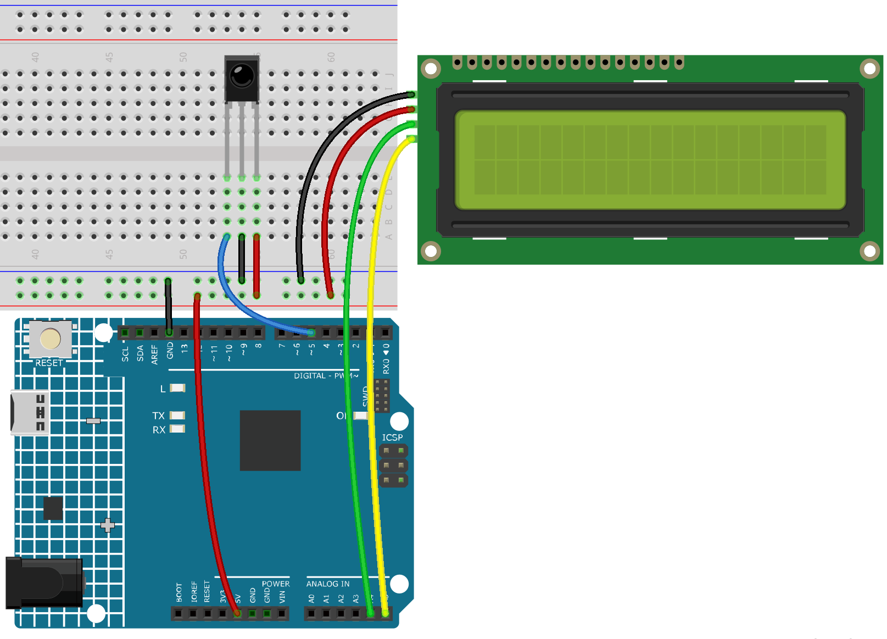

.. note::

    Bonjour, bienvenue dans la communauté SunFounder Raspberry Pi & Arduino & ESP32 Enthusiasts sur Facebook ! Plongez dans le monde de Raspberry Pi, Arduino et ESP32 avec d'autres passionnés.

    **Pourquoi nous rejoindre ?**

    - **Support d'experts** : Résolvez les problèmes après-vente et les défis techniques avec l'aide de notre communauté et de notre équipe.
    - **Apprendre et partager** : Échangez des conseils et des tutoriels pour améliorer vos compétences.
    - **Aperçus exclusifs** : Accédez en avant-première aux annonces de nouveaux produits et aux aperçus.
    - **Réductions spéciales** : Profitez de réductions exclusives sur nos nouveaux produits.
    - **Promotions festives et cadeaux** : Participez à des cadeaux et à des promotions festives.

    👉 Prêt à explorer et à créer avec nous ? Cliquez sur [|link_sf_facebook|] et rejoignez-nous dès aujourd'hui !

.. _ar_guess_number:

6.6 Devinez le nombre
========================

"Deviner le nombre" est un jeu amusant où vous et vos amis tour à tour saisissez un nombre 
(de 0 à 99). La plage de nombres devient plus petite à chaque saisie jusqu'à ce qu'un joueur 
trouve le bon numéro. Ce joueur perd alors et subit une pénalité. Par exemple, si le nombre 
mystère est 51 (non visible pour les joueurs), et que le joueur 1 entre 50, l'indication de 
plage passe à 50~99 ; si le joueur 2 entre 70, la plage devient 50~70 ; si le joueur 3 entre 
51, il ou elle est le joueur malchanceux. Ici, nous utilisons une télécommande infrarouge 
pour saisir les nombres et un écran LCD pour afficher les résultats.

**Composants nécessaires**

Dans ce projet, nous avons besoin des composants suivants. 

Il est très pratique d'acheter un kit complet, voici le lien : 

.. list-table::
    :widths: 20 20 20
    :header-rows: 1

    *   - Nom	
        - ÉLÉMENTS DANS CE KIT
        - LIEN
    *   - Kit de démarrage 3 en 1
        - 380+
        - |link_3IN1_kit|

Vous pouvez également les acheter séparément via les liens ci-dessous.

.. list-table::
    :widths: 30 20
    :header-rows: 1

    *   - INTRODUCTION DES COMPOSANTS
        - LIEN D'ACHAT

    *   - :ref:`cpn_uno`
        - \-
    *   - :ref:`cpn_breadboard`
        - |link_breadboard_buy|
    *   - :ref:`cpn_wires`
        - |link_wires_buy|
    *   - :ref:`cpn_i2c_lcd1602`
        - |link_i2clcd1602_buy|
    *   - :ref:`cpn_receiver`
        - \-

**Schéma**

.. image:: img/circuit_guess_number.png
    :align: center

**Câblage**

Dans cet exemple, le câblage de l'écran LCD1602 et du module récepteur infrarouge est le suivant.

**Code**

.. note::

    * Vous pouvez ouvrir le fichier ``6.6.guess_number.ino`` dans le répertoire ``3in1-kit\learning_project\6.6.guess_number``.
    * Ou copiez ce code dans Arduino IDE.
    * Les bibliothèques ``LiquidCrystal I2C`` et ``IRremote`` sont utilisées ici, vous pouvez les installer via le **Gestionnaire de bibliothèques**.

.. raw:: html
    
    <iframe src=https://create.arduino.cc/editor/sunfounder01/6bafb36d-6763-460c-98b7-aba48120e718/preview?embed style="height:510px;width:100%;margin:10px 0" frameborder=0></iframe>

Après avoir téléchargé le code avec succès, les caractères de bienvenue apparaîtront sur l'écran LCD1602. Appuyez maintenant sur un numéro selon l'indication de plage affichée à l'écran. La plage deviendra de plus en plus petite jusqu'à ce que vous trouviez le numéro mystère.

.. note::
    Si le code et le câblage sont corrects mais que l'écran LCD ne s'affiche pas, vous pouvez ajuster le potentiomètre à l'arrière pour augmenter le contraste.

**Comment ça fonctionne ?**

Pour rendre le jeu de devinette amusant et dynamique, nous devons réaliser 
les fonctions suivantes :

1. Le numéro mystère sera affiché au démarrage et à la réinitialisation du jeu, 
   et l'indication de plage de numéros sera réinitialisée à 0 ~ 99.

2. Le LCD affichera le numéro saisi et l'indication de plage de numéros.

3. Après avoir saisi deux chiffres, le résultat est automatiquement jugé.

4. Si vous saisissez un seul chiffre, vous pouvez appuyer sur la touche CYCLE 
   (au centre de la télécommande) pour lancer le jugement du résultat.

5. Si le numéro n'est pas deviné, une nouvelle indication de plage de numéros 
   s'affiche (par exemple, si le numéro mystère est 51 et que vous entrez 50, 
   la plage devient 50~99).

6. Le jeu se réinitialise automatiquement après que le numéro mystère a été deviné, 
   permettant aux joueurs de commencer une nouvelle manche.

7. Le jeu peut être réinitialisé directement en appuyant sur le bouton POWER 
   (en haut à gauche).

En résumé, le flux de travail du projet est illustré dans le diagramme ci-dessous.

.. image:: img/Part_three_4_Example_Explanation.png
    :align: center

