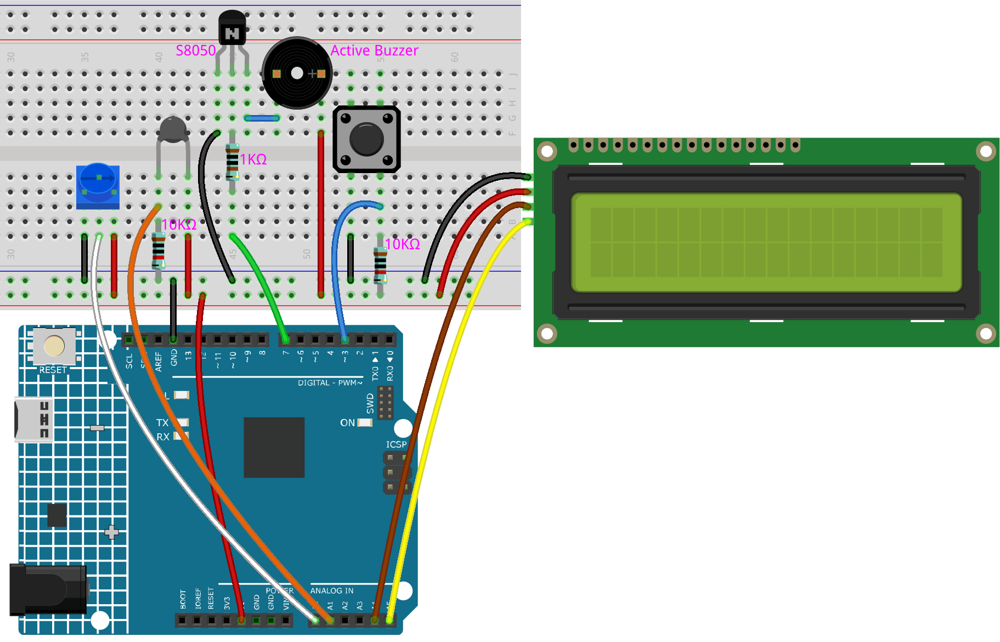

.. note::

    Bonjour, bienvenue dans la communauté SunFounder Raspberry Pi & Arduino & ESP32 Enthusiasts sur Facebook ! Plongez dans le monde de Raspberry Pi, Arduino et ESP32 avec d'autres passionnés.

    **Pourquoi nous rejoindre ?**

    - **Support d'experts** : Résolvez les problèmes après-vente et les défis techniques avec l'aide de notre communauté et de notre équipe.
    - **Apprendre et partager** : Échangez des conseils et des tutoriels pour améliorer vos compétences.
    - **Aperçus exclusifs** : Accédez en avant-première aux annonces de nouveaux produits et aux aperçus.
    - **Réductions spéciales** : Profitez de réductions exclusives sur nos nouveaux produits.
    - **Promotions festives et cadeaux** : Participez à des cadeaux et à des promotions festives.

    👉 Prêt à explorer et à créer avec nous ? Cliquez sur [|link_sf_facebook|] et rejoignez-nous dès aujourd'hui !

.. _ar_high_tem_alarm:

6.3 Alarme de haute température
====================================

Ensuite, nous allons fabriquer un dispositif d'alarme de haute température à l'aide d'une thermistance, d'un bouton-poussoir, d'un potentiomètre et d'un écran LCD. 
Le LCD1602 affiche la température détectée par la thermistance ainsi que la valeur seuil de température élevée, 
qui peut être ajustée à l'aide d'un potentiomètre. 
La valeur seuil est simultanément stockée dans l'EEPROM, de sorte que si la température actuelle dépasse la valeur seuil, 
le buzzer se déclenche.

**Composants nécessaires**

Dans ce projet, nous avons besoin des composants suivants. 

Il est très pratique d'acheter un kit complet, voici le lien : 

.. list-table::
    :widths: 20 20 20
    :header-rows: 1

    *   - Nom	
        - ÉLÉMENTS DANS CE KIT
        - LIEN
    *   - Kit de démarrage 3 en 1
        - 380+
        - |link_3IN1_kit|

Vous pouvez également les acheter séparément via les liens ci-dessous.

.. list-table::
    :widths: 30 20
    :header-rows: 1

    *   - INTRODUCTION DES COMPOSANTS
        - LIEN D'ACHAT

    *   - :ref:`cpn_uno`
        - \-
    *   - :ref:`cpn_breadboard`
        - |link_breadboard_buy|
    *   - :ref:`cpn_wires`
        - |link_wires_buy|
    *   - :ref:`cpn_resistor`
        - |link_resistor_buy|
    *   - :ref:`cpn_buzzer`
        - \-
    *   - :ref:`cpn_button`
        - |link_button_buy|
    *   - :ref:`cpn_i2c_lcd1602`
        - |link_i2clcd1602_buy|
    *   - :ref:`cpn_thermistor`
        - |link_thermistor_buy|
    *   - :ref:`cpn_potentiometer`
        - |link_potentiometer_buy|

**Schéma**

.. image:: img/wiring_high_tem.png
   :align: center

**Câblage**

**Code**

.. note::

    * Vous pouvez ouvrir le fichier ``6.3.high_tem_alarm.ino`` directement dans le répertoire ``3in1-kit\learning_project\6.3.high_tem_alarm``.
    * Ou copiez ce code dans l'Arduino IDE.
    * La bibliothèque ``LiquidCrystal I2C`` est utilisée ici, vous pouvez l'installer via le **Gestionnaire de bibliothèques**.

        .. image:: ../img/lib_liquidcrystal_i2c.png
    

.. raw:: html

    <iframe src=https://create.arduino.cc/editor/sunfounder01/1341b79d-c87e-4cea-ad90-189c2ebf40ee/preview?embed style="height:510px;width:100%;margin:10px 0" frameborder=0></iframe>

Après le téléchargement du code avec succès, le LCD1602 affiche la température détectée par la thermistance ainsi que la valeur seuil de température élevée, qui peut être ajustée à l'aide d'un potentiomètre. La valeur seuil est stockée dans l'EEPROM en même temps, et si la température actuelle dépasse la valeur seuil, le buzzer émet un son.

.. note::
    Si le code et le câblage sont corrects mais que le LCD ne s'affiche pas, vous pouvez ajuster le potentiomètre à l'arrière.

**Comment ça fonctionne ?**

#. Initialisez le bouton, le buzzer et le LCD1602 I2C, puis lisez les valeurs de l'EEPROM. Une interruption est également utilisée ici pour lire l'état du bouton.

    .. code-block:: arduino

        void setup()
        {
            pinMode(buzzerPin, OUTPUT);
            pinMode(buttonPin, INPUT);
            lcd.init();
            lcd.backlight();
            upperTem = EEPROM.read(0);
            delay(1000);
            attachInterrupt(digitalPinToInterrupt(buttonPin), buttonState, FALLING);
        }
    
    * L'interruption est utilisée ici pour lire l'état du bouton. Lorsque le bouton est enfoncé, ``buttonPin`` passe de bas à haut.
    * La fonction `buttonState` est appelée lorsqu'une interruption est déclenchée, et elle bascule la valeur de la variable `state`.
    * ``FALLING`` signifie que l'interruption se produit lorsque ``buttonPin`` passe de bas à haut.

#. Pour définir la valeur seuil de température élevée, la fonction ``upperTemSetting()`` est appelée lorsque `state` vaut 1 (state bascule entre 0 et 1 avec l'appui du bouton) dans le programme principal, sinon ``monitoringTemp()`` est appelée pour afficher la température actuelle et le seuil défini.

    .. code-block:: arduino

        void loop()
        {
            if (state == 1)
            {
                upperTemSetting();
            }
            else {
                monitoringTemp();
            }
        }

#. À propos de la fonction ``upperTemSetting()``.

    .. code-block:: arduino

        void upperTemSetting()
        {
            int setTem = 0;

            lcd.clear();
            lcd.setCursor(0, 0);
            lcd.print("Adjusting...");
            lcd.setCursor(0, 1);
            lcd.print("Upper Tem: ");

            while (1) {
                lcd.setCursor(11, 1);
                setTem = map(analogRead(potPin), 0, 1023, 0, 100);
                lcd.print(setTem);
                if (state == 0)
                {
                    EEPROM.write(0, setTem);
                    upperTem = setTem;
                    lcd.clear();
                    return;
                }
            }
        }

    * Vous pouvez définir une valeur seuil avec cette fonction. Lors de son exécution, le LCD1602 affiche la valeur seuil actuelle, qui peut être modifiée à l'aide du potentiomètre. Cette valeur est enregistrée dans l'EEPROM et la fonction quitte lorsqu'on appuie à nouveau sur le bouton.

#. À propos de la fonction ``monitoringTemp()``.

    .. code-block:: arduino

        void monitoringTemp()
        {
            long a = analogRead(temPin);
            float tempC = beta / (log((1025.0 * 10 / a - 10) / 10) + beta / 298.0) - 273.0;
            float tempF = 1.8 * tempC + 32.0;
            lcd.setCursor(0, 0);
            lcd.print("Temp: ");
            lcd.print(tempC);
            lcd.print(char(223));
            lcd.print("C   ");
            lcd.setCursor(0, 1);
            lcd.print("Upper: ");
            lcd.print(upperTem);
            lcd.print(char(223));
            lcd.print("C   ");
            delay(300);
            if (tempC >= upperTem)
            {
                digitalWrite(buzzerPin, HIGH);
                delay(50);
                digitalWrite(buzzerPin, LOW);
                delay(10);
            }
            else
            {
                digitalWrite(buzzerPin, LOW);
            }
        }

    * Cette fonction permet d'afficher la température et de définir une alarme.
    * La valeur de la thermistance est lue puis convertie en température Celsius selon la formule, puis affichée sur le LCD1602.
    * Le seuil défini est également affiché sur le LCD.
    * Si la température actuelle dépasse le seuil, le buzzer émet une alarme.
