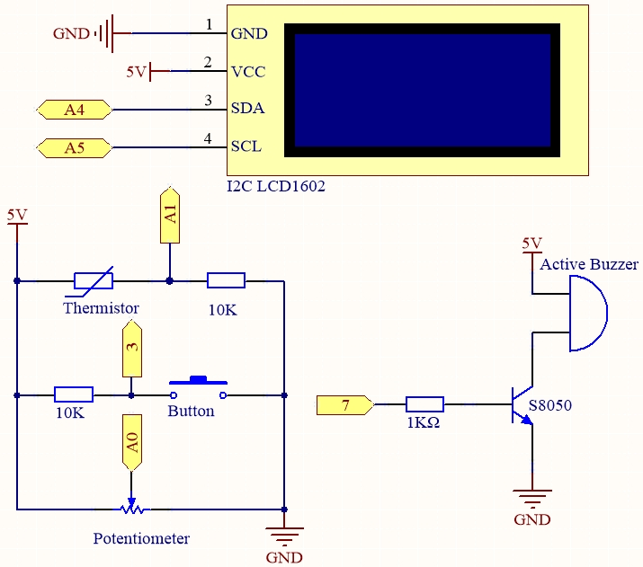

.. note::

    Hello, welcome to the SunFounder Raspberry Pi & Arduino & ESP32 Enthusiasts Community on Facebook! Dive deeper into Raspberry Pi, Arduino, and ESP32 with fellow enthusiasts.

    **Why Join?**

    - **Expert Support**: Solve post-sale issues and technical challenges with help from our community and team.
    - **Learn & Share**: Exchange tips and tutorials to enhance your skills.
    - **Exclusive Previews**: Get early access to new product announcements and sneak peeks.
    - **Special Discounts**: Enjoy exclusive discounts on our newest products.
    - **Festive Promotions and Giveaways**: Take part in giveaways and holiday promotions.

    👉 Ready to explore and create with us? Click [|link_sf_facebook|] and join today!

.. _ar_high_tem_alarm:

6.3 High Temperature Alarm
====================================

Next, we will make a high temperature alarm device using thermistor, push button, potentiometer and LCD. 
The LCD1602 shows the temperature detected by the thermistor and the high temperature threshold value, 
which can be adjusted using a potentiometer. 
The threshold value is stored on EEPROM at the same time, so if the current temperature exceeds the threshold value, 
the buzzer will sound.

**Required Components**

In this project, we need the following components. 

It's definitely convenient to buy a whole kit, here's the link: 

.. list-table::
    :widths: 20 20 20
    :header-rows: 1

    *   - Name	
        - ITEMS IN THIS KIT
        - LINK
    *   - 3 in 1 Starter Kit
        - 380+
        - |link_3IN1_kit|

You can also buy them separately from the links below.

.. list-table::
    :widths: 30 20
    :header-rows: 1

    *   - COMPONENT INTRODUCTION
        - PURCHASE LINK

    *   - :ref:`cpn_uno`
        - |link_Uno_R3_buy|
    *   - :ref:`cpn_breadboard`
        - |link_breadboard_buy|
    *   - :ref:`cpn_wires`
        - |link_wires_buy|
    *   - :ref:`cpn_resistor`
        - |link_resistor_buy|
    *   - :ref:`cpn_buzzer`
        - \-
    *   - :ref:`cpn_button`
        - |link_button_buy|
    *   - :ref:`cpn_i2c_lcd1602`
        - |link_i2clcd1602_buy|
    *   - :ref:`cpn_thermistor`
        - |link_thermistor_buy|
    *   - :ref:`cpn_potentiometer`
        - |link_potentiometer_buy|

**Schematic**

**Wiring**

.. image:: img/tem_alarm.png
    :width: 800
    :align: center

**Code**

.. note::

    * You can open the file ``6.3.high_tem_alarm.ino`` under the path of ``3in1-kit\basic_project\6.3.high_tem_alarm`` directly.
    * Or copy this code into Arduino IDE .
    * The ``LiquidCrystal I2C`` library is used here, you can install it from the **Library Manager**.

        .. image:: ../img/lib_liquidcrystal_i2c.png
    

.. raw:: html

    <iframe src=https://create.arduino.cc/editor/sunfounder01/1341b79d-c87e-4cea-ad90-189c2ebf40ee/preview?embed style="height:510px;width:100%;margin:10px 0" frameborder=0></iframe>

After the code is successfully uploaded, The LCD1602 shows the temperature detected by the thermistor and the high temperature threshold value, which can be adjusted using a potentiometer. The threshold value is stored on EEPROM at the same time, so if the current temperature exceeds the threshold value, the buzzer will sound.

.. note::
    If the code and wiring are fine, but the LCD still does not display content, you can turn the potentiometer on the back.

**How it works?**

#. Initialize the button, buzzer and I2C LCD1602, and read the EEPROM values. An interrupt is also used here to read the button status.

    .. code-block:: arduino

        void setup()
        {
            pinMode(buzzerPin, OUTPUT);
            pinMode(buttonPin, INPUT);
            lcd.init();
            lcd.backlight();
            upperTem = EEPROM.read(0);
            delay(1000);
            attachInterrupt(digitalPinToInterrupt(buttonPin), buttonState, FALLING);
        }
    
    * The interrupt is used here to read the button's state. When the button is pressed, ``buttonPin`` changes from low to high.
    * The function buttonState is called when the interrupt triggers, and it toggles the value of the variable state.
    * ``FALLING`` means the interrupt occurs when ``buttonPin`` goes from low to high.

#. To set the high temperature threshold, the function ``upperTemSetting()`` is called when state is 1 (state switches between 0 and 1 with button press) in the main program, otherwise ``monitoringTemp()`` is called to display the current temperature and the set threshold.

    .. code-block:: arduino

        void loop()
        {
            if (state == 1)
            {
                upperTemSetting();
            }
            else {
                monitoringTemp();
            }
        }

#. About ``upperTemSetting()`` function.

    .. code-block:: arduino

        void upperTemSetting()
        {
            int setTem = 0;

            lcd.clear();
            lcd.setCursor(0, 0);
            lcd.print("Adjusting...");
            lcd.setCursor(0, 1);
            lcd.print("Upper Tem: ");

            while (1) {
                lcd.setCursor(11, 1);
                setTem = map(analogRead(potPin), 0, 1023, 0, 100);
                lcd.print(setTem);
                if (state == 0)
                {
                    EEPROM.write(0, setTem);
                    upperTem = setTem;
                    lcd.clear();
                    return;
                }
            }
        }

    * A threshold can be set with this function. When you enter this function, the LCD1602 displays the current threshold value, which can be modified using the potentiometer. This threshold value will be stored in EEPROM and exited when the button is pressed again.

#. About ``monitoringTemp()`` function.

    .. code-block:: arduino

        void monitoringTemp()
        {
        long a = analogRead(temPin);
        float tempC = beta / (log((1025.0 * 10 / a - 10) / 10) + beta / 298.0) - 273.0;
        float tempF = 1.8 * tempC + 32.0;
        lcd.setCursor(0, 0);
        lcd.print("Temp: ");
        lcd.print(tempC);
        lcd.print(char(223));
        lcd.print("C   ");
        lcd.setCursor(0, 1);
        lcd.print("Upper: ");
        lcd.print(upperTem);
        lcd.print(char(223));
        lcd.print("C   ");
        delay(300);
        if (tempC >= upperTem)
        {
            digitalWrite(buzzerPin, HIGH);
            delay(50);
            digitalWrite(buzzerPin, LOW);
            delay(10);
        }
        else
        {
            digitalWrite(buzzerPin, LOW);
        }
        }

    * Using this function, you can display temperature and set an alarm.
    * The thermistor value is read and then converted to Celsius temperature by the formula and displayed on the LCD1602.
    * The set threshold is also displayed on the LCD.
    * If the current temperature is greater than the threshold, the buzzer will sound an alarm.