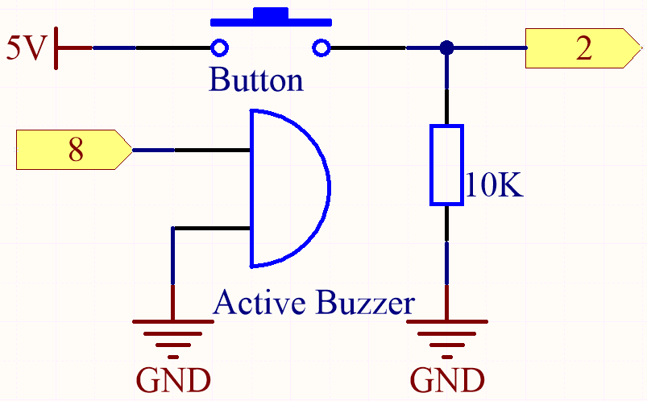
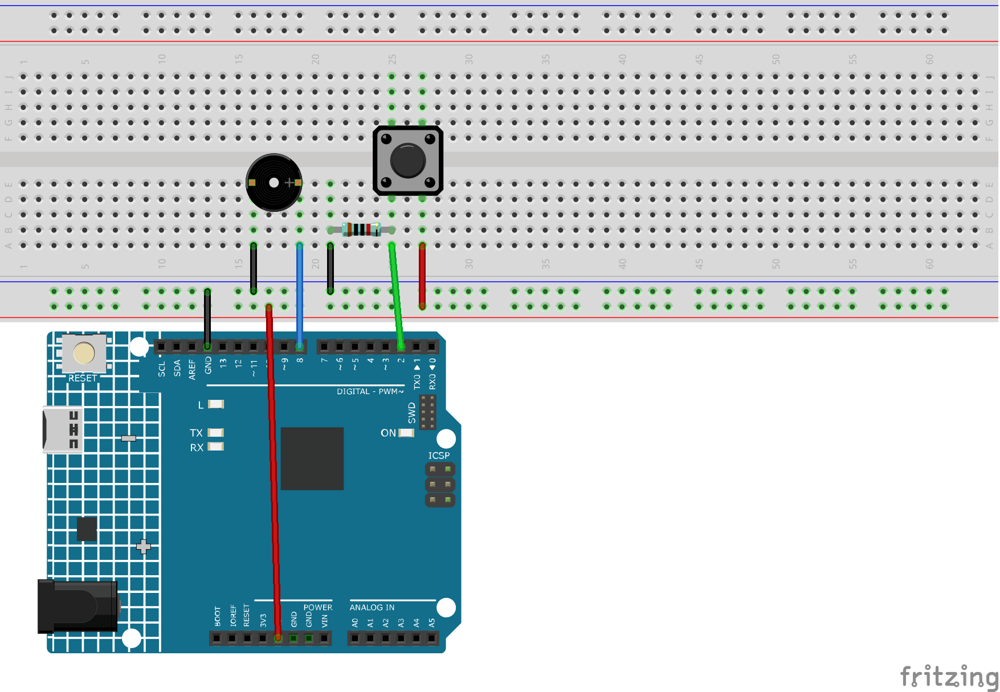

.. note::

    こんにちは、SunFounderのRaspberry Pi & Arduino & ESP32愛好家コミュニティへようこそ！Facebook上でRaspberry Pi、Arduino、ESP32についてもっと深く掘り下げ、他の愛好家と交流しましょう。

    **参加する理由は？**

    - **エキスパートサポート**：コミュニティやチームの助けを借りて、販売後の問題や技術的な課題を解決します。
    - **学び＆共有**：ヒントやチュートリアルを交換してスキルを向上させましょう。
    - **独占的なプレビュー**：新製品の発表や先行プレビューに早期アクセスしましょう。
    - **特別割引**：最新製品の独占割引をお楽しみください。
    - **祭りのプロモーションとギフト**：ギフトや祝日のプロモーションに参加しましょう。

    👉 私たちと一緒に探索し、創造する準備はできていますか？[|link_sf_facebook|]をクリックして今すぐ参加しましょう！

.. _ar_interrupt:

5.13 インタラプト
=======================

センサーを使用するプロジェクトで ``delay()`` 関数を使用すると、これらのセンサーをトリガーするとプログラムが効果を発揮しないことがあります。これは、delay文によりプログラムが一時停止し、センサーから主制御ボードへの信号を取得できないためです。

この場合、インタラプトを使用できます。インタラプトにより、プログラムがパルスを逃さないようにすることができます。

この章では、アクティブブザーとボタンを使用して、インタラプトの使用プロセスを体験します。

``loop()`` 関数内で、 ``delay(1000)`` は秒をカウントするために使用されます。
ボタンをISR内のブザーの制御に配置することで、遅延による干渉を受けずにタスクをスムーズに完了させることができます。

.. note::
    ISRsは、他の関数にはないユニークな制限を持つ特別な関数です。ISRにはパラメータを持たせることはできず、何も返さないようにする必要があります。
    一般的に、ISRはできるだけ短く、高速にする必要があります。複数のISRを使用するスケッチでは、一度に1つしか実行できず、現在のISRが終了した後に他のインタラプトが優先順位に応じて実行されます。

**必要な部品**

このプロジェクトでは、以下のコンポーネントが必要です。

全体のキットを購入すると確かに便利です。リンクはこちら：

.. list-table::
    :widths: 20 20 20
    :header-rows: 1

    *   - 名前	
        - このキットのアイテム
        - リンク
    *   - 3 in 1 Starter Kit
        - 380+
        - |link_3IN1_kit|

以下のリンクから別々に購入することもできます。

.. list-table::
    :widths: 30 20
    :header-rows: 1

    *   - コンポーネントの紹介
        - 購入リンク

    *   - :ref:`cpn_uno`
        - \-
    *   - :ref:`cpn_breadboard`
        - |link_breadboard_buy|
    *   - :ref:`cpn_wires`
        - |link_wires_buy|
    *   - :ref:`cpn_resistor`
        - |link_resistor_buy|
    *   - :ref:`cpn_button`
        - |link_button_buy|
    *   - :ref:`cpn_buzzer`
        - \-

**回路図**

**配線図**

**コード**

.. note::

    * ``3in1-kit\learning_project\5.13.interrupt`` のパスの下の ``5.13.interrupt.ino`` ファイルを開きます。
    * または、このコードを **Arduino IDE** にコピーします。

.. raw:: html
    
    <iframe src=https://create.arduino.cc/editor/sunfounder01/6111757d-dd63-4c4c-95b5-9d96fb0843f0/preview?embed style="height:510px;width:100%;margin:10px 0" frameborder=0></iframe>

コードが正常にアップロードされると、シリアルモニターをオンにして、毎秒自動で増加する数字が表示されます。ボタンを押すと、ブザーが鳴ります。
ボタンで制御されるブザーの機能とタイミングの機能は互いに競合しません。

**どのように動作するのか？**

* ``attachInterrupt(digitalPinToInterrupt(pin), ISR, mode)``: インタラプトを追加します。

    **構文**
        attachInterrupt(digitalPinToInterrupt(pin), ISR, mode) 

    **パラメータ**
        * ``pin``: Arduinoのピン番号。 ``digitalPinToInterrupt(pin)`` を使用して、実際のデジタルピンを特定のインタラプト番号に変換する必要があります。例えば、ピン3に接続する場合、第1のパラメータとして ``digitalPinToInterrupt(3)`` を使用します。
        * ``ISR``: インタラプトが発生したときに呼び出すISR。この関数はパラメータを持たないこと、何も返さないことが必要です。この関数は、インタラプトサービスルーチンとしても参照されることがあります。
        * ``mode``: インタラプトをトリガーするタイミングを定義します。4つの定数が有効な値として事前に定義されています：

          * ``LOW`` ピンが低いときにインタラプトをトリガーします。
          * ``CHANGE`` ピンの値が変わるたびにインタラプトをトリガーします。
          * ``RISING`` ピンが低から高に変わるときにトリガーします。
          * ``FALLING`` ピンが高から低に変わるときにトリガーします。

.. note:: 
    異なる主制御ボードでは、インタラプトピンの使用方法が異なる場合があります。あなたのボードでは、ピン2とピン3だけがインタラプトを使用できます。
