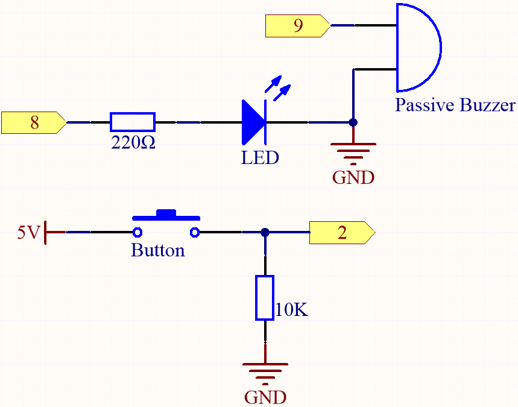
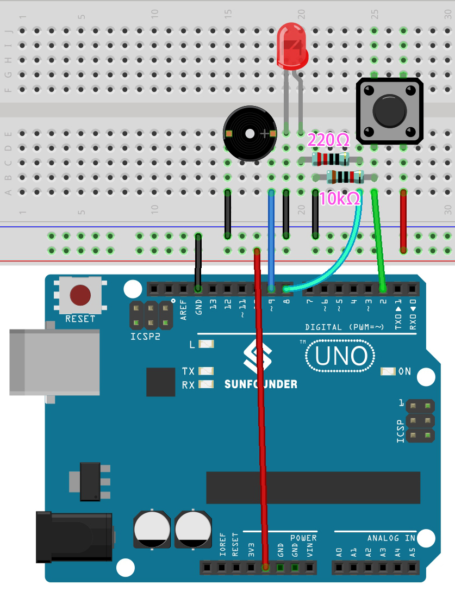

.. _ar_interval:

5.4 Interval
================

Sometimes you need to do two things at once. For example you might want
to blink an LED while reading a button press. In this case, you can't
use ``delay()``, because Arduino pauses your program during the ``delay()``. If
the button is pressed while Arduino is paused waiting for the ``delay()`` to
pass, your program will miss the button press.

An analogy would be warming up a pizza in your microwave, and also
waiting some important email. You put the pizza in the microwave and set
it for 10 minutes. The analogy to using ``delay()`` would be to sit in front
of the microwave watching the timer count down from 10 minutes until the
timer reaches zero. If the important email arrives during this time you
will miss it.

What you would do in real life would be to turn on the pizza, and then
check your email, and then maybe do something else (that doesn't take
too long!) and every so often you will come back to the microwave to see
if the timer has reached zero, indicating that your pizza is done.

This sketch demonstrates how to tone an buzzer without using ``delay()``. 
It turns the buzzer on and then makes note of the time. Then, each time
through ``loop()``, it checks to see if the desired interval time has passed.
If it has, it tone the buzzer and makes note of the new time.
In this way the buzzer tones continuously while the sketch execution never
lags on a single instruction.

Based on this condition, we can add the code of the button to control the LED, 
it will not be disturbed by the buzzer playing music.

**Required Components**

In this project, we need the following components. 

It's definitely convenient to buy a whole kit, here's the link: 

.. list-table::
    :widths: 20 20 20
    :header-rows: 1

    *   - Name	
        - ITEMS IN THIS KIT
        - LINK
    *   - 3 in 1 Starter Kit
        - 380+
        - |link_3IN1_kit|

You can also buy them separately from the links below.

.. list-table::
    :widths: 30 20
    :header-rows: 1

    *   - COMPONENT INTRODUCTION
        - PURCHASE LINK

    *   - :ref:`cpn_uno`
        - |link_Uno_R3_buy|
    *   - :ref:`cpn_breadboard`
        - |link_breadboard_buy|
    *   - :ref:`cpn_wires`
        - |link_wires_buy|
    *   - :ref:`cpn_resistor`
        - |link_resistor_buy|
    *   - :ref:`cpn_led`
        - |link_led_buy|
    *   - :ref:`cpn_button`
        - |link_button_buy|
    *   - :ref:`cpn_buzzer`
        - |link_passive_buzzer_buy|

**Schematic**

**Wiring**

**Code**

.. note::

    * Open the ``5.4.interval.ino`` file under the path of ``3in1-kit\basic_project\5.4.interval``.
    * Or copy this code into **Arduino IDE**.
    
    * Or upload the code through the `Arduino Web Editor <https://docs.arduino.cc/cloud/web-editor/tutorials/getting-started/getting-started-web-editor>`_.

.. raw:: html
    
    <iframe src=https://create.arduino.cc/editor/sunfounder01/0d430b04-ef2d-4e32-8d76-671a3a917cb1/preview?embed style="height:510px;width:100%;margin:10px 0" frameborder=0></iframe>
    
After the code is uploaded successfully, the buzzer will play music; whenever you press the button, the LED will light up. The work of LED and buzzer does not interfere with each other.

**How it works?**

Initial a variable named ``previousMillis`` to store previous operating time of microcontroller.

.. code-block:: arduino

    unsigned long previousMillis = 0;     

Mark which note is played.

.. code-block:: arduino

    int thisNote=0; 

The interval time of each note.

.. code-block:: arduino

    long interval = 1000; 

In ``loop()``, declare ``currentMillis`` to store the current time.

.. code-block:: arduino

    unsigned long currentMillis = millis();

When the interval between the current operating time and last updating time is larger than 1000ms, certain functions are triggered. Meanwhile, update the previousMillis to the current time for the next triggering that is to happen 1 second latter.  

.. code-block:: arduino

    if (currentMillis - previousMillis >= interval) {
        previousMillis = currentMillis;// save the last time of the last tone
        //...
    }

Play the notes in the melody one by one.

.. code-block:: arduino

    tone(buzzerPin,melody[thisNote],100);
    interval=1000/noteDurations[thisNote]; // interval at which to tone
    thisNote=(thisNote+1)%(sizeof(melody)/2); //iterate over the notes of the melody

The button control the LED.

.. code-block:: arduino

  // play button & led 
  digitalWrite(ledPin,digitalRead(buttonPin));