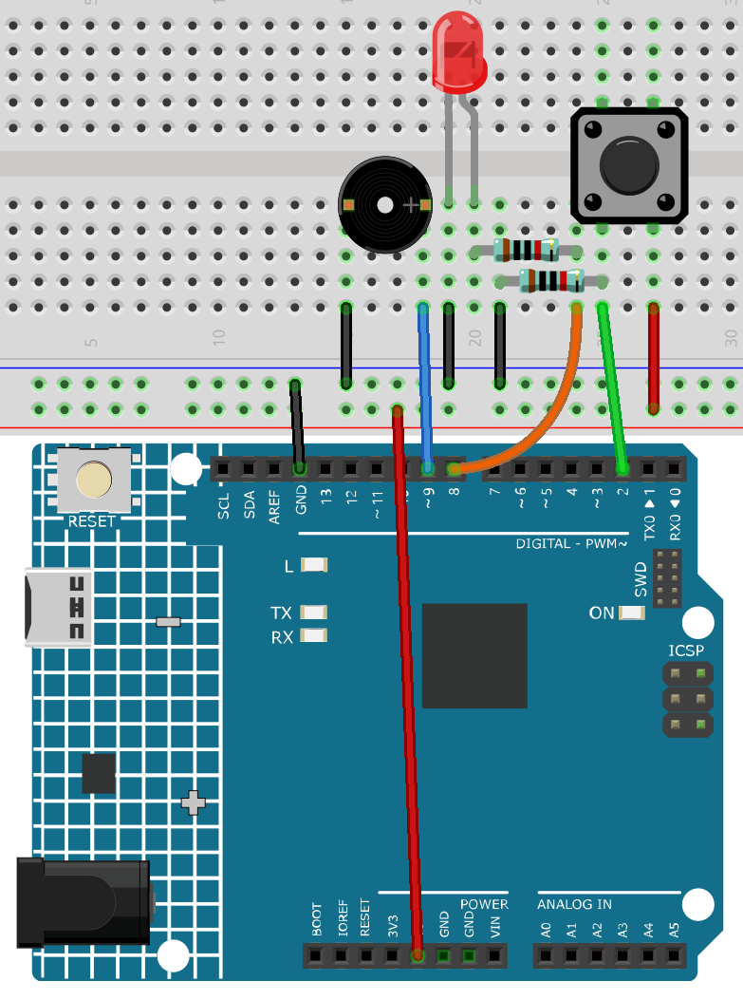

.. note::

    こんにちは、SunFounderのRaspberry Pi & Arduino & ESP32愛好家コミュニティへようこそ！Facebook上でRaspberry Pi、Arduino、ESP32についてもっと深く掘り下げ、他の愛好家と交流しましょう。

    **参加する理由は？**

    - **エキスパートサポート**：コミュニティやチームの助けを借りて、販売後の問題や技術的な課題を解決します。
    - **学び＆共有**：ヒントやチュートリアルを交換してスキルを向上させましょう。
    - **独占的なプレビュー**：新製品の発表や先行プレビューに早期アクセスしましょう。
    - **特別割引**：最新製品の独占割引をお楽しみください。
    - **祭りのプロモーションとギフト**：ギフトや祝日のプロモーションに参加しましょう。

    👉 私たちと一緒に探索し、創造する準備はできていますか？[|link_sf_facebook|]をクリックして今すぐ参加しましょう！

.. _ar_interval:

5.4 インターバル
================

時には、二つのことを同時に行いたい場合があります。例えば、LEDを点滅させながらボタンの押下を読み取りたい場合などです。この場合、 ``delay()`` は使用できません。なぜなら、Arduinoは ``delay()`` の間プログラムを一時停止させるからです。もしボタンがArduinoが ``delay()`` の待ち時間中に押された場合、プログラムはボタンの押下を検出できません。

この状況を例えるなら、電子レンジでピザを温めながら、重要なメールを待つシチュエーションです。ピザを電子レンジに入れ、10分設定します。 ``delay()`` の使用を例えると、電子レンジの前でタイマーが0になるのを見つめることになります。この間に重要なメールが届いた場合、それを見逃してしまいます。

実際には、ピザのタイマーをセットし、メールを確認し、他の短い作業を行い、時折電子レンジのタイマーをチェックすることでしょう。

このスケッチでは、 ``delay()`` を使わずにブザーを鳴らす方法を示しています。ブザーをオンにして、現在の時間を記録します。そして、 ``loop()`` のたびに、指定されたインターバル時間が経過したかどうかをチェックします。経過していれば、ブザーを鳴らし、新しい時間を記録します。この方法で、ブザーは連続して鳴らされ、スケッチの実行は一つの命令で遅れることがありません。

この条件に基づき、ブザーが音楽を奏でるのを邪魔されることなく、LEDを制御するボタンのコードを追加することができます。

**必要な部品**

このプロジェクトでは、以下のコンポーネントが必要です。

一式を購入するのが便利です。購入リンクはこちら：

.. list-table::
    :widths: 20 20 20
    :header-rows: 1

    *   - 名前	
        - このキットのアイテム
        - リンク
    *   - 3 in 1 Starter Kit
        - 380+
        - |link_3IN1_kit|

以下のリンクから個別に購入することもできます。

.. list-table::
    :widths: 30 20
    :header-rows: 1

    *   - コンポーネントの紹介
        - 購入リンク

    *   - :ref:`cpn_uno`
        - \-
    *   - :ref:`cpn_breadboard`
        - |link_breadboard_buy|
    *   - :ref:`cpn_wires`
        - |link_wires_buy|
    *   - :ref:`cpn_resistor`
        - |link_resistor_buy|
    *   - :ref:`cpn_led`
        - |link_led_buy|
    *   - :ref:`cpn_button`
        - |link_button_buy|
    *   - :ref:`cpn_buzzer`
        - |link_passive_buzzer_buy|

**回路図**

.. image:: img/circuit_8.5_interval.png

**配線図**

.. note::

    * ``3in1-kit\learning_project\5.4.interval`` のパスの下の ``5.4.interval.ino`` ファイルを開きます。
    * または、このコードを **Arduino IDE** にコピーします。
    

.. raw:: html

    <iframe src=https://create.arduino.cc/editor/sunfounder01/0d430b04-ef2d-4e32-8d76-671a3a917cb1/preview?embed style="height:510px;width:100%;margin:10px 0" frameborder=0></iframe>

コードが正常にアップロードされると、ブザーが音楽を再生します。ボタンを押すたびに、LEDが点灯します。LEDとブザーの動作は互いに干渉しません。

**どのように動作するのか？**

マイコンの前回の動作時間を格納するための変数 ``previousMillis`` を初期化します。

.. code-block:: arduino

    unsigned long previousMillis = 0;     

どの音符が再生されているかをマークします。

.. code-block:: arduino

    int thisNote=0; 

各音符の間隔時間。

.. code-block:: arduino

    long interval = 1000; 

``loop()`` 内で、現在の時間を格納するための ``currentMillis`` を宣言します。

.. code-block:: arduino

    unsigned long currentMillis = millis();

現在の動作時間と最後の更新時間の間隔が1000msより大きい場合、特定の関数がトリガされます。その後、次のトリガが1秒後に発生するため、previousMillisを現在の時間に更新します。

.. code-block:: arduino

    if (currentMillis - previousMillis >= interval) {
        previousMillis = currentMillis;// save the last time of the last tone
        //...
    }

メロディの音符を順番に再生します。

.. code-block:: arduino

    tone(buzzerPin,melody[thisNote],100);
    interval=1000/noteDurations[thisNote]; // interval at which to tone
    thisNote=(thisNote+1)%(sizeof(melody)/2); //iterate over the notes of the melody

ボタンはLEDを制御します。

.. code-block:: arduino

  // play button & led 
  digitalWrite(ledPin,digitalRead(buttonPin));
