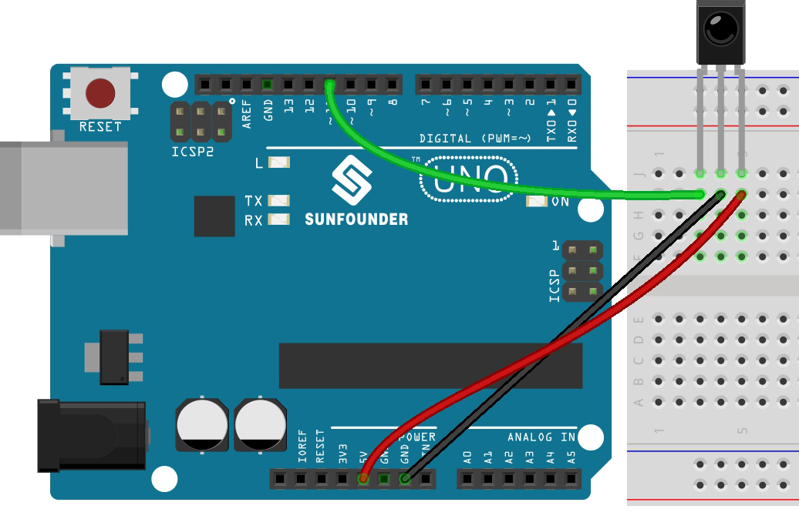

.. _ar_receiver:

5.11.2 IRレシーバー
=========================

このプロジェクトでは、IRレシーバーの使用方法を学びます。

赤外線受信機は、赤外線信号を受信し、独立して赤外線を受信してTTLレベルと互換性のある信号を出力する部品です。
通常のプラスチックパッケージのトランジスタとサイズが似ており、各種の赤外線リモコンや赤外線伝送に適しています。

**必要な部品**

このプロジェクトでは、以下の部品が必要です。

全体のキットを購入すると非常に便利です、リンクは以下です：

.. list-table::
    :widths: 20 20 20
    :header-rows: 1

    *   - 名前
        - このキットのアイテム
        - リンク
    *   - 3 in 1 Starter Kit
        - 380+
        - |link_3IN1_kit|

以下のリンクからそれぞれ購入することもできます。

.. list-table::
    :widths: 30 20
    :header-rows: 1

    *   - コンポーネントの紹介
        - 購入リンク

    *   - :ref:`cpn_uno`
        - |link_Uno_R3_buy|
    *   - :ref:`cpn_breadboard`
        - |link_breadboard_buy|
    *   - :ref:`cpn_wires`
        - |link_wires_buy|
    *   - :ref:`cpn_receiver`
        - \-

**回路図**

.. image:: img/circuit_7.2_receiver.png

**配線図**

この例では、IRレシーバーの左のピンをピン11に、中央のピンをGNDに、右のピンを5Vに接続します。

**コード**

.. note::

    * ``3in1-kit\basic_project\5.11.ir_receiver`` のパスの下にある ``5.11.ir_receiver.ino`` ファイルを開きます。
    * または、このコードを **Arduino IDE** にコピーします。
    * ここでは ``IRremote`` ライブラリが使用されています。 **Library Manager** からインストールできます。

        .. image:: ../img/lib_irremote.png

.. raw:: html

    <iframe src=https://create.arduino.cc/editor/sunfounder01/1141d808-cc26-4589-ae5c-d1834033ac3d/preview?embed style="height:510px;width:100%;margin:10px 0" frameborder=0></iframe>

コードをR3ボードにアップロードすると、IRリモートコントローラの押されたボタンの現在の値がシリアルモニタに表示されます。

**どのように動作するのか？**

このコードは、 ``IRremote`` ライブラリを使用して赤外線（IR）リモコンとともに動作するように設計されています。詳細は以下のとおりです：

#. ライブラリのインクルード： ``IRremote`` ライブラリを含めます。これは、IRリモコンと連携するための関数を提供します。

    .. code-block:: arduino

        #include <IRremote.h>

#. IRセンサーの信号ピンが接続されているArduinoのピンを定義し。

    .. code-block:: arduino

        const int IR_RECEIVE_PIN = 11;  // IRセンサーのピン番号を定義する。

#. ボーレート9600でシリアル通信を初期化します。指定されたピン(``IR_RECEIVE_PIN``)でIRレシーバを初期化し、LEDフィードバックを有効にします(該当する場合)。

    .. code-block:: arduino

        void setup() {
            Serial.begin(9600);                                     // ボーレート9600でシリアル通信を開始する。
            IrReceiver.begin(IR_RECEIVE_PIN, ENABLE_LED_FEEDBACK);  // IRレシーバーの起動
        }

#. ループは、入力されたIRリモコンの信号を継続的に処理します。

    .. code-block:: arduino

        void loop() {
            if (IrReceiver.decode()) {
                String decodedValue = decodeKeyValue(IrReceiver.decodedIRData.command);
                if (decodedValue != "ERROR") {
                    Serial.println(decodedValue);
                    delay(100);
                }
                IrReceiver.resume();  // Enable receiving of the next value
            }
        }

    * IR信号が受信され、正常にデコードされたかどうかを確認します。
    * IRコマンドをデコードし、カスタムの ``decodeKeyValue()`` 関数を使用して ``decodedValue`` に保存します。
    * デコードされた値がエラーでないかを確認します。
    * デコードされたIR値をシリアルモニタに印刷します。
    * 次の信号のIR信号受信を再開します。
