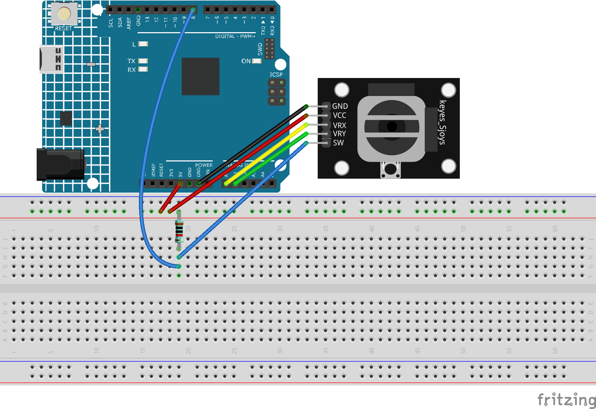

.. note::

    Bonjour, bienvenue dans la communauté SunFounder Raspberry Pi & Arduino & ESP32 Enthusiasts sur Facebook ! Plongez dans l'univers de Raspberry Pi, Arduino et ESP32 avec d'autres passionnés.

    **Pourquoi nous rejoindre ?**

    - **Support d'experts** : Résolvez les problèmes après-vente et les défis techniques avec l'aide de notre communauté et de notre équipe.
    - **Apprendre et partager** : Échangez des conseils et des tutoriels pour améliorer vos compétences.
    - **Aperçus exclusifs** : Accédez en avant-première aux annonces de nouveaux produits et aux aperçus.
    - **Réductions spéciales** : Profitez de réductions exclusives sur nos nouveaux produits.
    - **Promotions festives et cadeaux** : Participez à des cadeaux et à des promotions festives.

    👉 Prêt à explorer et à créer avec nous ? Cliquez sur [|link_sf_facebook|] et rejoignez-nous dès aujourd'hui !

.. _ar_joystick:

4.3 Basculer le Joystick
================================

Le joystick est très familier pour quiconque joue régulièrement aux jeux vidéo. 
Il est généralement utilisé pour déplacer des personnages ou faire pivoter l'écran.

Nos mouvements peuvent être captés par le joystick, qui fonctionne selon un principe 
très simple. Il se compose de deux potentiomètres perpendiculaires l'un à l'autre. 
Ces deux potentiomètres mesurent la valeur analogique du joystick dans les directions 
verticale et horizontale, produisant une valeur (x, y) dans un système de coordonnées 
rectangulaire planaire.

Ce kit comprend également un joystick avec une entrée numérique, activée lorsque le 
joystick est pressé.

**Composants nécessaires**

Dans ce projet, nous avons besoin des composants suivants :

C'est pratique d'acheter un kit complet, voici le lien :

.. list-table::
    :widths: 20 20 20
    :header-rows: 1

    *   - Nom
        - ARTICLES DANS CE KIT
        - LIEN
    *   - Kit de démarrage 3 en 1
        - 380+
        - |link_3IN1_kit|

Vous pouvez également les acheter séparément via les liens ci-dessous.

.. list-table::
    :widths: 30 20
    :header-rows: 1

    *   - INTRODUCTION DES COMPOSANTS
        - LIEN D'ACHAT

    *   - :ref:`cpn_uno`
        - \-
    *   - :ref:`cpn_breadboard`
        - |link_breadboard_buy|
    *   - :ref:`cpn_wires`
        - |link_wires_buy|
    *   - :ref:`cpn_resistor`
        - |link_resistor_buy|
    *   - :ref:`cpn_joystick`
        - \-

**Schéma**

.. image:: img/circuit_5.3_joystick.png

.. note::
    La broche SW est connectée à une résistance de pull-up de 10K, 
    afin d'obtenir un niveau haut stable sur la broche SW (axe Z) lorsque le joystick n'est pas pressé ; 
    sinon, la broche SW est en état suspendu et la valeur de sortie peut varier entre 0 et 1.

**Câblage**

**Code**

.. note::

    * Ouvrez le fichier ``4.3.toggle_the_joystick.ino`` dans le répertoire ``3in1-kit\learning_project\4.3.toggle_the_joystick``.
    * Ou copiez ce code dans l'IDE Arduino.
    
    

.. raw:: html
    
    <iframe src=https://create.arduino.cc/editor/sunfounder01/f678a03f-546c-42ed-bfae-b8c7daa5eec9/preview?embed style="height:510px;width:100%;margin:10px 0" frameborder=0></iframe>

Ouvrez le moniteur série après avoir téléversé le code avec succès pour voir les valeurs x, y, z du joystick.

* Les valeurs des axes x et y sont des valeurs analogiques variant de 0 à 1023.
* L'axe Z est une valeur numérique avec un état de 1 ou 0 (lorsqu'il est pressé, il est à 0).
