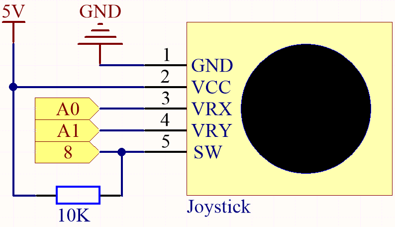
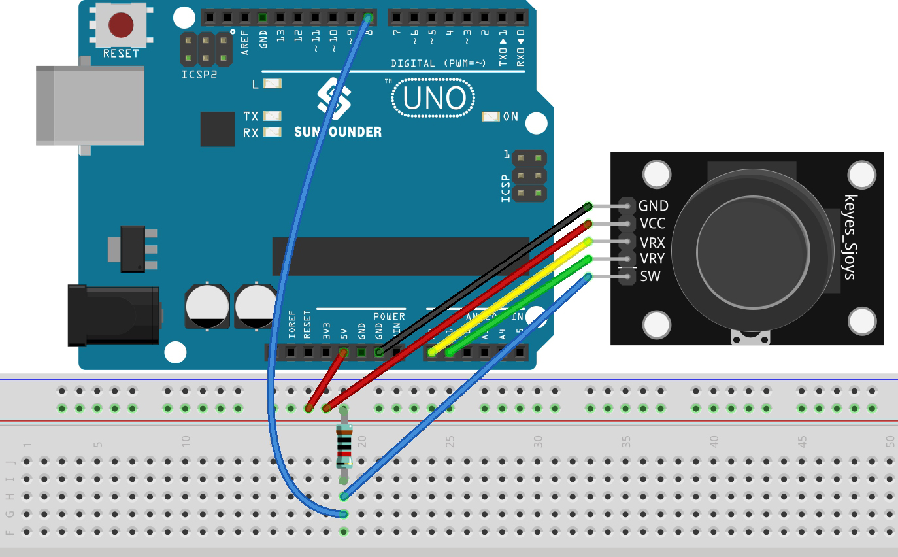

.. note::

    Ciao, benvenuto nella Community SunFounder Raspberry Pi & Arduino & ESP32 su Facebook! Approfondisci le tue conoscenze su Raspberry Pi, Arduino ed ESP32 insieme ad altri appassionati.

    **Perché unirti?**

    - **Supporto Esperto**: Risolvi problemi post-vendita e sfide tecniche con l'aiuto della nostra community e del nostro team.
    - **Impara & Condividi**: Scambia suggerimenti e tutorial per migliorare le tue abilità.
    - **Anteprime Esclusive**: Ottieni accesso anticipato ai nuovi annunci di prodotti e anteprime.
    - **Sconti Speciali**: Approfitta di sconti esclusivi sui nostri prodotti più recenti.
    - **Promozioni e Omaggi Festivi**: Partecipa a promozioni e omaggi durante le festività.

    👉 Pronto a esplorare e creare con noi? Clicca su [|link_sf_facebook|] e unisciti oggi!

.. _ar_joystick:

4.3 Usa il Joystick
================================

Il joystick dovrebbe essere molto familiare a chi gioca regolarmente ai 
videogiochi. Viene solitamente utilizzato per muovere i personaggi o ruotare lo schermo.

I nostri movimenti possono essere letti dal joystick, che funziona su un 
principio molto semplice. Consiste in due potenziometri perpendicolari tra 
loro. Questi due potenziometri misurano il valore analogico del joystick sia 
in direzione verticale che orizzontale, producendo un valore (x,y) in un 
sistema di coordinate cartesiane.

Questo kit include anche un joystick con un input digitale. Viene attivato 
quando si preme il joystick.

**Componenti Necessari**

In questo progetto, abbiamo bisogno dei seguenti componenti.

È sicuramente conveniente acquistare un intero kit, ecco il link:

.. list-table::
    :widths: 20 20 20
    :header-rows: 1

    *   - Nome	
        - ELEMENTI IN QUESTO KIT
        - LINK
    *   - 3 in 1 Starter Kit
        - 380+
        - |link_3IN1_kit|

Puoi anche acquistarli separatamente dai link qui sotto.

.. list-table::
    :widths: 30 20
    :header-rows: 1

    *   - INTRODUZIONE AI COMPONENTI
        - LINK PER L'ACQUISTO

    *   - :ref:`cpn_uno`
        - |link_Uno_R3_buy|
    *   - :ref:`cpn_breadboard`
        - |link_breadboard_buy|
    *   - :ref:`cpn_wires`
        - |link_wires_buy|
    *   - :ref:`cpn_resistor`
        - |link_resistor_buy|
    *   - :ref:`cpn_joystick`
        - \-

**Schema Elettrico**

.. note::
    Il pin SW è collegato a una resistenza pull-up da 10K, 
    per garantire un livello alto stabile sul pin SW (asse Z) quando il joystick non viene premuto; 
    altrimenti il pin SW si troverebbe in uno stato sospeso e il valore di output potrebbe variare tra 0 e 1.

**Collegamenti**

**Codice**

.. note::

    * Apri il file ``4.3.toggle_the_joystick.ino`` nel percorso ``3in1-kit\basic_project\4.3.toggle_the_joystick``.
    * Oppure copia questo codice nell'**Arduino IDE**.
    
    * Oppure carica il codice tramite l'`Arduino Web Editor <https://docs.arduino.cc/cloud/web-editor/tutorials/getting-started/getting-started-web-editor>`_.

.. raw:: html
    
    <iframe src=https://create.arduino.cc/editor/sunfounder01/f678a03f-546c-42ed-bfae-b8c7daa5eec9/preview?embed style="height:510px;width:100%;margin:10px 0" frameborder=0></iframe>

Apri il monitor seriale dopo aver caricato correttamente il codice per vedere i valori x, y, z del joystick.

* I valori degli assi x e y sono valori analogici che variano da 0 a 1023.
* L'asse Z è un valore digitale con uno stato di 1 o 0 (quando viene premuto, è 0).
