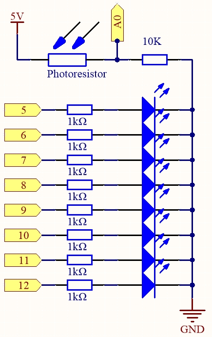
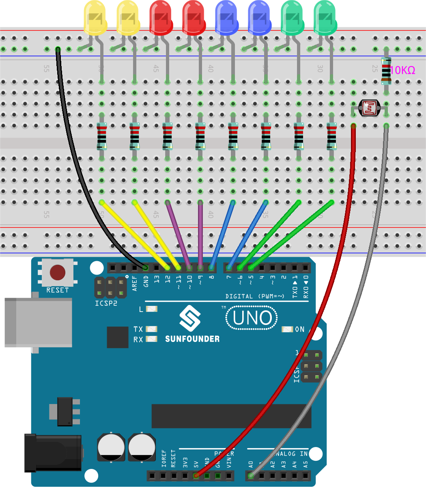

.. note::

    ¡Hola, bienvenido a la Comunidad de Aficionados a Raspberry Pi, Arduino y ESP32 de SunFounder en Facebook! Profundiza en Raspberry Pi, Arduino y ESP32 con otros entusiastas.

    **¿Por qué unirse?**

    - **Soporte de expertos**: Resuelve problemas posventa y desafíos técnicos con ayuda de nuestra comunidad y equipo.
    - **Aprender y compartir**: Intercambia consejos y tutoriales para mejorar tus habilidades.
    - **Vistas previas exclusivas**: Obtén acceso anticipado a anuncios de nuevos productos y avances.
    - **Descuentos especiales**: Disfruta de descuentos exclusivos en nuestros productos más nuevos.
    - **Promociones festivas y sorteos**: Participa en sorteos y promociones de fiestas.

    👉 ¿Listo para explorar y crear con nosotros? Haz clic en [|link_sf_facebook|] y únete hoy!

.. _ar_light_flow_led:

6.1 Arreglo Fotosensible
===========================

Un fotoresistor o célula fotoeléctrica es una resistencia variable controlada por luz. La resistencia de un fotoresistor disminuye con el aumento de la intensidad de luz incidente; en otras palabras, muestra fotoconductividad. Un fotoresistor puede aplicarse en circuitos detectores sensibles a la luz, y en circuitos de conmutación activados por luz y oscuridad.

La resistencia de un fotoresistor cambia con la intensidad de luz incidente. Si la intensidad de luz aumenta, la resistencia disminuye; si disminuye, la resistencia aumenta.
En este experimento, utilizaremos ocho LED para mostrar la intensidad de la luz. Cuanto mayor sea la intensidad de luz, más LED se iluminarán. Cuando la intensidad de luz sea suficientemente alta, todos los LED estarán encendidos. Cuando no haya luz, todos los LED se apagarán.

**Componentes Necesarios**

Para este proyecto, necesitamos los siguientes componentes.

Comprar un kit completo es definitivamente conveniente, aquí está el enlace:

.. list-table::
    :widths: 20 20 20
    :header-rows: 1

    *   - Nombre	
        - ELEMENTOS DE ESTE KIT
        - ENLACE
    *   - 3 in 1 Starter Kit
        - 380+
        - |link_3IN1_kit|

También puedes comprarlos por separado en los siguientes enlaces.

.. list-table::
    :widths: 30 20
    :header-rows: 1

    *   - INTRODUCCIÓN DEL COMPONENTE
        - ENLACE DE COMPRA

    *   - :ref:`cpn_uno`
        - |link_Uno_R3_buy|
    *   - :ref:`cpn_breadboard`
        - |link_breadboard_buy|
    *   - :ref:`cpn_wires`
        - |link_wires_buy|
    *   - :ref:`cpn_resistor`
        - |link_resistor_buy|
    *   - :ref:`cpn_led`
        - |link_led_buy|
    *   - :ref:`cpn_photoresistor`
        - |link_photoresistor_buy|

**Esquemático**

**Cableado**

**Código**

.. note::

    * Abre el archivo ``6.1.light_control_led.ino`` en la ruta ``3in1-kit\basic_project\6.1.light_control_led``.
    * O copia este código en **Arduino IDE**.
    
    * O sube el código a través del `Arduino Web Editor <https://docs.arduino.cc/cloud/web-editor/tutorials/getting-started/getting-started-web-editor>`_.

.. raw:: html

    <iframe src=https://create.arduino.cc/editor/sunfounder01/859e1688-5801-400e-9409-f844ca9b7da7/preview?embed style="height:510px;width:100%;margin:10px 0" frameborder=0></iframe>
    
Ahora, ilumina el fotoresistor y verás varios LED encenderse. Ilumina más y verás más LED encenderse. Cuando lo coloques en un ambiente oscuro, todos los LED se apagarán.

**¿Cómo funciona?**

.. code-block:: arduino

    void loop() 
    {
        sensorValue = analogRead(photocellPin); //read the value of A0
        ledLevel = map(sensorValue, 300, 1023, 0, NbrLEDs); // map to the number of LEDs
        for (int led = 0; led < NbrLEDs; led++)//
        {
            if (led < ledLevel ) //When led is smaller than ledLevel, run the following code. 
            {
                digitalWrite(ledPins[led], HIGH); // turn on pins less than the level
            }
            else 
            {
                digitalWrite(ledPins[led],LOW); // turn off pins higher than 
            }
        }
    }

Utilizando la función ``map()``, puedes mapear el valor del fotoresistor a los 8 LEDs, por ejemplo, si sensorValue es 560, entonces ledLevel será 4, por lo que en este punto, ledPins[0] a ledPins[4] deben estar encendidos, y ledPins[5] a ledPins[7] deben estar apagados.

