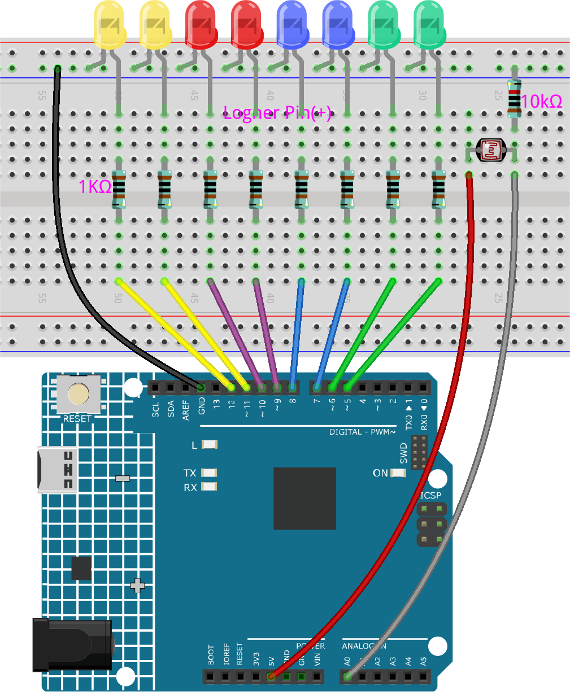

.. note::

    Bonjour, bienvenue dans la communauté SunFounder Raspberry Pi & Arduino & ESP32 Enthusiasts sur Facebook ! Plongez dans l'univers de Raspberry Pi, Arduino et ESP32 avec d'autres passionnés.

    **Pourquoi nous rejoindre ?**

    - **Support d'experts** : Résolvez les problèmes après-vente et les défis techniques avec l'aide de notre communauté et de notre équipe.
    - **Apprendre et partager** : Échangez des conseils et des tutoriels pour améliorer vos compétences.
    - **Aperçus exclusifs** : Accédez en avant-première aux annonces de nouveaux produits et aux aperçus.
    - **Réductions spéciales** : Profitez de réductions exclusives sur nos nouveaux produits.
    - **Promotions festives et cadeaux** : Participez à des cadeaux et à des promotions festives.

    👉 Prêt à explorer et à créer avec nous ? Cliquez sur [|link_sf_facebook|] et rejoignez-nous dès aujourd'hui !

6.1 Matrice de sensibilité à la lumière
===========================================

Une photo-résistance, ou cellule photoélectrique, est une résistance variable contrôlée par la lumière. La résistance d'une photo-résistance diminue à mesure que l'intensité de la lumière incidente augmente ; en d'autres termes, elle présente une photoconductivité. Une photo-résistance peut être utilisée dans des circuits de détection de lumière et des circuits activés par la lumière ou l'obscurité.

La résistance d'une photo-résistance varie avec l'intensité de la lumière incidente. Si l'intensité lumineuse augmente, la résistance diminue ; si elle diminue, la résistance augmente.
Dans cette expérience, nous utiliserons huit LED pour indiquer l'intensité lumineuse. Plus la lumière est intense, plus les LED s'allument. Lorsque l'intensité lumineuse est suffisante, toutes les LED s'allument. Dans l'obscurité, toutes les LED s'éteignent.

**Composants nécessaires**

Dans ce projet, nous avons besoin des composants suivants :

C'est pratique d'acheter un kit complet, voici le lien :

.. list-table::
    :widths: 20 20 20
    :header-rows: 1

    *   - Nom
        - ARTICLES DANS CE KIT
        - LIEN
    *   - Kit de démarrage 3 en 1
        - 380+
        - |link_3IN1_kit|

Vous pouvez également les acheter séparément via les liens ci-dessous.

.. list-table::
    :widths: 30 20
    :header-rows: 1

    *   - INTRODUCTION DES COMPOSANTS
        - LIEN D'ACHAT

    *   - :ref:`cpn_uno`
        - \-
    *   - :ref:`cpn_breadboard`
        - |link_breadboard_buy|
    *   - :ref:`cpn_wires`
        - |link_wires_buy|
    *   - :ref:`cpn_resistor`
        - |link_resistor_buy|
    *   - :ref:`cpn_led`
        - |link_led_buy|
    *   - :ref:`cpn_photoresistor`
        - |link_photoresistor_buy|

**Schéma**

.. image:: img/circuit_6.1_light_led.png

**Câblage**

**Code**

.. note::

    * Ouvrez le fichier ``6.1.light_control_led.ino`` dans le répertoire ``3in1-kit\learning_project\6.1.light_control_led``.
    * Ou copiez ce code dans l'IDE Arduino.
    

.. raw:: html

    <iframe src=https://create.arduino.cc/editor/sunfounder01/859e1688-5801-400e-9409-f844ca9b7da7/preview?embed style="height:510px;width:100%;margin:10px 0" frameborder=0></iframe>
    
Maintenant, éclairez la photo-résistance avec une lumière et vous verrez plusieurs LED s'allumer. Augmentez la lumière et vous verrez plus de LED s'allumer. Placez-la dans un environnement sombre, et toutes les LED s'éteindront.

**Comment ça fonctionne ?**

.. code-block:: arduino

    void loop() 
    {
        sensorValue = analogRead(photocellPin); // lire la valeur sur A0
        ledLevel = map(sensorValue, 300, 1023, 0, NbrLEDs); // mapper au nombre de LEDs
        for (int led = 0; led < NbrLEDs; led++)//
        {
            if (led < ledLevel ) // Si led est inférieur à ledLevel, exécuter le code suivant.
            {
                digitalWrite(ledPins[led], HIGH); // allumer les broches inférieures au niveau
            }
            else 
            {
                digitalWrite(ledPins[led],LOW); // éteindre les broches supérieures
            }
        }
    }

En utilisant la fonction ``map()``, vous pouvez mapper la valeur de la photo-résistance sur les 8 LED. Par exemple, si ``sensorValue`` est 560, alors ``ledLevel`` est 4, donc à ce moment-là, ``ledPins[0]`` à ``ledPins[4]`` devraient être allumées, et ``ledPins[5]`` à ``ledPins[7]`` devraient être éteintes.
