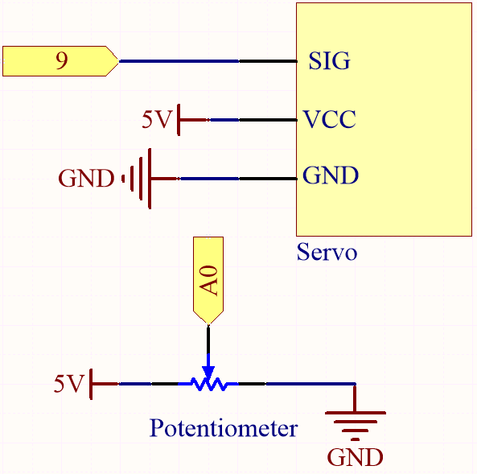

.. note::

    Bonjour et bienvenue dans la Communauté Facebook des passionnés de Raspberry Pi, Arduino et ESP32 de SunFounder ! Plongez plus profondément dans l'univers des Raspberry Pi, Arduino et ESP32 avec d'autres passionnés.

    **Pourquoi rejoindre ?**

    - **Support d'experts** : Résolvez les problèmes après-vente et les défis techniques avec l'aide de notre communauté et de notre équipe.
    - **Apprendre et partager** : Échangez des astuces et des tutoriels pour améliorer vos compétences.
    - **Aperçus exclusifs** : Accédez en avant-première aux annonces de nouveaux produits et aux aperçus.
    - **Réductions spéciales** : Profitez de réductions exclusives sur nos produits les plus récents.
    - **Promotions festives et cadeaux** : Participez à des cadeaux et des promotions de vacances.

    👉 Prêt à explorer et à créer avec nous ? Cliquez [|link_sf_facebook|] et rejoignez-nous aujourd'hui !

.. _ar_map:

5.6 Cartographie
===================

Si vous observez attentivement, vous remarquerez que de nombreuses valeurs ont des plages différentes en programmation.
Par exemple, la plage de valeurs pour les entrées analogiques est de (0~1023).
La plage de valeurs pour la sortie analogique est de (0~255).
L'angle de sortie du servomoteur est de (0~180).

Cela signifie que si nous voulons utiliser le potentiomètre pour contrôler la luminosité de la LED ou l'angle du servomoteur, nous devons passer par une opération de cartographie.

Voyons maintenant comment y parvenir.

**Composants requis**

Pour ce projet, nous avons besoin des composants suivants.

Il est certainement pratique d'acheter un kit complet, voici le lien :

.. list-table::
    :widths: 20 20 20
    :header-rows: 1

    *   - Nom	
        - ÉLÉMENTS DE CE KIT
        - LIEN
    *   - 3 in 1 Starter Kit
        - 380+
        - |link_3IN1_kit|

Vous pouvez également les acheter séparément via les liens ci-dessous.

.. list-table::
    :widths: 30 20
    :header-rows: 1

    *   - INTRODUCTION DES COMPOSANTS
        - LIEN D'ACHAT

    *   - :ref:`cpn_uno`
        - |link_Uno_R3_buy|
    *   - :ref:`cpn_breadboard`
        - |link_breadboard_buy|
    *   - :ref:`cpn_wires`
        - |link_wires_buy|
    *   - :ref:`cpn_servo`
        - |link_servo_buy|
    *   - :ref:`cpn_potentiometer`
        - |link_potentiometer_buy|

**Schéma**

**Câblage**

.. image:: img/map_bb.jpg
    :width: 800
    :align: center

**Code**

.. note::

    * Ouvrez le fichier ``5.6.map.ino`` sous le chemin ``3in1-kit\basic_project\5.6.map``.
    * Ou copiez ce code dans **Arduino IDE**.
    
    * Ou téléchargez le code via l'`Arduino Web Editor <https://docs.arduino.cc/cloud/web-editor/tutorials/getting-started/getting-started-web-editor>`_.

.. raw:: html
    
    <iframe src=https://create.arduino.cc/editor/sunfounder01/f00e4c4c-fb13-4445-9d89-eb2857b5fe87/preview?embed style="height:510px;width:100%;margin:10px 0" frameborder=0></iframe>
    
Après le téléchargement réussi du code, vous pouvez tourner le potentiomètre d'avant en arrière, et l'arbre de sortie du servo tournera d'avant en arrière.

**Comment ça fonctionne ?**

``map(value, fromLow, fromHigh, toLow, toHigh)`` : Mappez un nombre d'une plage à une autre.
C'est-à-dire qu'une valeur de fromLow est mappée sur toLow, et une valeur de fromHigh est mappée sur toHigh.

    **Syntaxe**
        map(value, fromLow, fromHigh, toLow, toHigh)

    **Paramètres**
        * ``value`` : le nombre à mapper.
        * ``fromLow`` : la limite inférieure de la plage actuelle de la valeur.
        * ``fromHigh`` : la limite supérieure de la plage actuelle de la valeur.
        * ``toLow`` : la limite inférieure de la plage cible de la valeur.
        * ``toHigh`` : la limite supérieure de la plage cible de la valeur.

Si le potentiomètre contrôle la LED, vous pouvez également utiliser la cartographie pour accomplir la tâche.

.. code-block:: arduino

    int x = analogRead(knob);
    int y = map(x,0,1023,0,255);
    analogWrite(led,y);

**Notes et Avertissements**

* La "limite inférieure" des deux plages peut être plus grande ou plus petite que la "limite supérieure", ce qui signifie que la fonction ``map()`` peut être utilisée pour inverser une plage de nombres.

  .. code-block:: arduino

    y = map(x,0,180,180,0);

* La cartographie fonctionne également bien pour les nombres négatifs.

  .. code-block:: arduino

    y = map(x,0,1023,-90,90);

* La cartographie utilise des entiers, et les décimales des nombres flottants sont ignorées.
