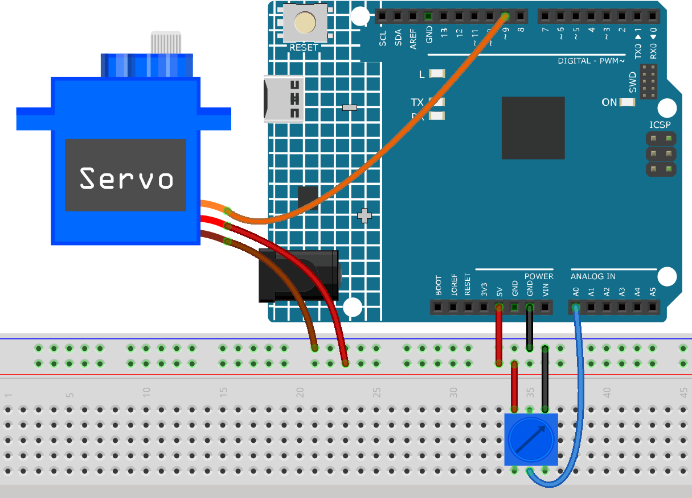

.. note::

    Hello, welcome to the SunFounder Raspberry Pi & Arduino & ESP32 Enthusiasts Community on Facebook! Dive deeper into Raspberry Pi, Arduino, and ESP32 with fellow enthusiasts.

    **Why Join?**

    - **Expert Support**: Solve post-sale issues and technical challenges with help from our community and team.
    - **Learn & Share**: Exchange tips and tutorials to enhance your skills.
    - **Exclusive Previews**: Get early access to new product announcements and sneak peeks.
    - **Special Discounts**: Enjoy exclusive discounts on our newest products.
    - **Festive Promotions and Giveaways**: Take part in giveaways and holiday promotions.

    👉 Ready to explore and create with us? Click [|link_sf_facebook|] and join today!

.. _ar_map:

5.6 Map
===================

If you observe carefully, you will notice that many values have different ranges in programming.
For example, the range of values for analog inputs is (0~1023).
The value range for the analog output is (0~255).
The output angle of the servo is (0~180).

This means that if we want to use the potentiometer to control the brightness of the LED or the angle of the servo, we need to go through a mapping operation.

Now let's see how to achieve it.

**Required Components**

In this project, we need the following components. 

It's definitely convenient to buy a whole kit, here's the link: 

.. list-table::
    :widths: 20 20 20
    :header-rows: 1

    *   - Name	
        - ITEMS IN THIS KIT
        - LINK
    *   - 3 in 1 Starter Kit
        - 380+
        - |link_3IN1_kit|

You can also buy them separately from the links below.

.. list-table::
    :widths: 30 20
    :header-rows: 1

    *   - COMPONENT INTRODUCTION
        - PURCHASE LINK

    *   - :ref:`cpn_uno`
        - \-
    *   - :ref:`cpn_breadboard`
        - |link_breadboard_buy|
    *   - :ref:`cpn_wires`
        - |link_wires_buy|
    *   - :ref:`cpn_servo`
        - |link_servo_buy|
    *   - :ref:`cpn_potentiometer`
        - |link_potentiometer_buy|

**Schematic**

.. image:: img/circuit_8.3_amp.png

**Wiring**

**Code**

.. note::

    * Open the ``5.6.map.ino`` file under the path of ``3in1-kit\learning_project\5.6.map``.
    * Or copy this code into **Arduino IDE**.
    
    

.. raw:: html
    
    <iframe src=https://create.arduino.cc/editor/sunfounder01/f00e4c4c-fb13-4445-9d89-eb2857b5fe87/preview?embed style="height:510px;width:100%;margin:10px 0" frameborder=0></iframe>
    
After the code is uploaded successfully, you can rotate the potentiometer back and forth, and the output shaft of the servo will rotate back and forth.

**How it works?**

``map(value, fromLow, fromHigh, toLow, toHigh)``: Map a number from one range to another.
That is, a fromLow value is mapped to toLow, and a fromHigh value is mapped to toHigh.

    **Syntax**
        map(value, fromLow, fromHigh, toLow, toHigh)

    **Parameters**
        * ``value``: the number to map.
        * ``fromLow``: the lower bound of the value’s current range.
        * ``fromHigh``: the upper bound of the value’s curr+ent range.
        * ``toLow``: the lower bound of the value’s target range.
        * ``toHigh``: the upper bound of the value’s target range.

If the potentiometer controls the LED, you can also use the map to complete the task.

.. code-block:: arduino

    int x = analogRead(knob);
    int y = map(x,0,1023,0,255);
    analogWrite(led,y);

**Notes and Warnings**

* The "lower bound" of both ranges may be larger or smaller than the "upper bound", which means that the ``map()`` function can be used to reverse a range of numbers.

  .. code-block:: arduino

    y = map(x,0,180,180,0);

* Mapping also works well for negative numbers.

  .. code-block:: arduino

    y = map(x,0,1023,-90,90);

* The mapping uses integers, and the decimal places of floats are discarded.