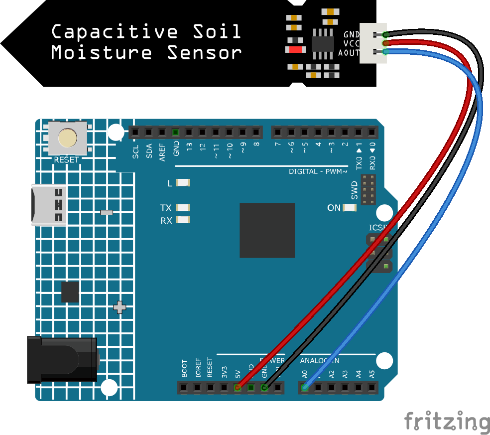

.. note::

    こんにちは、SunFounderのRaspberry Pi & Arduino & ESP32愛好家コミュニティへようこそ！Facebook上でRaspberry Pi、Arduino、ESP32についてもっと深く掘り下げ、他の愛好家と交流しましょう。

    **参加する理由は？**

    - **エキスパートサポート**：コミュニティやチームの助けを借りて、販売後の問題や技術的な課題を解決します。
    - **学び＆共有**：ヒントやチュートリアルを交換してスキルを向上させましょう。
    - **独占的なプレビュー**：新製品の発表や先行プレビューに早期アクセスしましょう。
    - **特別割引**：最新製品の独占割引をお楽しみください。
    - **祭りのプロモーションとギフト**：ギフトや祝日のプロモーションに参加しましょう。

    👉 私たちと一緒に探索し、創造する準備はできていますか？[|link_sf_facebook|]をクリックして今すぐ参加しましょう！

.. _ar_moisture:

4.4 土壌の湿度を測定する
==========================

農業の世界では、作物自体が土壌の無機元素を直接取得することはできません。
土壌中の水が、これらの無機元素を溶解する溶媒として作用します。

作物は根系を通じて土壌の湿度を吸収し、栄養を得て、成長を促進します。

作物の成長と発展の過程で、土壌の温度に対する要求も異なります。
そのため、土壌湿度センサーが必要とされます。

**必要な部品**

このプロジェクトでは、以下の部品が必要です。

一式を購入するのは確かに便利です。リンクは以下のとおりです：

.. list-table::
    :widths: 20 20 20
    :header-rows: 1

    *   - 名前
        - このキットのアイテム
        - リンク
    *   - 3 in 1 Starter Kit
        - 380+
        - |link_3IN1_kit|

以下のリンクから別々に購入することも可能です。

.. list-table::
    :widths: 30 20
    :header-rows: 1

    *   - コンポーネントの紹介
        - 購入リンク

    *   - :ref:`cpn_uno`
        - \-
    *   - :ref:`cpn_wires`
        - |link_wires_buy|
    *   - :ref:`cpn_soil_moisture`
        - |link_soil_moisture_buy|

**回路図**

.. image:: img/circuit_5.4_soil.png

**配線図**

**コード**

.. note::

    * ``3in1-kit\learning_project\4.4.measure_soil_moisture`` のパスの下の ``4.4.measure_soil_moisture.ino`` ファイルを開きます。
    * あるいは、このコードを **Arduino IDE** にコピーします。
    

.. raw:: html

    <iframe src=https://create.arduino.cc/editor/sunfounder01/b6f7e756-0f14-4117-9bb2-ee5083b6445f/preview?embed style="height:510px;width:100%;margin:10px 0" frameborder=0></iframe>

コードが正常にアップロードされると、シリアルモニターに土壌の湿度値が表示されます。

モジュールを土壌に差し込み、水をやると、土壌湿度センサーの値は小さくなります。
