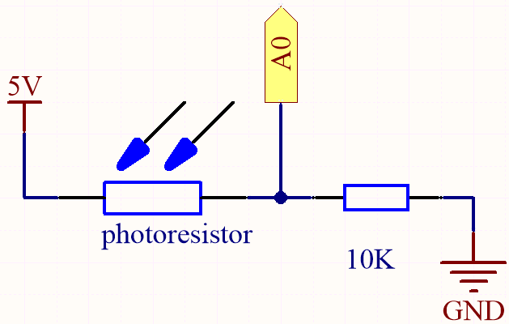
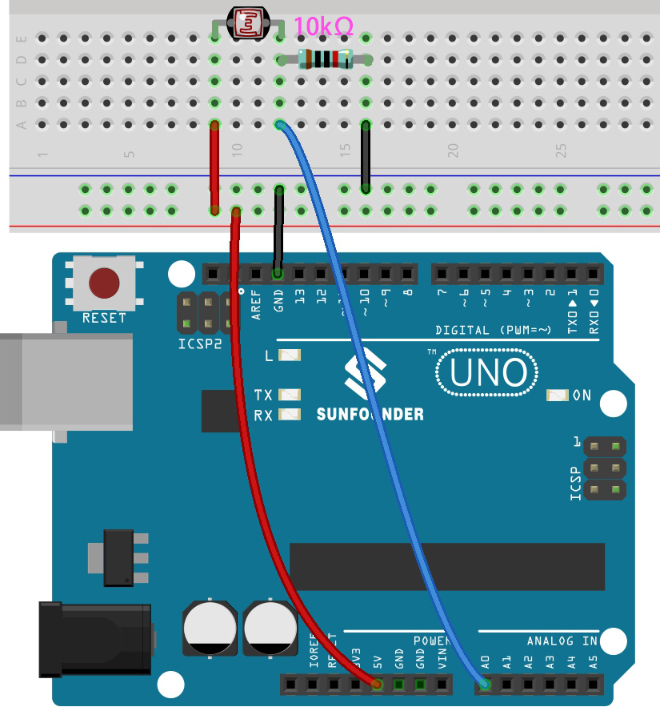

.. _ar_photoresistor:

4.2 Licht wahrnehmen
===========================

Der Fotowiderstand ist ein typisches Gerät für analoge Eingänge und wird in einer sehr ähnlichen Weise wie ein Potentiometer verwendet. Sein Widerstandswert hängt von der Intensität des Lichts ab: Je stärker das einfallende Licht, desto geringer ist sein Widerstandswert und umgekehrt.

**Benötigte Komponenten**

Für dieses Projekt benötigen wir folgende Komponenten.

Es ist sicherlich praktisch, ein komplettes Set zu kaufen, hier ist der Link:

.. list-table::
    :widths: 20 20 20
    :header-rows: 1

    *   - Name	
        - ARTIKEL IN DIESEM KIT
        - LINK
    *   - 3 in 1 Starter Kit
        - 380+
        - |link_3IN1_kit|

Sie können diese auch einzeln über die untenstehenden Links kaufen.

.. list-table::
    :widths: 30 20
    :header-rows: 1

    *   - KOMPONENTENBESCHREIBUNG
        - KAUF-LINK

    *   - :ref:`cpn_uno`
        - |link_Uno_R3_buy|
    *   - :ref:`cpn_breadboard`
        - |link_breadboard_buy|
    *   - :ref:`cpn_wires`
        - |link_wires_buy|
    *   - :ref:`cpn_resistor`
        - |link_resistor_buy|
    *   - :ref:`cpn_photoresistor`
        - |link_photoresistor_buy|

**Schaltplan**

In dieser Schaltung sind der 10K Widerstand und der Fotowiderstand in Reihe geschaltet und der durch sie fließende Strom ist derselbe. Der 10K Widerstand dient als Schutz und der Pin A0 liest den Wert nach der Spannungsumwandlung des Fotowiderstands.

Wenn das Licht verstärkt wird, verringert sich der Widerstand des Fotowiderstands, seine Spannung sinkt und der Wert von Pin A0 steigt.
Wenn das Licht stark genug ist, wird der Widerstand des Fotowiderstands nahezu 0 sein und der Wert von Pin A0 wird nahe 1023 liegen.
Der 10K Widerstand spielt hierbei eine schützende Rolle, sodass 5V und GND nicht miteinander verbunden werden und es zu einem Kurzschluss kommt.

Platziert man den Fotowiderstand in einer dunklen Umgebung, wird der Wert von Pin A0 sinken.
In einer ausreichend dunklen Umgebung wird der Widerstand des Fotowiderstands unendlich groß und seine Spannung nahe 5V liegen (der 10K Widerstand ist vernachlässigbar), der Wert von Pin A0 wird nahe 0 liegen.

Die Berechnungsformel lautet wie folgt:

    (Vp/5V) x 1023 = Ap

**Verkabelung**

**Code**

.. note::

    * Öffnen Sie die Datei ``4.2.feel_the_light.ino`` unter dem Pfad ``3in1-kit\basic_project\4.2.feel_the_light``.
    * Oder kopieren Sie diesen Code in die **Arduino IDE**.
    
    * Oder laden Sie den Code über den `Arduino Web Editor <https://docs.arduino.cc/cloud/web-editor/tutorials/getting-started/getting-started-web-editor>`_ hoch.

.. raw:: html

    <iframe src=https://create.arduino.cc/editor/sunfounder01/e1bc4c8b-788e-4bfe-a0a1-532d4fdc7753/preview?embed style="height:510px;width:100%;margin:10px 0" frameborder=0></iframe>
    
Nach erfolgreichem Hochladen des Codes gibt der serielle Monitor die Werte des Fotowiderstands aus. 
Je stärker die aktuelle Umgebungshelligkeit, desto größer ist der auf dem seriellen Monitor angezeigte Wert.
