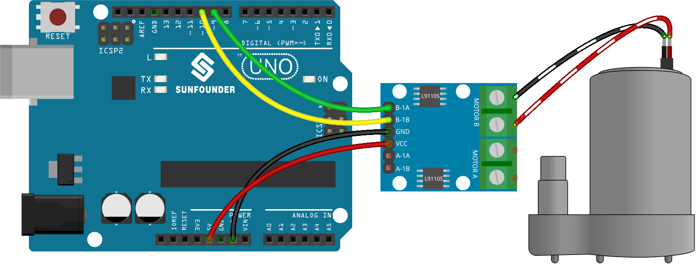

.. note::

    こんにちは、SunFounderのRaspberry Pi & Arduino & ESP32愛好家コミュニティへようこそ！Facebook上でRaspberry Pi、Arduino、ESP32についてもっと深く掘り下げ、他の愛好家と交流しましょう。

    **参加する理由は？**

    - **エキスパートサポート**：コミュニティやチームの助けを借りて、販売後の問題や技術的な課題を解決します。
    - **学び＆共有**：ヒントやチュートリアルを交換してスキルを向上させましょう。
    - **独占的なプレビュー**：新製品の発表や先行プレビューに早期アクセスしましょう。
    - **特別割引**：最新製品の独占割引をお楽しみください。
    - **祭りのプロモーションとギフト**：ギフトや祝日のプロモーションに参加しましょう。

    👉 私たちと一緒に探索し、創造する準備はできていますか？[|link_sf_facebook|]をクリックして今すぐ参加しましょう！

.. _ar_pump:

1.4 ポンピング
===================

水ポンプもモーターの一つで、モーターや他の外部エネルギーの機械エネルギーを特別な構造を通じて液体を輸送するものです。

**必要な部品**

このプロジェクトには以下の部品が必要です。

キット全体を購入すると非常に便利です、リンクは以下です:

.. list-table::
    :widths: 20 20 20
    :header-rows: 1

    *   - 名前	
        - このキットのアイテム
        - リンク
    *   - 3 in 1 Starter Kit
        - 380+
        - |link_3IN1_kit|

下のリンクから個別に購入することもできます。

.. list-table::
    :widths: 30 20
    :header-rows: 1

    *   - コンポーネント紹介
        - 購入リンク

    *   - :ref:`cpn_uno`
        - |link_Uno_R3_buy|
    *   - :ref:`cpn_wires`
        - |link_wires_buy|
    *   - :ref:`cpn_l9110`
        - \-
    *   - :ref:`cpn_pump`
        - \-

**回路図**

.. image:: img/circuit_1.3_wheel_l9110.png

**配線図**

**コード**

.. note::

   * ファイル ``1.4.pumping.ino`` を ``3in1-kit\basic_project\1.4.pumping`` のパスから開くことができます。
   * また、このコードを **Arduino IDE** にコピーしてください。
   
   * あるいは、 `Arduino Web Editor <https://docs.arduino.cc/cloud/web-editor/tutorials/getting-started/getting-started-web-editor>`_ を使ってコードをアップロードしてください。

.. raw:: html
    
    <iframe src=https://create.arduino.cc/editor/sunfounder01/aadf3a3f-3384-49ae-9a52-44d6eaa6a211/preview?embed style="height:510px;width:100%;margin:10px 0" frameborder=0></iframe>
    
ポンプにチューブを追加して、それをベースンに置きます。コードが正常にアップロードされた後、しばらくするとベースンの水が排水されるのを確認できます。
この実験を行う際は、短絡を避けるため回路を水から離してください！
