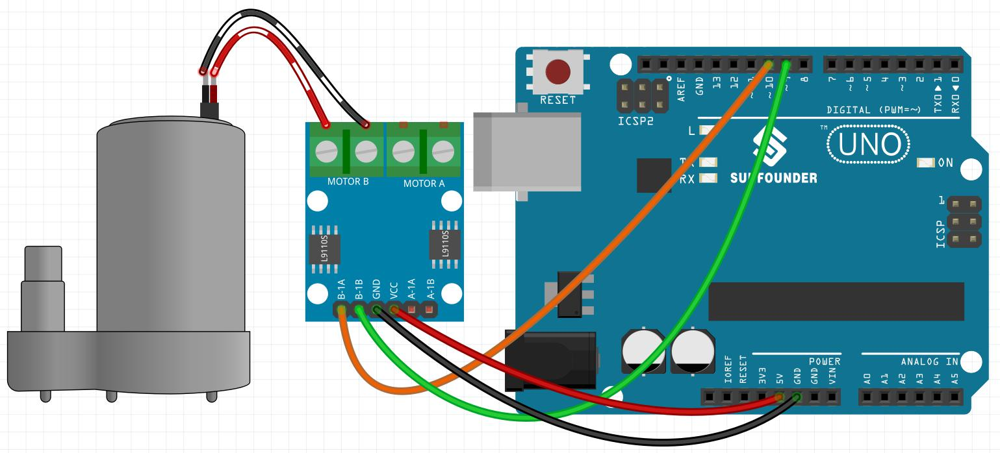

.. _ar_pump:

1.4 Pumping
===================

The water pump is also a motor, which converts the mechanical energy of the motor or other external energy through a special structure to transport the liquid.

**Schematic**

.. image:: img/circuit_1.3_wheel.png

IN1~IN4 are the inputs of the L298N module, and OUT1~OUT4 are the outputs.

A simple way to use them is: input high level for INx, OUTx will output high level; input low level for INx, OUTx will output low level.
Connecting the two ends of the motor to OUT1 and OUT2, inputting opposite level signals for IN1 and IN2 will make the motor rotate. OUT3 and OUT4 can be used in the same way.

**Wiring**

.. list-table:: 
    :widths: 25 25 50
    :header-rows: 1

    * - L298N
      - R3 Board
      - Motor
    * - 12V
      - 5V
      - 
    * - GND
      - GND
      - 
    * - IN3
      - 9
      -
    * - IN4
      - 10
      - 
    * - OUT3
      - 
      - one wire of the motor
    * - OUT4
      - 
      - one wire of the motor

* :ref:`cpn_uno`
* :ref:`cpn_wires`
* :ref:`cpn_l298n`
* :ref:`cpn_pump`

**Code**

.. note::

   * You can open the file ``1.4.pumping.ino`` under the path of ``3in1-kit\learning_project\1.4.pumping``. 
   * Or copy this code into **Arduino IDE**.
   
   * Or upload the code through the `Arduino Web Editor <https://docs.arduino.cc/cloud/web-editor/tutorials/getting-started/getting-started-web-editor>`_.

.. raw:: html
    
    <iframe src=https://create.arduino.cc/editor/sunfounder01/f829508f-2475-4de6-bc2f-ab0a68d707b1/preview?F=undefined?embed style="height:510px;width:100%;margin:10px 0" frameborder=0></iframe>
    
Add the tubing to the pump and place it in the basin. After the code is uploaded successfully, you can see that the water in the basin is drained after a while.
When doing this experiment, please keep the circuit away from water to avoid short circuit!