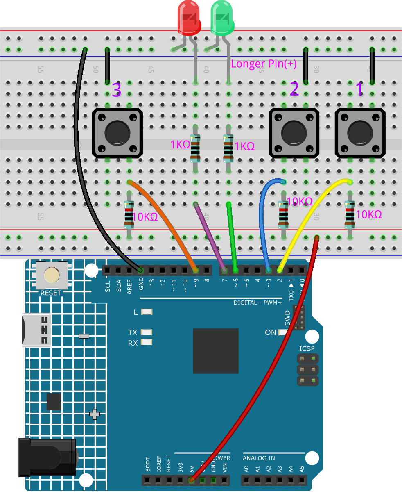

6.5 Reaktionsspiel
==========================

Unser Körper hat viele Reaktionszeiten, wie z.B. akustische RT, visuelle RT, taktile RT usw.

Reaktionszeiten haben viele Auswirkungen auf unser tägliches Leben. Zum Beispiel kann eine langsamer als normale Reaktionszeit beim Autofahren zu schwerwiegenden Folgen führen.

In diesem Projekt verwenden wir 3 Tasten und 2 LEDs, um unsere visuelle Reaktionszeit zu messen.

Das serielle Monitor des Arduino zeigt die Nachricht "Warte..." an.
Nachdem die "Bereit"-Taste gedrückt wurde, muss eine der beiden LEDs nach einer zufälligen Zeit zufällig aufleuchten. Es ist wichtig, dass der Proband die entsprechende Taste so schnell wie möglich drückt.
Der Arduino zeichnet den Zeitunterschied zwischen dem Aufleuchten der LED und dem Drücken der entsprechenden Taste durch die Person auf und gibt die gemessene Reaktionszeit auf dem Arduino seriellen Monitor aus.

**Benötigte Komponenten**

Für dieses Projekt benötigen wir die folgenden Komponenten.

Es ist definitiv praktisch, ein ganzes Kit zu kaufen, hier ist der Link:

.. list-table::
    :widths: 20 20 20
    :header-rows: 1

    *   - Name	
        - ARTIKEL IN DIESEM KIT
        - LINK
    *   - 3 in 1 Starter Kit
        - 380+
        - |link_3IN1_kit|

Sie können sie auch separat über die untenstehenden Links kaufen.

.. list-table::
    :widths: 30 20
    :header-rows: 1

    *   - KOMPONENTENBESCHREIBUNG
        - KAUF-LINK

    *   - :ref:`cpn_uno`
        - \-
    *   - :ref:`cpn_breadboard`
        - |link_breadboard_buy|
    *   - :ref:`cpn_wires`
        - |link_wires_buy|
    *   - :ref:`cpn_resistor`
        - |link_resistor_buy|
    *   - :ref:`cpn_led`
        - |link_led_buy|
    *   - :ref:`cpn_button`
        - |link_button_buy|

**Schaltplan**

.. image:: img/wiring_reaction_game.png
    :align: center

**Verdrahtung**

**Code**

.. note::

    * Sie können die Datei ``6.5_reaction_time.ino`` direkt unter dem Pfad ``3in1-kit\learning_project\6.5_reversingAid`` öffnen.
    * Oder kopieren Sie diesen Code in die Arduino IDE.
    
    * Stellen Sie sicher, dass Sie die ``LiquidCrystal_I2C``-Bibliothek hinzugefügt haben. Detaillierte Anleitungen finden Sie unter :ref:`install_libraries_ar`.

.. raw:: html

    <iframe src=https://create.arduino.cc/editor/sunfounder01/4313dd1c-e1d2-4939-ae20-0a5b82a12390/preview?embed style="height:510px;width:100%;margin:10px 0" frameborder=0></iframe>

**Wie funktioniert das?**

#. Initialisieren Sie die Tasten und LEDs, hier werden 2 Interrupts verwendet, um den Status der Tasten auszulesen.

    .. code-block:: arduino

        void setup()
        {

            ...

            attachInterrupt(digitalPinToInterrupt(buttonPin1), pressed1, FALLING);
            attachInterrupt(digitalPinToInterrupt(buttonPin2), pressed2, FALLING);
            ...
        }

#. Wenn die ``rstBtn``-Taste gedrückt wird, beginnt das Spiel von Neuem. Nach einer zufälligen Zeit zwischen 2 und 5ms wird eine der LEDs eingeschaltet.

    .. code-block:: arduino

        void loop()
        {
            if (flag == -1 && digitalRead(rstBtn) == LOW) {
                digitalWrite(ledPin1, LOW);
                digitalWrite(ledPin2, LOW);
                Serial.println("Waiting...");
                int randomTime = random(2000, 5000);
                delay(randomTime);

                timer = millis();
                flag = randomTime % 2;
                Serial.println("Light!");

                if (flag == 0) {
                    digitalWrite(ledPin1, HIGH);
                } else if (flag == 1) {
                    digitalWrite(ledPin2, HIGH);
                }
            }
            delay(200);
        }

    * Wenn flag -1 ist und die ``rstBtn``-Taste gedrückt wird, wird die ``random()``-Funktion verwendet, um eine zufällige Zeit von 2-5s zu generieren.
    * Diese Zeit wird dann verwendet, um das Licht der LEDs zu steuern.
    * Das Einschalten der 2 LEDs wird zufällig mit ``randomTime % 2`` mit 0 und 1 generiert. Wenn flag 0 ist, dann leuchtet LED1; wenn 1, dann leuchtet LED2.

#. Über die Funktion ``pressed1()``

    .. code-block:: arduino

        void pressed1() {
            if (flag == -1) {
                return;
            }
            if (flag == 0) {
                int currentTime = millis();
                Serial.print("Correct! You reaction time is : ");
                Serial.print(currentTime - timer);
                Serial.println(" ms");
            } else if (flag == 1) {
                Serial.println("Wrong Click!");
            }
            flag = -1;
        }

    Dies ist die Funktion, die ausgelöst wird, wenn die Taste 1 gedrückt wird. Wird die Taste 1 gedrückt und ist flag zu diesem Zeitpunkt 0, wird die Reaktionszeit ausgegeben, ansonsten wird ein Druckfehler angezeigt.

#. Über die Funktion ``pressed2()``

    .. code-block:: arduino

        void pressed2() {
            if (flag == -1) {
                return;
            }
            if (flag == 1) {
                int currentTime =millis();
                Serial.print("Correct! You reaction time is : ");
                Serial.print(currentTime - timer);
                Serial.println(" ms");
            } else if (flag == 0) {
                Serial.println("Wrong Click!");
            }
            flag = -1;
        }

    Dies ist die Funktion, die ausgelöst wird, wenn die Taste 2 gedrückt wird. Wird die Taste 2 gedrückt und ist flag zu diesem Zeitpunkt 1, wird die Reaktionszeit ausgegeben, ansonsten wird ein Druckfehler angezeigt.

