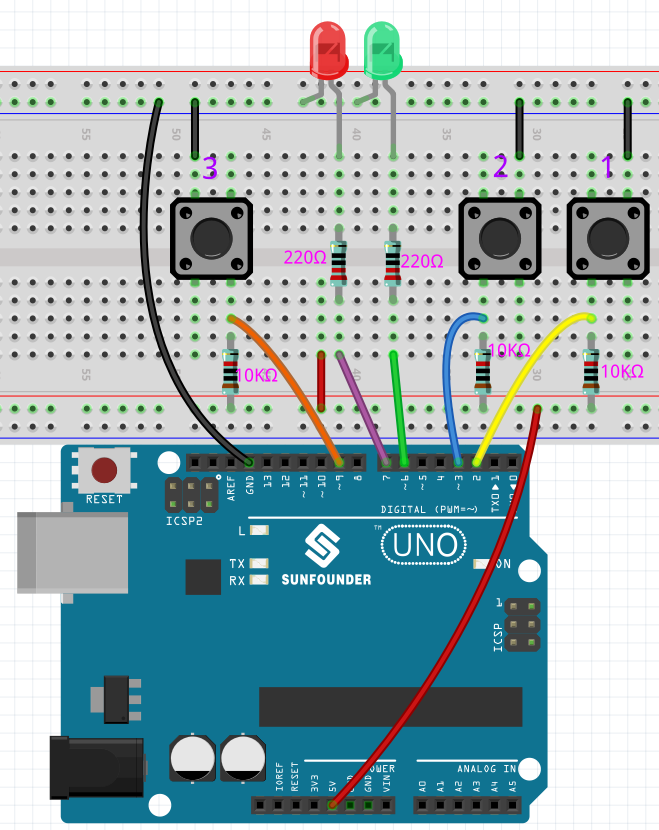

6.5 Reaction Game
==========================

Our body has many reaction times, such as audio RT, visual RT, touch RT, etc.

Reaction times have many effects on our daily life, for example, slower than normal reaction times when driving can lead to serious consequences.

In this project, we use 3 buttons and 2 LEDs to measure our visual reaction time.

The serial monitor of the Arduino displays the message "waiting..."
After pressing the Ready button, one of the two LEDs must light up randomly after a random time interval. It is important that the testee pushes the corresponding button as soon as possible.
The Arduino records the time difference between when the LED lights up and when the person presses the corresponding button, and prints the measured response time on the Arduino serial monitor.

**Schematic Diagram**

.. image:: img/6.5_reaction_game_bb.png
    :align: center

**Fritzing Circuit**

* :ref:`cpn_uno`
* :ref:`cpn_breadboard`
* :ref:`cpn_wires`
* :ref:`cpn_led`
* :ref:`cpn_resistor`
* :ref:`cpn_button`

**Code**

.. note::

    * You can open the file ``6.5_reaction_time.ino`` under the path of ``3in1-kit\learning_project\6.5_reversingAid`` directly.
    * Or copy this code into Arduino IDE 1/2.
    
    * Please make sure you have added the ``LiquidCrystal_I2C`` library, detailed tutorials refer to :ref:`add_libraries_ar`.

.. raw:: html

    <iframe src=https://create.arduino.cc/editor/sunfounder01/4313dd1c-e1d2-4939-ae20-0a5b82a12390/preview?embed style="height:510px;width:100%;margin:10px 0" frameborder=0></iframe>

**How it works?**

#. Initialize the buttons and LEDs, 2 interrupt are used here to read the button status.

    .. code-block:: arduino

        void setup()
        {

            ...

            attachInterrupt(digitalPinToInterrupt(buttonPin1), pressed1, FALLING);
            attachInterrupt(digitalPinToInterrupt(buttonPin2), pressed2, FALLING);
            ...
        }

#. If the ``rstBtn`` button is pressed, the game starts again. At a random time between 2 and 5ms, make one of the LEDs light up.

    .. code-block:: arduino

        void loop()
        {
            if (flag == -1 && digitalRead(rstBtn) == LOW) {
                digitalWrite(ledPin1, LOW);
                digitalWrite(ledPin2, LOW);
                Serial.println("Waiting...");
                int randomTime = random(2000, 5000);
                delay(randomTime);

                timer = millis();
                flag = randomTime % 2;
                Serial.println("Light!");

                if (flag == 0) {
                    digitalWrite(ledPin1, HIGH);
                } else if (flag == 1) {
                    digitalWrite(ledPin2, HIGH);
                }
            }
            delay(200);
        }

    * When flag is -1 and ``rstBtn`` button is pressed, use ``random()`` function to generate a random time of 2-5s.
    * This time is then used to control the lighting of the LEDs.
    * Also the lighting of 2 LEDs is randomly generated by ``randomTime % 2`` with 0 and 1. If flag is 0, then LED1 is lit; if 1, then LED2 is lit.

#. About ``pressed1()`` function

    .. code-block:: arduino

        void pressed1() {
            if (flag == -1) {
                return;
            }
            if (flag == 0) {
                int currentTime = millis();
                Serial.print("Correct! You reaction time is : ");
                Serial.print(currentTime - timer);
                Serial.println(" ms");
            } else if (flag == 1) {
                Serial.println("Wrong Click!");
            }
            flag = -1;
        }

    This is the function that will be triggered when button 1 is pressed. When button 1 is pressed, if the flag is 0 at this time, the response time will be printed, otherwise the press error will be prompted.

#. About ``pressed2()`` function

    .. code-block:: arduino

        void pressed2() {
            if (flag == -1) {
                return;
            }
            if (flag == 1) {
                int currentTime =millis();
                Serial.print("Correct! You reaction time is : ");
                Serial.print(currentTime - timer);
                Serial.println(" ms");
            } else if (flag == 0) {
                Serial.println("Wrong Click!");
            }
            flag = -1;
        }

    This is the function that will be triggered when button 2 is pressed. When button 2 is pressed, if the flag is 1 at this time, the response time will be printed, otherwise the press error will be prompted.

