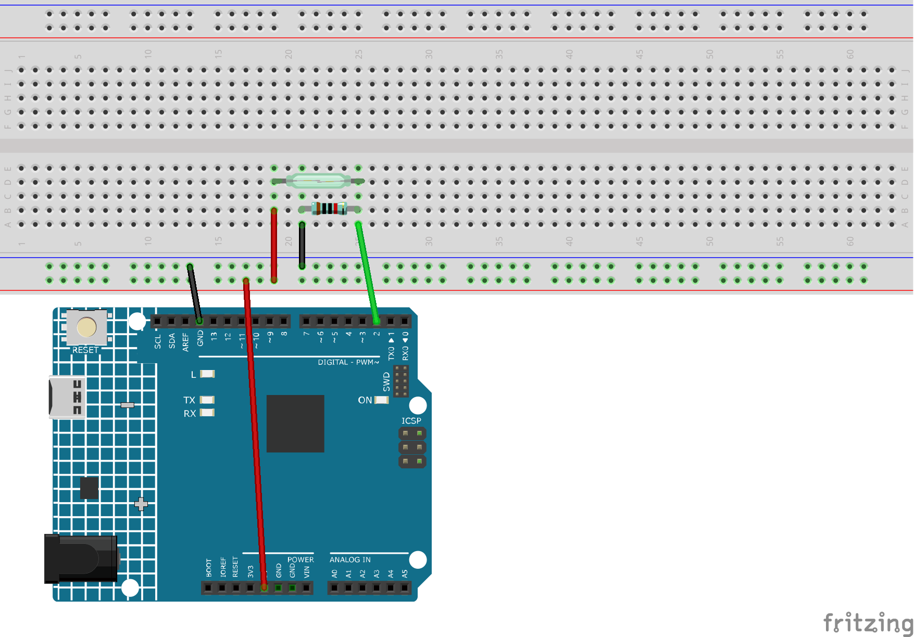

.. note::

    Bonjour, bienvenue dans la communauté SunFounder Raspberry Pi & Arduino & ESP32 Enthusiasts sur Facebook ! Plongez dans l'univers de Raspberry Pi, Arduino et ESP32 avec d'autres passionnés.

    **Pourquoi nous rejoindre ?**

    - **Support d'experts** : Résolvez les problèmes après-vente et les défis techniques avec l'aide de notre communauté et de notre équipe.
    - **Apprendre et partager** : Échangez des conseils et des tutoriels pour améliorer vos compétences.
    - **Aperçus exclusifs** : Accédez en avant-première aux annonces de nouveaux produits et aux avant-premières.
    - **Réductions spéciales** : Profitez de réductions exclusives sur nos nouveaux produits.
    - **Promotions festives et cadeaux** : Participez à des promotions et à des cadeaux festifs.

    👉 Prêt à explorer et à créer avec nous ? Cliquez sur [|link_sf_facebook|] et rejoignez-nous dès aujourd'hui !

.. _ar_reed:

3.2 Ressentir le magnétisme
===============================

Le type de commutateur à lame le plus courant contient une paire de lamelles métalliques flexibles et magnétisables, dont les extrémités sont séparées par un petit écart lorsque le commutateur est ouvert.

Un champ magnétique provenant d'un électroaimant ou d'un aimant permanent provoque l'attraction des lamelles, complétant ainsi un circuit électrique.
La force de rappel des lamelles les fait se séparer et ouvrir le circuit lorsque le champ magnétique cesse.

Un exemple courant d'application d'un commutateur à lame est la détection de l'ouverture d'une porte ou d'une fenêtre pour un système d'alarme.

**Composants nécessaires**

Dans ce projet, nous avons besoin des composants suivants :

C'est pratique d'acheter un kit complet, voici le lien :

.. list-table::
    :widths: 20 20 20
    :header-rows: 1

    *   - Nom
        - ARTICLES DANS CE KIT
        - LIEN
    *   - Kit de démarrage 3 en 1
        - 380+
        - |link_3IN1_kit|

Vous pouvez également les acheter séparément via les liens ci-dessous.

.. list-table::
    :widths: 30 20
    :header-rows: 1

    *   - INTRODUCTION DES COMPOSANTS
        - LIEN D'ACHAT

    *   - :ref:`cpn_uno`
        - \-
    *   - :ref:`cpn_breadboard`
        - |link_breadboard_buy|
    *   - :ref:`cpn_wires`
        - |link_wires_buy|
    *   - :ref:`cpn_resistor`
        - |link_resistor_buy|
    *   - :ref:`cpn_reed`
        - \-

**Schéma**

.. image:: img/circuit_3.2_reed.png

Par défaut, la broche 2 est à l'état bas ; elle passe à l'état haut lorsque l'aimant est proche du commutateur à lame.

Le rôle de la résistance de 10 kΩ est de maintenir la broche 2 à un niveau bas stable lorsqu'aucun aimant n'est à proximité.

**Câblage**

**Code**

.. note::

   * Vous pouvez ouvrir le fichier ``3.2.feel_the_magnetism.ino`` dans le répertoire ``3in1-kit\learning_project\3.2.feel_the_magnetism``.
   * Ou copiez ce code dans l'IDE Arduino.

.. raw:: html

    <iframe src=https://create.arduino.cc/editor/sunfounder01/d28c942e-5144-44a1-85d8-d5e6894fc5df/preview?embed style="height:510px;width:100%;margin:10px 0" frameborder=0></iframe>
    
Après avoir téléchargé le code avec succès, lorsque l'aimant est proche du commutateur à lame, le moniteur série affiche 1.
