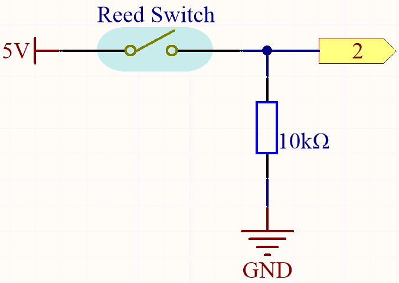

.. _ar_reed:

3.2 磁気を感じる
===============================

最も一般的なリードスイッチは、スイッチが開いているときに小さな隙間で分離された、磁化可能な、柔軟な、金属製のリードのペアを含んでいます。

電磁石または永久磁石からの磁場は、リードがお互いを引き付ける原因となり、これにより電気回路が完成します。
磁場が停止すると、リードのばねの力がそれらを分離させ、回路を開きます。

リードスイッチの一般的な使用例は、セキュリティアラームのためのドアや窓の開放を検出することです。

**必要な部品**

このプロジェクトには、以下の部品が必要です。

全体のキットを購入すると非常に便利です。こちらがリンクです：

.. list-table::
    :widths: 20 20 20
    :header-rows: 1

    *   - 名前	
        - このキットのアイテム
        - リンク
    *   - 3 in 1 Starter Kit
        - 380+
        - |link_3IN1_kit|

以下のリンクから個別に購入することもできます。

.. list-table::
    :widths: 30 20
    :header-rows: 1

    *   - コンポーネント紹介
        - 購入リンク

    *   - :ref:`cpn_uno`
        - |link_Uno_R3_buy|
    *   - :ref:`cpn_breadboard`
        - |link_breadboard_buy|
    *   - :ref:`cpn_wires`
        - |link_wires_buy|
    *   - :ref:`cpn_resistor`
        - |link_resistor_buy|
    *   - :ref:`cpn_reed`
        - \-

**回路図**

デフォルトでは、ピン2はローです。磁石がリードスイッチの近くにあると、ピン2はハイになります。

10Kの抵抗の目的は、磁石が近くにないときにピン2を安定したローレベルに保つことです。

**配線図**

.. image:: img/feel_the_magnetism_bb.jpg
    :width: 600
    :align: center

**コード**

.. note::

   * ``3in1-kit\basic_project\3.2.feel_the_magnetism`` のパスの下で ``3.2.feel_the_magnetism.ino`` ファイルを開くことができます。
   * または、このコードを **Arduino IDE** にコピーします。
   
   * または、 `Arduino Web Editor <https://docs.arduino.cc/cloud/web-editor/tutorials/getting-started/getting-started-web-editor>`_ を通じてコードをアップロードします。

.. raw:: html
    
    <iframe src=https://create.arduino.cc/editor/sunfounder01/d28c942e-5144-44a1-85d8-d5e6894fc5df/preview?embed style="height:510px;width:100%;margin:10px 0" frameborder=0></iframe>

コードが正常にアップロードされた後、磁石がリードスイッチの近くにあると、シリアルモニタに1と表示されます。

