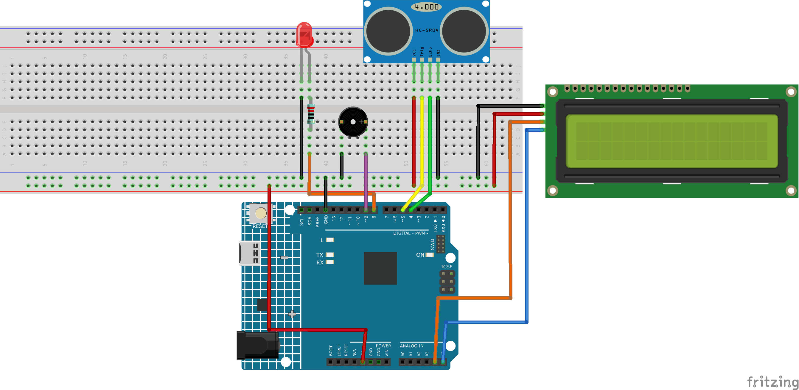

.. note::

    Bonjour, bienvenue dans la communauté SunFounder Raspberry Pi & Arduino & ESP32 Enthusiasts sur Facebook ! Plongez dans l'univers de Raspberry Pi, Arduino et ESP32 avec d'autres passionnés.

    **Pourquoi nous rejoindre ?**

    - **Support d'experts** : Résolvez les problèmes après-vente et les défis techniques avec l'aide de notre communauté et de notre équipe.
    - **Apprendre et partager** : Échangez des conseils et des tutoriels pour améliorer vos compétences.
    - **Aperçus exclusifs** : Accédez en avant-première aux annonces de nouveaux produits et aux avant-premières.
    - **Réductions spéciales** : Profitez de réductions exclusives sur nos nouveaux produits.
    - **Promotions festives et cadeaux** : Participez à des promotions et à des cadeaux festifs.

    👉 Prêt à explorer et à créer avec nous ? Cliquez sur [|link_sf_facebook|] et rejoignez-nous dès aujourd'hui !

.. _ar_reversing_aid:

6.4 Assistance au Recul
==========================

Avec le développement des sciences et des technologies, de nombreux produits de 
haute technologie ont été intégrés aux voitures, parmi lesquels le système 
d'assistance au recul. Ici, nous utilisons un module ultrason, un écran LCD, 
une LED et un buzzer pour créer un simple système d'assistance au recul par ultrasons.

**Composants nécessaires**

Dans ce projet, nous avons besoin des composants suivants :

C'est pratique d'acheter un kit complet, voici le lien :

.. list-table::
    :widths: 20 20 20
    :header-rows: 1

    *   - Nom
        - ARTICLES DANS CE KIT
        - LIEN
    *   - Kit de démarrage 3 en 1
        - 380+
        - |link_3IN1_kit|

Vous pouvez également les acheter séparément via les liens ci-dessous.

.. list-table::
    :widths: 30 20
    :header-rows: 1

    *   - INTRODUCTION DES COMPOSANTS
        - LIEN D'ACHAT

    *   - :ref:`cpn_uno`
        - \-
    *   - :ref:`cpn_breadboard`
        - |link_breadboard_buy|
    *   - :ref:`cpn_wires`
        - |link_wires_buy|
    *   - :ref:`cpn_resistor`
        - |link_resistor_buy|
    *   - :ref:`cpn_led`
        - |link_led_buy|
    *   - :ref:`cpn_buzzer`
        - |link_passive_buzzer_buy|
    *   - :ref:`cpn_i2c_lcd1602`
        - |link_i2clcd1602_buy|
    *   - :ref:`cpn_ultrasonic`
        - |link_ultrasonic_buy|

**Schéma**

.. image:: img/image265.png
    :width: 800
    :align: center

**Câblage**

**Code**

.. note::

    * Vous pouvez ouvrir le fichier ``6.4_reversingAid.ino`` dans le répertoire ``3in1-kit\learning_project\6.4_reversingAid`` directement.
    * Ou copiez ce code dans l'IDE Arduino.
    * La bibliothèque ``LiquidCrystal I2C`` est utilisée ici, vous pouvez l'installer depuis le **Library Manager**.

        .. image:: ../img/lib_liquidcrystal_i2c.png

.. raw:: html

    <iframe src=https://create.arduino.cc/editor/sunfounder01/d6848669-fe79-42e9-afd7-0f083f96a6d6/preview?embed style="height:510px;width:100%;margin:10px 0" frameborder=0></iframe>

Après le téléversement réussi du code, la distance actuelle détectée sera affichée sur l'écran LCD. Ensuite, le buzzer ajustera sa fréquence sonore en fonction des différentes distances.

.. note::
    Si le code et le câblage sont corrects mais que le LCD n'affiche toujours pas de contenu, vous pouvez ajuster le potentiomètre à l'arrière.

**Comment ça fonctionne ?**

Ce code nous permet de créer un dispositif simple de mesure de distance qui mesure la distance entre des objets et fournit un retour via un écran LCD et un buzzer.

La fonction ``loop()`` contient la logique principale du programme et fonctionne en continu. Voici un aperçu détaillé de la fonction ``loop()``.

#. Boucle pour lire la distance et mettre à jour les paramètres

    Dans la boucle ``loop``, le code commence par lire la distance mesurée par le module ultrason et met à jour le paramètre d'intervalle en fonction de la distance.

    .. code-block:: arduino

        // Mise à jour de la distance
        distance = readDistance();

        // Mise à jour des intervalles en fonction de la distance
        if (distance <= 10) {
            intervals = 300;
        } else if (distance <= 20) {
            intervals = 500;
        } else if (distance <= 50) {
            intervals = 1000;
        } else {
            intervals = 2000;
        }

#. Vérifier s'il est temps de faire retentir le buzzer

    Le code calcule la différence entre le temps actuel et le temps précédent du bip. Si la différence est supérieure ou égale au temps d'intervalle, il déclenche le buzzer et met à jour le temps précédent.

    .. code-block:: arduino

        unsigned long currentMillis = millis();
        if (currentMillis - previousMillis >= intervals) {
            Serial.println("Beeping!");
            beep();
            previousMillis = currentMillis;
        }

#. Mise à jour de l'affichage LCD

    Le code efface l'écran LCD puis affiche "Dis:" et la distance actuelle en centimètres sur la première ligne.

    .. code-block:: arduino

        lcd.clear();
        lcd.setCursor(0, 0);
        lcd.print("Dis: ");
        lcd.print(distance);
        lcd.print(" cm");

        delay(100);
