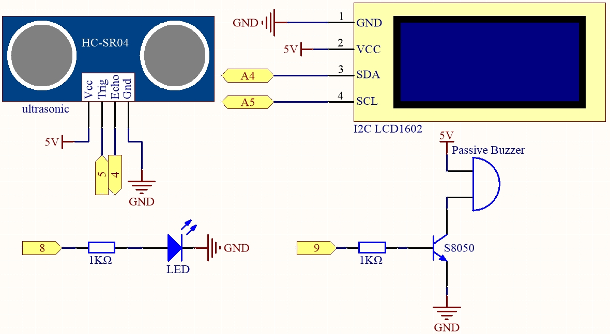
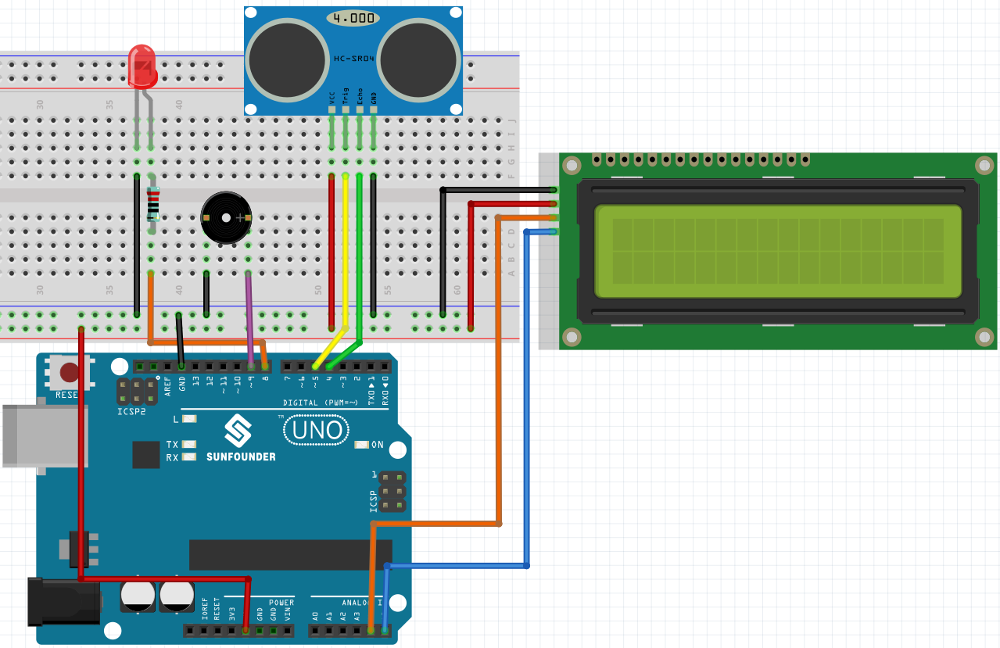

.. note::

    Hello, welcome to the SunFounder Raspberry Pi & Arduino & ESP32 Enthusiasts Community on Facebook! Dive deeper into Raspberry Pi, Arduino, and ESP32 with fellow enthusiasts.

    **Why Join?**

    - **Expert Support**: Solve post-sale issues and technical challenges with help from our community and team.
    - **Learn & Share**: Exchange tips and tutorials to enhance your skills.
    - **Exclusive Previews**: Get early access to new product announcements and sneak peeks.
    - **Special Discounts**: Enjoy exclusive discounts on our newest products.
    - **Festive Promotions and Giveaways**: Take part in giveaways and holiday promotions.

    👉 Ready to explore and create with us? Click [|link_sf_facebook|] and join today!

.. _ar_reversing_aid:

6.4 Reversing Aid
===================

With the development of science and technology, a lot of high-tech
products have been installed in cars, among which the reversing assist
system is one of them. Here we use ultrasonic module, LCD, LED and
buzzer to make a simple ultrasonic reversing assist system.

**Required Components**

In this project, we need the following components. 

It's definitely convenient to buy a whole kit, here's the link: 

.. list-table::
    :widths: 20 20 20
    :header-rows: 1

    *   - Name	
        - ITEMS IN THIS KIT
        - LINK
    *   - 3 in 1 Starter Kit
        - 380+
        - |link_3IN1_kit|

You can also buy them separately from the links below.

.. list-table::
    :widths: 30 20
    :header-rows: 1

    *   - COMPONENT INTRODUCTION
        - PURCHASE LINK

    *   - :ref:`cpn_uno`
        - |link_Uno_R3_buy|
    *   - :ref:`cpn_breadboard`
        - |link_breadboard_buy|
    *   - :ref:`cpn_wires`
        - |link_wires_buy|
    *   - :ref:`cpn_resistor`
        - |link_resistor_buy|
    *   - :ref:`cpn_led`
        - |link_led_buy|
    *   - :ref:`cpn_buzzer`
        - |link_passive_buzzer_buy|
    *   - :ref:`cpn_i2c_lcd1602`
        - |link_i2clcd1602_buy|
    *   - :ref:`cpn_ultrasonic`
        - |link_ultrasonic_buy|

**Schematic**

**Wiring**

**Code**

.. note::

    * You can open the file ``6.4_reversingAid.ino`` under the path of ``3in1-kit\basic_project\6.4_reversingAid`` directly.
    * Or copy this code into Arduino IDE .
    * The ``LiquidCrystal I2C`` library is used here, you can install it from the **Library Manager**.

        .. image:: ../img/lib_liquidcrystal_i2c.png

.. raw:: html

    <iframe src=https://create.arduino.cc/editor/sunfounder01/d6848669-fe79-42e9-afd7-0f083f96a6d6/preview?embed style="height:510px;width:100%;margin:10px 0" frameborder=0></iframe>

After the code is successfully uploaded, the current detected distance will be displayed on the LCD. Then the buzzer will change the sounding frequency according to different distances.

.. note::
    If the code and wiring are fine, but the LCD still does not display content, you can turn the potentiometer on the back.

**How it works?**

This code helps us create a simple distance measuring device that can measure the distance between objects and provide feedback through an LCD display and a buzzer.

The ``loop()`` function contains the main logic of the program and runs continuously. Let's take a closer look at the ``loop()`` function.

#. Loop to read distance and update parameters

    In the ``loop``, the code first reads the distance measured by the ultrasonic module and updates the interval parameter based on the distance. 

    .. code-block:: arduino

        // Update the distance
        distance = readDistance();

        // Update intervals based on distance
        if (distance <= 10) {
            intervals = 300;
        } else if (distance <= 20) {
            intervals = 500;
        } else if (distance <= 50) {
            intervals = 1000;
        } else {
            intervals = 2000;
        }

#. Check if it's time to beep

    The code calculates the difference between the current time and the previous beep time, and if the difference is greater than or equal to the interval time, it triggers the buzzer and updates the previous beep time.

    .. code-block:: arduino

        unsigned long currentMillis = millis();
        if (currentMillis - previousMillis >= intervals) {
            Serial.println("Beeping!");
            beep();
            previousMillis = currentMillis;
        }

#. Update LCD display

    The code clears the LCD display and then displays "Dis:" and the current distance in centimeters on the first line.

    .. code-block:: arduino

        lcd.clear();
        lcd.setCursor(0, 0);
        lcd.print("Dis: ");
        lcd.print(distance);
        lcd.print(" cm");

        delay(100);