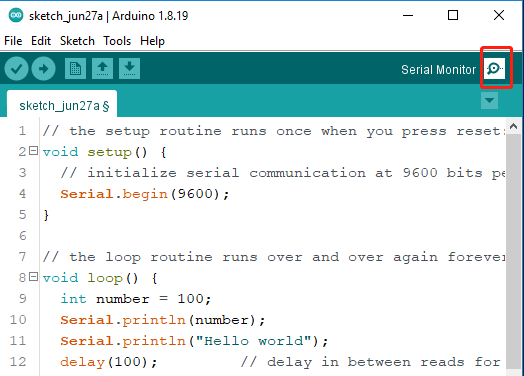
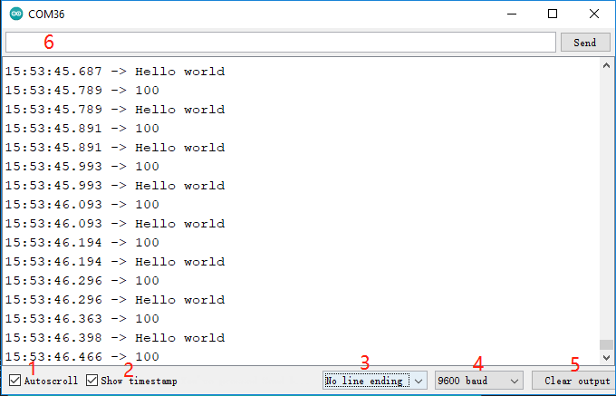

.. _ard_serial_monitor:

3.0 Monitor Serial
=============================

En el IDE de Arduino, hay un monitor serial que te permite enviar mensajes desde tu computadora a la placa Arduino (a través de USB) y también recibir mensajes desde Arduino.

Así que en este proyecto aprenderemos a recibir datos de la placa Arduino.

.. note::

    En Uno, Nano, Mini y Mega, los pines 0 y 1 se utilizan para la comunicación con la computadora. Conectar algo a estos pines puede interferir con esa comunicación, incluyendo causar fallas en las cargas a la placa.

**Usando el Monitor Serial**

1. Abre el IDE de Arduino y pega el siguiente código en él.

    .. code-block:: arduino

        // the setup routine runs once when you press reset:
        void setup() {
            // initialize serial communication at 9600 bits per second:
            Serial.begin(9600);
        }

        // the loop routine runs over and over again forever:
        void loop() {
            int number = 100;
            Serial.println(number);
            Serial.println("Hello world");
            delay(100);         // delay in between reads for stability
        }

   * `Serial.begin() <https://www.arduino.cc/reference/en/language/functions/communication/serial/begin/>`_: Establece la tasa de datos en bits por segundo (baudios) para la transmisión de datos seriales, aquí configurado a 9600.
   * `Serial.println() <https://www.arduino.cc/reference/en/language/functions/communication/serial/println/>`_.

2. Selecciona la placa y el puerto correctos para subir el código.
3. En la barra de herramientas, haz clic en el icono de la lupa para activar el Monitor Serial.

4. Aquí está el Monitor Serial.

* **1**: Opción para seleccionar entre desplazamiento automático y no desplazamiento.
* **2**: Opción para mostrar la marca de tiempo antes de los datos mostrados en el Monitor Serial.
* **3**: Selección de finalización, selecciona los caracteres finales que se añaden a los datos enviados a Arduino. Las opciones incluyen:

        * **Sin finalización de línea** solo envía lo que escribes; 
        * **Nueva línea** es ``\n`` y enviará un código de nueva línea ASCII después de lo que escribas;
        * **Retorno de carro** es ``\r``, que enviará un carácter de retorno de carro ASCII después de lo que escribas; 
        * **Ambos NL & CR** es ``\r\n`` que enviará tanto un retorno de carro como un carácter de nueva línea después de lo que escribas.
* **4**: Selecciona la velocidad de comunicación entre la placa Arduino y la PC. Este valor DEBE ser el mismo que el valor establecido en ``Serial.begin()``.
* **5**: Borra todo el texto en la consola de salida.
* **6**: Un cuadro de texto para enviar caracteres a la placa Arduino, consulta :ref:`ar_serial_read` para un tutorial.

