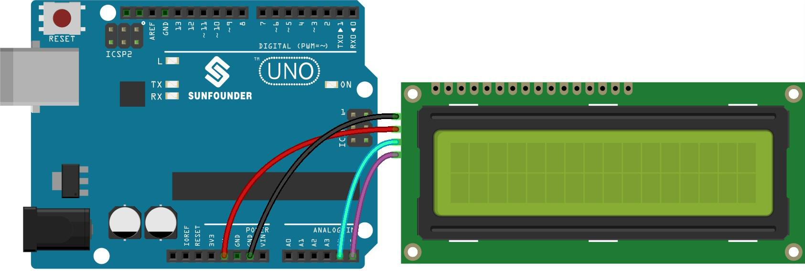

.. _ar_serial_read:

5.12 シリアルリード
======================

``Serial.print()`` 関数を使用するとき、これに気づいたかもしれません。
印刷があるなら、読取りはありますか？シリアルモニターのテキストボックスは何に使われるのでしょうか？
そう、推測通り、シリアルモニタのテキストボックスに情報を入力することで、プログラムや回路を制御する方法があります。

このプロジェクトでは、I2C LCD1602を使用して、シリアルモニタに入力されたテキストを表示し、 ``Serial.read()`` の使用法を体験します。

**必要な部品**

このプロジェクトでは、以下の部品が必要です。

キットをまとめて購入するのはとても便利です、リンクはこちら：

.. list-table::
    :widths: 20 20 20
    :header-rows: 1

    *   - 名前	
        - このキットのアイテム
        - リンク
    *   - 3 in 1 Starter Kit
        - 380+
        - |link_3IN1_kit|

下のリンクから個別に購入することもできます。

.. list-table::
    :widths: 30 20
    :header-rows: 1

    *   - コンポーネントの紹介
        - 購入リンク

    *   - :ref:`cpn_uno`
        - |link_Uno_R3_buy|
    *   - :ref:`cpn_wires`
        - |link_wires_buy|
    *   - :ref:`cpn_i2c_lcd1602`
        - |link_i2clcd1602_buy|

**回路図**

.. image:: img/circuit_7.1_lcd1602.png

**配線図**

**コード**

.. note::

    * ``3in1-kit\basic_project\5.12.serial_read`` のパスの下にある ``5.12.serial_read.ino`` ファイルを開きます。
    * または、このコードを **Arduino IDE** にコピーします。
    * ここでは ``LiquidCrystal I2C`` ライブラリが使用されています。 **Library Manager** からインストールできます。

        .. image:: ../img/lib_liquidcrystal_i2c.png

.. raw:: html
    
    <iframe src=https://create.arduino.cc/editor/sunfounder01/a6197c53-6969-402e-8930-84a9165397b9/preview?embed style="height:510px;width:100%;margin:10px 0" frameborder=0></iframe>
    
コードが正常にアップロードされたら、シリアルモニターのテキストボックスにテキストを入力することができ、LCDに情報が表示されます。

**どのように動作するのか？**

    .. code-block:: arduino

        void loop()
        {
        // シリアルポートから文字が届いたとき...
            if (Serial.available()) {
                // メッセージがすべて届くのを少し待つ
                delay(100);
                // 画面をクリア
                lcd.clear();
                // 利用可能なすべての文字を読み取る
                while (Serial.available() > 0) {
                    // LCDに各文字を表示
                    lcd.write(Serial.read());
                }
            }
        }

* ``Serial.available()`` は、テキストボックスから何かを入力したときに、入ってくるストリームの文字の数を取得できます。入力には2つの終端記号があるため、 ``A`` を入力すると3文字、 ``AB`` を入力すると4文字が得られます。
* ``Serial.read()`` は、入ってくるストリームから最初の文字を取得します。例えば、 ``AB`` を入力した場合、 ``Serial.read()`` を一度だけ呼び出すと、文字 ``A`` が得られます。2回目の呼び出しで ``B`` が得られます。3回目と4回目の呼び出しで、2つの終了記号が得られます。入力ストリームに利用可能な文字がない状態でこの関数を呼び出すとエラーになります。

要するに、上記の二つを組み合わせ、 ``while`` ループを使用して、入力されたすべての文字を毎回読み取ることが一般的です。

    .. code-block:: arduino

        while (Serial.available() > 0) {
            Serial.print(Serial.read());
        }

ちなみに、入ってくるストリームから文字を取得するために ``Serial.read()`` を使用しないと、入ってくるストリームの文字が重なり合ってしまいます。
例えば、 ``A`` の後に ``AB`` を入力すると、入ってくるストリームは7文字を蓄積します。
