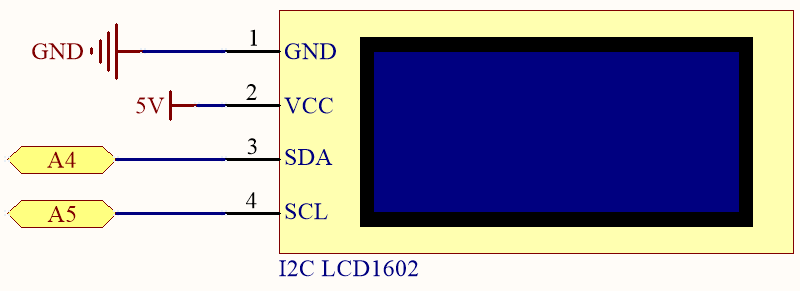
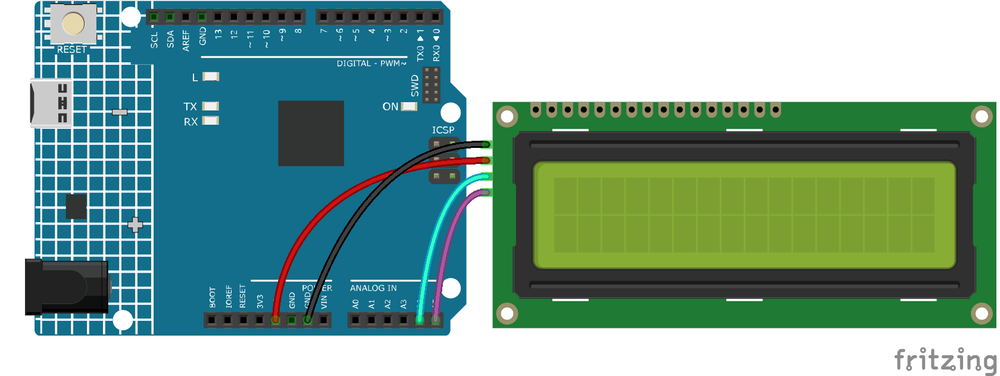

.. note::

    こんにちは、SunFounderのRaspberry Pi & Arduino & ESP32愛好家コミュニティへようこそ！Facebook上でRaspberry Pi、Arduino、ESP32についてもっと深く掘り下げ、他の愛好家と交流しましょう。

    **参加する理由は？**

    - **エキスパートサポート**：コミュニティやチームの助けを借りて、販売後の問題や技術的な課題を解決します。
    - **学び＆共有**：ヒントやチュートリアルを交換してスキルを向上させましょう。
    - **独占的なプレビュー**：新製品の発表や先行プレビューに早期アクセスしましょう。
    - **特別割引**：最新製品の独占割引をお楽しみください。
    - **祭りのプロモーションとギフト**：ギフトや祝日のプロモーションに参加しましょう。

    👉 私たちと一緒に探索し、創造する準備はできていますか？[|link_sf_facebook|]をクリックして今すぐ参加しましょう！

.. _ar_serial_read:

5.12 シリアル読み取り
=======================

``Serial.print()`` 関数を使用するときにこれに気付くかもしれません。
表示機能があるのなら、読み取り機能もあるのでは？シリアルモニタのテキストボックスは何のために使われるのでしょうか？
正解です、シリアルモニタのテキストボックスを通じて情報を入力することで、プログラムや回路を制御する方法があります。

このプロジェクトでは、シリアルモニタで入力されたテキストをI2C LCD1602に表示することで、``Serial.read()`` の使用法を体験します。

**必要な部品**

このプロジェクトには以下の部品が必要です。

一式を購入するのが便利です、リンクはこちらです:

.. list-table::
    :widths: 20 20 20
    :header-rows: 1

    *   - 名前
        - このキットのアイテム
        - リンク
    *   - 3 in 1 Starter Kit
        - 380+
        - |link_3IN1_kit|

以下のリンクから個別に購入することもできます。

.. list-table::
    :widths: 30 20
    :header-rows: 1

    *   - コンポーネントの紹介
        - 購入リンク

    *   - :ref:`cpn_uno`
        - \-
    *   - :ref:`cpn_wires`
        - |link_wires_buy|
    *   - :ref:`cpn_i2c_lcd1602`
        - |link_i2clcd1602_buy|

**回路図**

**配線図**

**コード**

.. note::

    * ``3in1-kit\learning_project\5.12.serial_read`` のパス下の ``5.12.serial_read.ino`` ファイルを開きます。
    * または、このコードを **Arduino IDE** にコピーします。
    * ここで ``LiquidCrystal I2C`` ライブラリを使用しています。 **Library Manager** からインストールできます。

        .. image:: ../img/lib_liquidcrystal_i2c.png

.. raw:: html
    
    <iframe src=https://create.arduino.cc/editor/sunfounder01/a6197c53-6969-402e-8930-84a9165397b9/preview?embed style="height:510px;width:100%;margin:10px 0" frameborder=0></iframe>

コードが正常にアップロードされた後、シリアルモニタのテキストボックスにテキストを入力すると、LCDに情報が表示されます。

**どのように動作するのか？**

    .. code-block:: arduino

        void loop()
        {
        // シリアルポートから文字が到着すると...
            if (Serial.available()) {
                // メッセージが全体として到着するのを少し待つ
                delay(100);
                // 画面をクリアする
                lcd.clear();
                // 利用可能な文字すべてを読む
                while (Serial.available() > 0) {
                    // 各文字をLCDに表示
                    lcd.write(Serial.read());
                }
            }
        }

* ``Serial.available()`` は、テキストボックスから何かを入力するときに、入力ストリームに利用可能な文字の数を取得できます。入力には2つの終端記号があるため、``A`` を入力すると実際には3つの文字があり、``AB`` を入力すると4つの文字があります。
* ``Serial.read()`` は、入力ストリームから最初の文字を取得します。例えば、 ``AB`` を入力した場合、 ``Serial.read()`` を一度だけ呼び出すと、文字 ``A`` を取得します。2回目の呼び出しで ``B`` を取得し、3回目と4回目の呼び出しで2つの終端記号を取得します。入力ストリームに文字が利用できない場合、この関数を呼び出すとエラーになります。

要するに、上記の2つを組み合わせて、毎回入力されたすべての文字を読み取るために ``while`` ループを使用するのが一般的です。

    .. code-block:: arduino

        while (Serial.available() > 0) {
            Serial.print(Serial.read());
        }

ちなみに、入力ストリームから文字を取得するために ``Serial.read()`` を使用しない場合、入力ストリームからの文字は一緒に積み上げられます。
例えば、 ``A`` の後に ``AB`` を入力すると、入力ストリームには7文字が蓄積されます。
