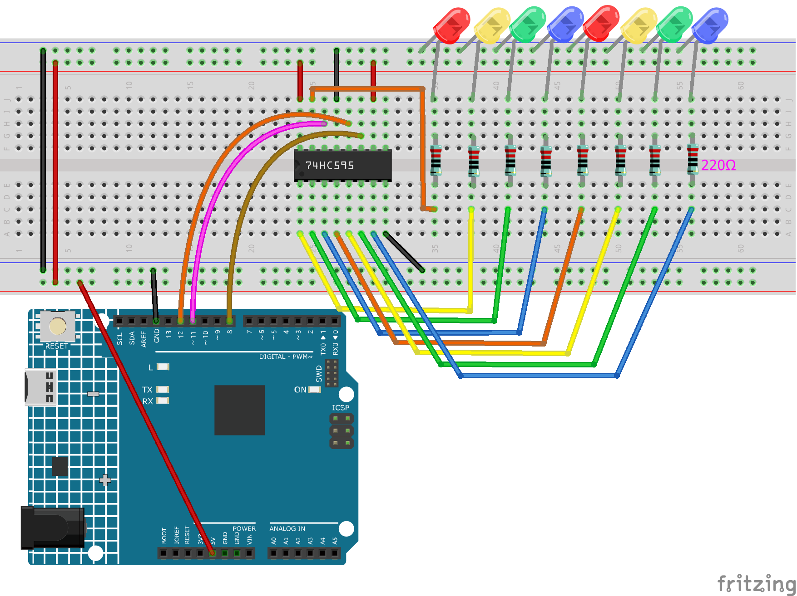

.. note::

    こんにちは、SunFounderのRaspberry Pi & Arduino & ESP32愛好家コミュニティへようこそ！Facebook上でRaspberry Pi、Arduino、ESP32についてもっと深く掘り下げ、他の愛好家と交流しましょう。

    **参加する理由は？**

    - **エキスパートサポート**：コミュニティやチームの助けを借りて、販売後の問題や技術的な課題を解決します。
    - **学び＆共有**：ヒントやチュートリアルを交換してスキルを向上させましょう。
    - **独占的なプレビュー**：新製品の発表や先行プレビューに早期アクセスしましょう。
    - **特別割引**：最新製品の独占割引をお楽しみください。
    - **祭りのプロモーションとギフト**：ギフトや祝日のプロモーションに参加しましょう。

    👉 私たちと一緒に探索し、創造する準備はできていますか？[|link_sf_facebook|]をクリックして今すぐ参加しましょう！

.. _ar_shiftout:

5.9 ShiftOut(LED)
=======================

``shiftOut()`` は74HC595に8つのデジタル信号を出力させることができます。バイナリ番号の最後のビットをQ0に、最初のビットをQ7に出力します。言い換えれば、バイナリ番号「00000001」を書き込むと、Q0は高レベルを出力し、Q1〜Q7は低レベルを出力します。

このプロジェクトでは、74HC595の使用方法を学びます。74HC595は、三状態並列出力を持つ8ビットシフトレジスタとストレージレジスタで構成されています。これにより、シリアル入力を並列出力に変換し、MCUのIOポートを節約できます。

具体的には、74hc595は8ビットのバイナリ数を書き込むことで、デジタル信号出力のための8つのピンを代替できます。

* `バイナリ数 - Wikipedia <https://en.wikipedia.org/wiki/Binary_number>`_

**必要な部品**

このプロジェクトでは、以下の部品が必要です。

全体のキットを購入するのが非常に便利です。リンクはこちら：

.. list-table::
    :widths: 20 20 20
    :header-rows: 1

    *   - 名前
        - このキットの内容
        - リンク
    *   - 3 in 1 スターターキット
        - 380+
        - |link_3IN1_kit|

以下のリンクから個別に購入することもできます。

.. list-table::
    :widths: 30 20
    :header-rows: 1

    *   - コンポーネントの紹介
        - 購入リンク

    *   - :ref:`cpn_uno`
        - \-
    *   - :ref:`cpn_breadboard`
        - |link_breadboard_buy|
    *   - :ref:`cpn_wires`
        - |link_wires_buy|
    *   - :ref:`cpn_resistor`
        - |link_resistor_buy|
    *   - :ref:`cpn_led`
        - |link_led_buy|
    *   - :ref:`cpn_74hc595`
        - |link_74hc595_buy|

**回路図**

.. image:: img/circuit_6.4_74hc595.png

* MR（ピン10）が高レベルで、OE（ピン13）が低レベルのとき、SHcpの立ち上がりエッジでデータが入力され、SHcpの立ち上がりエッジを経てメモリレジスタに移動します。
* 二つのクロックが一緒に接続されている場合、シフトレジスタはメモリレジスタより常に一つのパルスが早いです。
* メモリレジスタには、シリアルシフト入力ピン(Ds)、シリアル出力ピン(Q)、非同期リセットボタン(低レベル)があります。
* メモリレジスタは、3つの状態での並列8ビットのバスを出力します。
* OEが有効（低レベル）のとき、メモリレジスタのデータがバス(Q0 ~ Q7)に出力されます。

**配線図**

**コード**

.. note::

    * ``3in1-kit\learning_project\5.9.shiftout_led`` のパスの下の ``5.9.shiftout_led.ino`` ファイルを開いてください。
    * または、このコードを **Arduino IDE** にコピーしてください。
    

.. raw:: html

    <iframe src=https://create.arduino.cc/editor/sunfounder01/4c208eb3-67f0-40f7-999a-0eeca8b6b466/preview?embed style="height:510px;width:100%;margin:10px 0" frameborder=0></iframe>

コードをR4ボードにアップロードすると、LEDが順番に点灯するのが確認できます。

**どのように動作するのか？**

配列を宣言し、74HC595で制御される8つのLEDの動作状態を変更するために使用されるいくつかの8ビットバイナリ数を格納します。

.. code-block:: arduino

    int datArray[] = {B00000000, B00000001, B00000011, B00000111, B00001111, B00011111, B00111111, B01111111, B11111111};

最初に ``STcp`` を低レベルに設定し、次に高レベルに設定します。
これにより、STcpの立ち上がりエッジのパルスが生成されます。

.. code-block:: arduino

    digitalWrite(STcp,LOW); 

``shiftOut()`` は、一度に1ビットのデータをシフトアウトするために使用されます。
つまり、 ``datArray[num]`` のデータの1バイトを ``DS`` ピンでシフトレジスタにシフトします。 **MSBFIRST** は高ビットから移動することを意味します。

.. code-block:: arduino

    shiftOut(DS,SHcp,MSBFIRST,datArray[num]);

``digitalWrite(STcp,HIGH)`` が実行されると、 ``STcp`` は立ち上がりエッジになります。
この時、シフトレジスタのデータがメモリレジスタに移動します。

.. code-block:: arduino

    digitalWrite(STcp,HIGH);

8回後、1バイトのデータがメモリレジスタに転送されます。
その後、メモリレジスタのデータがバス(Q0-Q7)に出力されます。
例えば、 ``B00000001`` をシフトアウトすると、Q0で制御されるLEDが点灯し、Q1〜Q7で制御されるLEDが消灯します。

