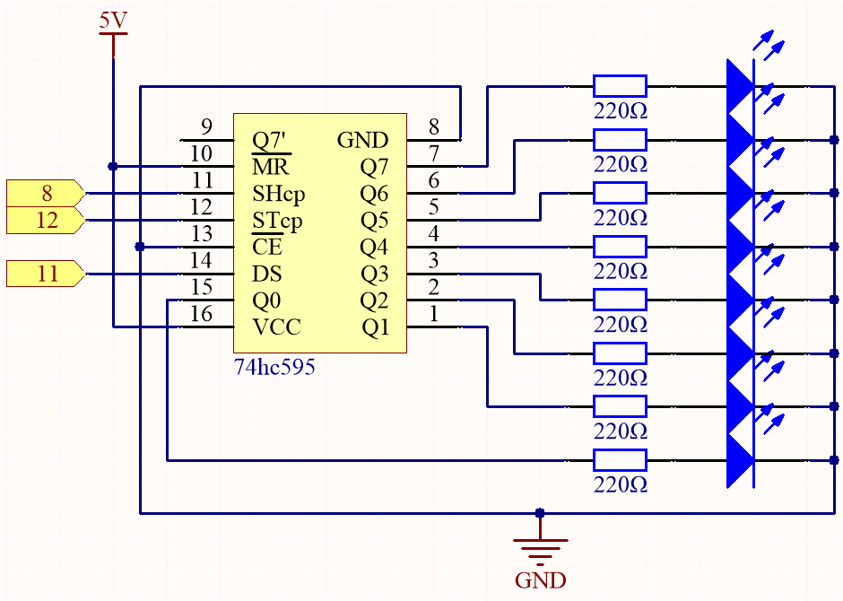
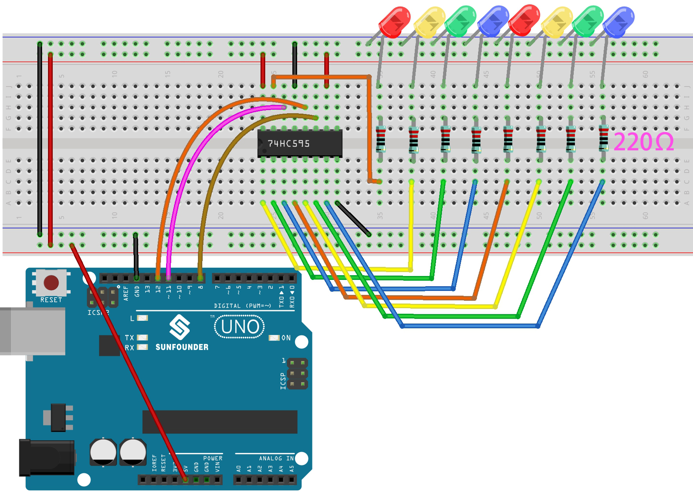

.. _ar_shiftout:

5.9 ShiftOut(LED)
=======================

``shiftOut()`` will make 74HC595 output 8 digital signals. It outputs the last bit of the binary number to Q0, and the output of the first bit to Q7. In other words, writing the binary number “00000001” will make Q0 output high level and Q1~Q7 output low level.

In this project, you will learn how to use 74HC595. 74HC595 consists of an 8−bit shift register and a storage register with three−state parallel outputs. It converts serial input into parallel output so you can save IO ports of an MCU.

Specifically, 74hc595 can replace 8 pins for digital signal output by writing an 8-bit binary number.

* `Binary number - Wikipedia <https://en.wikipedia.org/wiki/Binary_number>`_

**Required Components**

In this project, we need the following components. 

It's definitely convenient to buy a whole kit, here's the link: 

.. list-table::
    :widths: 20 20 20
    :header-rows: 1

    *   - Name	
        - ITEMS IN THIS KIT
        - LINK
    *   - 3 in 1 Starter Kit
        - 380+
        - |link_3IN1_kit|

You can also buy them separately from the links below.

.. list-table::
    :widths: 30 20
    :header-rows: 1

    *   - COMPONENT INTRODUCTION
        - PURCHASE LINK

    *   - :ref:`cpn_uno`
        - |link_Uno_R3_buy|
    *   - :ref:`cpn_breadboard`
        - |link_breadboard_buy|
    *   - :ref:`cpn_wires`
        - |link_wires_buy|
    *   - :ref:`cpn_resistor`
        - |link_resistor_buy|
    *   - :ref:`cpn_led`
        - |link_led_buy|
    *   - :ref:`cpn_74hc595`
        - |link_74hc595_buy|

**Schematic**

* When MR (pin10) is high level and OE (pin13) is low level, data is input in the rising edge of SHcp and goes to the memory register through the rising edge of SHcp.
* If the two clocks are connected together, the shift register is always one pulse earlier than the memory register.
* There is a serial shift input pin (Ds), a serial output pin (Q) and an asynchronous reset button (low level) in the memory register.
* The memory register outputs a Bus with a parallel 8-bit and in three states.
* When OE is enabled (low level), the data in memory register is output to the bus(Q0 ~ Q7).

**Wiring**

**Code**

.. note::

    * Open the ``5.9.shiftout_led.ino`` file under the path of ``3in1-kit\basic_project\5.9.shiftout_led``.
    * Or copy this code into **Arduino IDE**.
    
    * Or upload the code through the `Arduino Web Editor <https://docs.arduino.cc/cloud/web-editor/tutorials/getting-started/getting-started-web-editor>`_.

.. raw:: html

    <iframe src=https://create.arduino.cc/editor/sunfounder01/4c208eb3-67f0-40f7-999a-0eeca8b6b466/preview?embed style="height:510px;width:100%;margin:10px 0" frameborder=0></iframe>
    
When you finish uploading the codes to the R3 board, you can see the LEDs turning on one after another.

**How it works?**

Declare an array, 
store several 8 bit binary numbers that are used to change the working state of the eight LEDs controlled by 74HC595. 

.. code-block:: arduino

    int datArray[] = {B00000000, B00000001, B00000011, B00000111, B00001111, B00011111, B00111111, B01111111, B11111111};

Set ``STcp`` to low level first and then high level. 
It will generate a rising edge pulse of STcp.

.. code-block:: arduino

    digitalWrite(STcp,LOW); 

``shiftOut()`` is used to shift out a byte of data one bit at a time, 
which means to shift a byte of data in ``datArray[num]`` to the shifting register with 
the ``DS`` pin. **MSBFIRST** means to move from high bits.

.. code-block:: arduino

    shiftOut(DS,SHcp,MSBFIRST,datArray[num]);

After ``digitalWrite(STcp,HIGH)`` is run, the ``STcp`` will be at the rising edge. 
At this time, the data in the shift register will be moved to the memory register. 

.. code-block:: arduino

    digitalWrite(STcp,HIGH);

A byte of data will be transferred into the memory register after 8 times. 
Then the data of memory register are output to the bus (Q0-Q7). 
For example, shiftout ``B00000001`` will light up the LED controlled by Q0 and turn off the LED controlled by Q1~Q7. 
